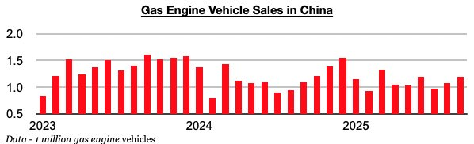
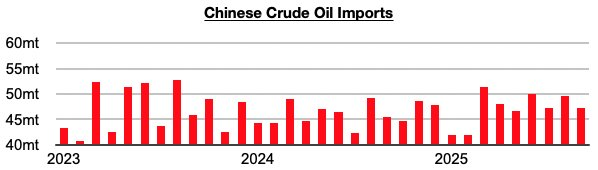

# Newfound Growth in Gas Engine Vehicle Sales in China Continues

**Date:** October 24, 2025  
**Publisher:** Breakwave Advisors | **Category:** Market Insights  
**Original URL:** [https://www.breakwaveadvisors.com/insights/2025/10/24/newfound-growth-in-gas-engine-vehicle-sales-in-china-continues](https://www.breakwaveadvisors.com/insights/2025/10/24/newfound-growth-in-gas-engine-vehicle-sales-in-china-continues)  

---

*By*[*Jeffrey Landsberg*](https://www.linkedin.com/in/jeffrey-landsberg-70ab957/)

As we discussed in Commodore Research's most recent Weekly China Report, September saw a total of 2.58 million vehicles sold in China (and also a record 652,000 vehicles exported). Of the 2.58 million vehicles, 1.19 million were gas engine vehicles, which marked a year-on-year increase of 9%. Gas-engine vehicle sales have now grown on a year-on-year basis for four straight months. Previously, they had contracted on a year-on-year basis in fifteen of the prior sixteen months.

> **Figure 1: Chart 1**  
> [Local Asset](file:///C:/Users/Dell/Github/Shipping/corpus/03-breakwave/insights/2025/assets/2025-10-24_newfound-growth-in-gas-engine-vehicle-sales-in-china-continues_img_chart1_fe881655f0fe.jpg)

China’s crude oil imports most recently totaled 47.3 million tons in September, which was down month-on-month by 2.2 million tons (-4%) but up year-on-year by 1.8 million tons (4%). Significant is that China's crude oil imports have now grown on a year-on-year basis during six of the last seven months. Previously, they had contracted on a year-on-year basis in nine of the prior ten month. The newfound growth in gas engine vehicle sales in China remains a tailwind for China's crude oil demand.

> **Figure 2: Chart 2**  
> [Local Asset](file:///C:/Users/Dell/Github/Shipping/corpus/03-breakwave/insights/2025/assets/2025-10-24_newfound-growth-in-gas-engine-vehicle-sales-in-china-continues_img_chart2_4aa575332cd1.jpg)

---

**Tags:** China, Crude, Commodities  
