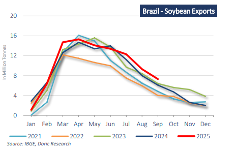

# Dry Bulk - Positive sentiment

**Date:** October 27, 2025  
**Publisher:** Breakwave Advisors | **Category:** Market Insights  
**Original URL:** [https://www.breakwaveadvisors.com/insights/2025/10/27/dry-bulk-positive-sentiment](https://www.breakwaveadvisors.com/insights/2025/10/27/dry-bulk-positive-sentiment)  

---

*By*[*Michalis Voutsinas*](https://www.linkedin.com/in/michalis-voutsinas-587544163/)

China’s iron ore imports surged in September, climbing 10.6 percent month-on-month to reach an all-time high for a single month, as strengthening domestic demand and firmer prices encouraged miners to ramp up shipments. The world’s largest consumer imported 116.33 million tonnes of iron ore during the month, surpassing analysts’ expectations of 100-106 million tonnes and maintaining volumes above the 100-million-tonne mark for the fourth consecutive month. This compared with 105.22 million tonnes in August and was 11.7 percent higher year-on-year than the 104.13 million tonnes recorded in September 2024. The strong inflows reflected improving sentiment in the steel sector following Beijing’s renewed efforts to tackle “involution-style” competition – cutthroat rivalry within the industry that has long contributed to inefficiencies and overcapacity. Demand was also buoyed by the resumption of operations at several steel mills after temporary curbs during a military parade early in the month. Over the first three quarters of 2025, China imported 917.69 million tonnes of iron ore, broadly flat year-on-year. While official forecasts for October are yet to be released, current indicators point to continued high import levels through the remainder of the year, supported by robust supply from Australia and Brazil, even as steel demand faces headwinds.

China’s coal imports also rose sharply in September, hitting a ninemonth high amid a widening import arbitrage caused by rising domestic prices. Total coal imports reached 46 million tonnes, according to data from the General Administration of Customs, though still marginally below the 47.59 million tonnes imported in the same month last year – a figure that marked the second-highest monthly volume on record. Over January-September 2025, China imported 345.89 million tonnes of coal, down 11 percent year-onyear. Breaking down the figures, thermal coal imports totaled 34.07 million tonnes (or 1.14 Mt/day), up 13.3 percent month-on-month but down 5.4 percent year-on-year, reaching their highest level since December 2023. The increase was largely due to end-users capitalising on improved import economics while domestic production remained subdued. Metallurgical coal imports rose to 11.93 million tonnes (0.28 Mt/day), up 5.8 percent month-on-month and 3.2 percent year-on-year, supported by restocking activity and partial substitution of domestic supply. This occurred even as crude steel production slipped 1.9 percent month-on-month and 4.7 percent year-on-year to 73.5 million tonnes. Looking ahead, overall coal demand is expected to be softish, weighed down by softer industrial activity, expectations of a milder winter, and continued weakness in steel output.

Turning to agricultural commodities, China – the world’s largest food importer – purchased 12.8 million tonnes of soybeans in September, a sharp rebound supported by increased shipments from Argentina following the temporary suspension of export taxes. However, imports from the United States fell to zero during the month, an unprecedented absence given the U.S.’s historical role as a key supplier. The lapse in purchases underscores the strain on U.S. farmers as trade negotiations with Beijing continue, raising concerns about lost export opportunities during the critical harvest season. Meanwhile, Brazilian soybean exports remain strong. In September, Brazil’s soybean exports increased by 19.6 7 percent year-on-year to 7.3 million tonnes. China is estimated to have accounted for approximately 93 percent of Brazil's total soybean exports in September, a historically high and disproportionate share and a direct result of the ongoing trade tensions and tariffs from the US.

Moving forward, the grain exporters’ association ANEC projects 7.34 million tonnes for October –up 65.6 percent year-on-year, marking a record for the month. For the first ten months of 2025, ANEC forecasts total exports at 102.42 million tonnes, an increase of 9.6 percent year-on-year. On the corn front, China’s corn imports rose to 56,562 tonnes in September, up 56.4 percent month-on-month, defying the typical seasonal slowdown during the domestic harvest. Major suppliers such as the United States and Brazil remained absent for a second consecutive month, leaving Russia (33,091 tonnes) and Myanmar (20,997 tonnes) as the main sources. Wheat imports also rebounded strongly over the same period, highlighting China’s continued reliance on imports to meet domestic feed and food demand. Looking forward, ANEC projects Brazilian corn exports at 6.57 million tonnes in October 2025, up from 5.67 million tonnes a year earlier, and 30.52 million tonnes for the first ten months of the year, reflecting ongoing strength in Latin American grain flows.

> **Figure 1: Στιγμιότυπο Οθόνης 2025 10 27 095947**  
> **Interactive Data & Source:** [Doric](https://www.doric.gr/) | [Local Asset](file:///C:/Users/Dell/Github/Shipping/corpus/03-breakwave/insights/2025/assets/2025-10-27_dry-bulk-positive-sentiment_img_cea3cf84ceb9ceb3cebcceb9cf8ccf84cf85_e791db38f9a8.png)

At this juncture, Chicago soybean futures eased on Friday from a onemonth high yet still recorded their strongest weekly gain in ten weeks, supported by optimism over renewed U.S.–China trade discussions. Market attention is now centred on the forthcoming meeting between President Donald Trump and President Xi Jinping in South Korea, where agricultural purchases – particularly soybeans – are expected to feature prominently on the agenda. The recent escalation in trade tensions, following Beijing’s expanded restrictions on rare-earth exports, has fuelled concerns over potential retaliatory measures, although both sides have signalled a willingness to return to the negotiating table. A potential trade deal could help U.S. farmers avert further losses, though the window for new Chinese purchases ahead of the North American export season appears to be narrowing.

In the spot market, sentiment has remained broadly positive. The extended grain export season ex-ECSA continued to underpin Panamax, Supramax and Handysize employment, with steady soybean and corn volumes sustaining tonne-mile demand across the Atlantic. At the same time, iron ore activity from Australia and Brazil kept Capesize utilisation firm, while coal shipments from Indonesia and Australia maintained solid momentum, supported by regional restocking and favourable import economics. During October, the Baltic Dry Index has an average of more than 2,000 points for the third consecutive month, reflecting balanced tonnage conditions and healthy cargo availability across all major segments, despite a backdrop of macroeconomic uncertainty and evolving trade patterns.

Data source:[Doric](https://www.doric.gr/)

---

**Tags:** China, Commodities, Drybulk  
