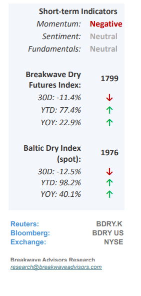
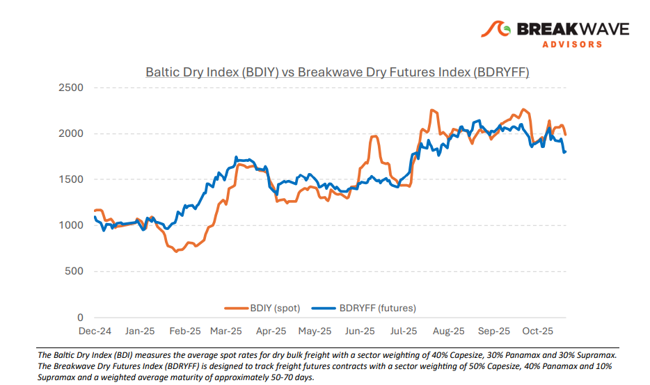
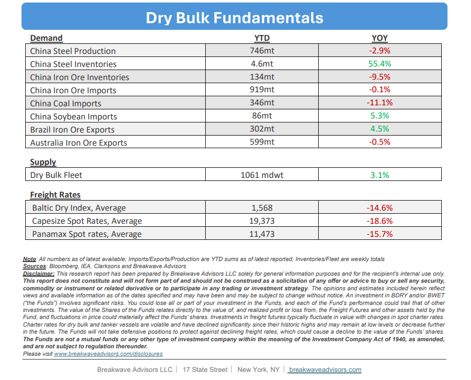

# Breakwave Bi-Weekly Dry Bulk Report - October 28, 2025

**Date:** October 28, 2025  
**Publisher:** Breakwave Advisors | **Category:** Market Insights  
**Original URL:** [https://www.breakwaveadvisors.com/insights/20251028db-jhy44lo4j478](https://www.breakwaveadvisors.com/insights/20251028db-jhy44lo4j478)  

---

•**Continuing Changes in Trade Policies Dominate Dry Bulk Headlines**– Political and global**trade policies continue to shape freight sentiment**, with the current discussion centering on agricultural products in the most recent. A potential USChina trade agreement, whatever its scope, has**improved sentiment**in the dry bulk sector, particularly for grain-focused Panamax and Supramax segments. Although**US agricultural exports have diminished**in importance for global freight trading, any meaningful, even if brief, adjustment could positively impact fourthquarter spot rates. We consider such an outcome unlikely, but possible. In the Capesize segment, where iron ore and coal dominate volumes, we are within a historically strong period, though the**second half of October**has often been the**weakest portion**of the fourth quarter. Yet, our base case scenario calls for a pickup in spot activity in early-to-mid November. Since freight futures for the remainder of the year are**essentially flat versus current spot rates**, a rise in activity could push rates back into the high-20,000s fairly quickly. Absent concrete signs of improvement, however, the near-term direction of rates and freight futures looks to remain down for the next few weeks until sentiment begins to turn.

> **Figure 1: Cea3cf84ceb9ceb3cebcceb9cf8ccf84cf85**  
> [Local Asset](file:///C:/Users/Dell/Github/Shipping/corpus/03-breakwave/insights/2025/assets/2025-10-28_20251028db-jhy44lo4j478_img_cea3cf84ceb9ceb3cebcceb9cf8ccf84cf85_be303e5b6458.png)

•**China Steel Production Remains Depressed While Steel Inventories Rise**– Iron ore imports into China have recovered and are showing a flattish year-overyear change, while**steel production remains below**last year’s levels. Iron ore inventories have declined, suggesting higher ore consumption in steelmaking, or the use of lower-grade ore, as indicated by the parallel trends in steel output. In September, China’s**iron ore imports**reached a monthly**record**116 million tonnes, whereas steel production fell to its lowest rate since December 2023. These apparent discrepancies typically converge over time due to the significant lead times in the steelmaking process. However, with a 12-month run rate of steel production remaining flat, a meaningful uptick in iron ore imports is unlikely, as imports have now been running at an annualized rate of about 1.2 billion tonnes for a while. Overall, we**continue to view the iron ore market as oversupplied.**With additional production anticipated from West Africa and approaching export timing, a tighter iron ore market appears unlikely in the near term.

•**Our Long-term View**– The last few years have been characterized by increased geopolitical uncertainty. Going forward, we expect such events to continue to affect global trade and have a meaningful impact on effective vessel supply. Combined with the potential for a multi-year cyclical rebound in China’s economic activity following the recent economic turmoil, dry bulk shipping should experience higher volatility on top of a secular tightness driven by stable bulk commodity demand and a slower fleet growth owing to a relatively low orderbook.

> **Figure 2: %Ce%a3%cf%84%ce%b9%ce%b3%ce%bc%ce%b9%cf%8c%cf%84%cf%85%cf%80%ce%bf+%ce%bf%ce%b8%cf%8c%ce%bd%ce%b7%cf%82+2025 10 28+081428**  
> [Local Asset](file:///C:/Users/Dell/Github/Shipping/corpus/03-breakwave/insights/2025/assets/2025-10-28_20251028db-jhy44lo4j478_img_25ce25a325cf258425ce25b925ce25b325ce_2e7657bf6d09.png)

> **Figure 3: Στιγμιότυπο Οθόνης 2025 10 28 093210**  
> [Local Asset](file:///C:/Users/Dell/Github/Shipping/corpus/03-breakwave/insights/2025/assets/2025-10-28_20251028db-jhy44lo4j478_img_cea3cf84ceb9ceb3cebcceb9cf8ccf84cf85_0307a5b3c13b.png)

### Subscribe:
