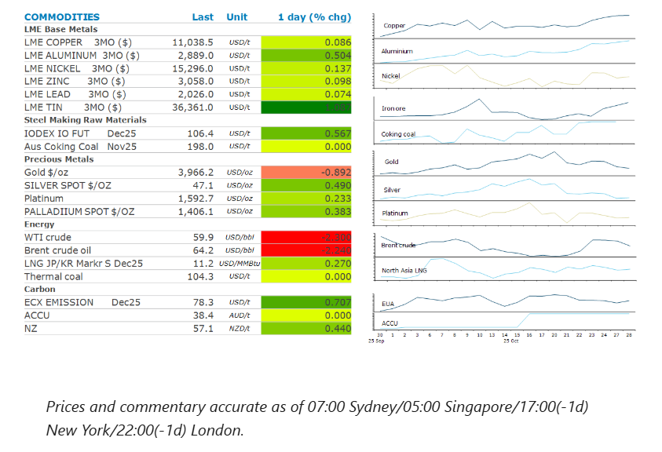
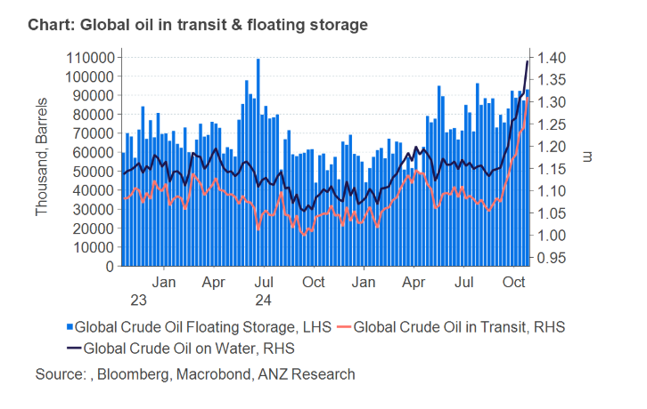

# Copper hovers near record high amid market tightness

**Date:** October 29, 2025  
**Publisher:** Breakwave Advisors | **Category:** Market Insights  
**Original URL:** [https://www.breakwaveadvisors.com/insights/2025/10/29/copper-hovers-near-record-high-amid-market-tightness](https://www.breakwaveadvisors.com/insights/2025/10/29/copper-hovers-near-record-high-amid-market-tightness)  

---

Sentiment was mixed as traders await details of a US-China trade deal. Copper gained mid more supply side issues. Oil fell as signs of oversupply emerge.

*By*[*Daniel Hynes*](https://www.linkedin.com/in/dahynes/)

> **Figure 1: Στιγμιότυπο Οθόνης 2025 10 29 124121**  
> **Interactive Data & Source:** [Linkedin](https://www.linkedin.com/newsletters/commodities-wrap-6692196755876012032/?fbclid=IwAR3kiXJqZdxmp9ZcRwBNI7FsBySI-XSC0pfPur1qzjt7OZp7PTE59Tsl1QI) | [Local Asset](file:///C:/Users/Dell/Github/Shipping/corpus/03-breakwave/insights/2025/assets/2025-10-29_copper-hovers-near-record-high-amid-market-tightness_img_cea3cf84ceb9ceb3cebcceb9cf8ccf84cf85_5a05102d03d9.png)

**Copper**steadied near its record high, as investors waited to see whether the US and China would finalise a much-anticipated trade deal. Negotiators have reached tentative agreements on issues such as tariffs, shipping fees and export controls. However, details remain vague. Copper has been supported by renewed supply side issues in recent months. There were fresh setbacks yesterday, with Anglo American warning that copper production at its Collahuasi mine in Chile will likely be lower than expected next year. Its 2026 output plans have been reduced from 470kt to between 380-410kt. This adds to an already tight market. The outlook for demand also brightened in Europe. Car sales in the region rose for a third consecutive month in September. New vehicle registrations increased 11% y/y to 1.24m units. Sales of electric vehicles jumped by a third amid robust demand for more affordable models.

Optimism surrounding easing US-China trade tensions and the signing of a new ASEAN-China free trade agreement boosted sentiment in the**steel and iron ore**markets. The prospect of China weathering the trade war with US better than was expected appears to have boosted the confidence of steel mills to start restocking in recent months. October imports are forecast to reach 113mt, based on ship tracking data from Kpler. If achieved, that would be second only to the all-time high of 116.33mt in September.

Progress in US-China trade talks continues to sap demand for haven assets such as**gold**, which extended a pullback as tension eased. Gold-backed exchange traded funds saw 448,7006oz cut from their holdings on Monday, the biggest daily decline in six months. However, the mood at this week’s London Bullion Market Association annual gathering has been bullish. A survey of over 10 attendees projected that gold will be trading near USD5,000/oz in a year. The recent declines may provide an opportunity for central banks to ramp up purchases.

**Crude oil**prices fell as signs of oversupply quelled a rally triggered by US sanctions on Russian oil companies. The amount of oil being shipped across the world’s oceans hit a record high. About 1.4mbbl are now aboard oil tankers, according to data from Vortexa. That is the highest level in figures going back to 2016. This comes as the OPEC+ alliance looks to meet this weekend to discuss its production plans. Another modest increase in output of 137kb/d is the base case, according to two delegates in a Bloomberg report. There could also be a political consideration in the decision. Saudi Arabian Crown Prince, Mohammed bin Salman, is scheduled to visit the White House on 18 November.

**European gas**futures steadied amid risks to domestic production. Ukraine’s Naftogaz said its gas facilities were hit again overnight. This is the seventh strike on gas infrastructure in October. This could force Ukraine to increase its gas imports and tighten the European market. The region’s supply balance remains fragile this winter and is heavily reliant on weather and volatile LNG flows. North Asian LNG prices were steady, although buyers remain on sidelines waiting for further falls before buying.

### Chart of the Day

The amount of crude oil held on tankers that have been stationary for at least 7 days rose to 89.75mbbls as of 24 October. That’s up 12% from 80.20mbbls on 17 October. This suggests the glut of oil the market has been anticipating even since OPEC announced it was raising output, is starting to emerge.

> **Figure 2: Στιγμιότυπο Οθόνης 2025 10 29 124219**  
> **Interactive Data & Source:** [Linkedin](https://www.linkedin.com/newsletters/commodities-wrap-6692196755876012032/?fbclid=IwAR3kiXJqZdxmp9ZcRwBNI7FsBySI-XSC0pfPur1qzjt7OZp7PTE59Tsl1QI) | [Local Asset](file:///C:/Users/Dell/Github/Shipping/corpus/03-breakwave/insights/2025/assets/2025-10-29_copper-hovers-near-record-high-amid-market-tightness_img_cea3cf84ceb9ceb3cebcceb9cf8ccf84cf85_7407863f6c24.png)

Data source:[Commodities Wrap](https://www.linkedin.com/newsletters/commodities-wrap-6692196755876012032/?fbclid=IwAR3kiXJqZdxmp9ZcRwBNI7FsBySI-XSC0pfPur1qzjt7OZp7PTE59Tsl1QI)

---

**Tags:** Shipping, Commodities, Markets  
