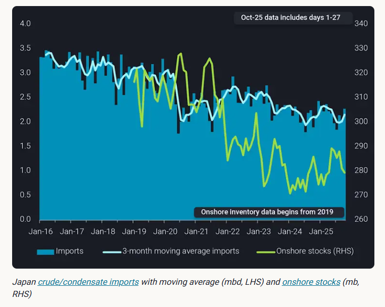
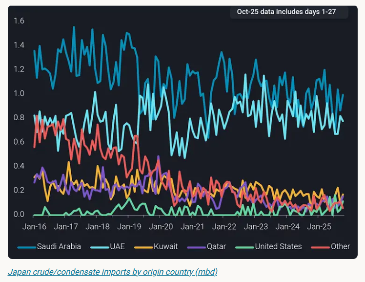
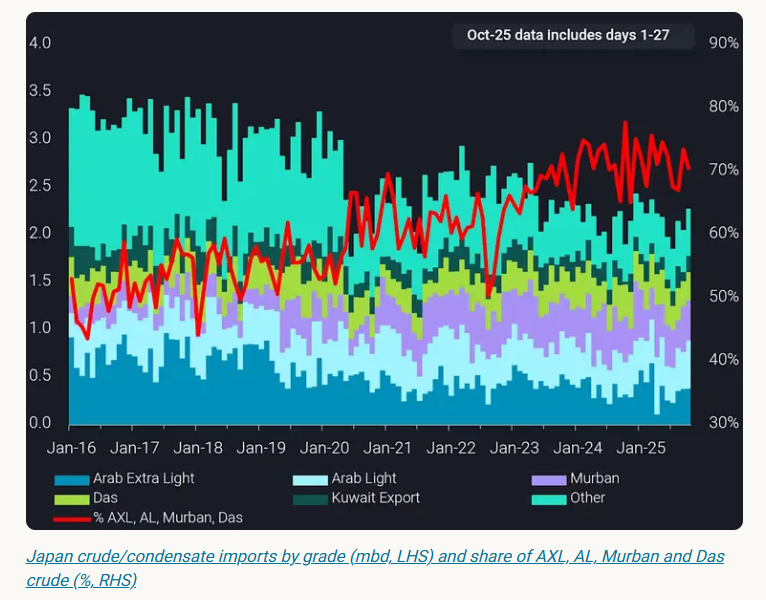
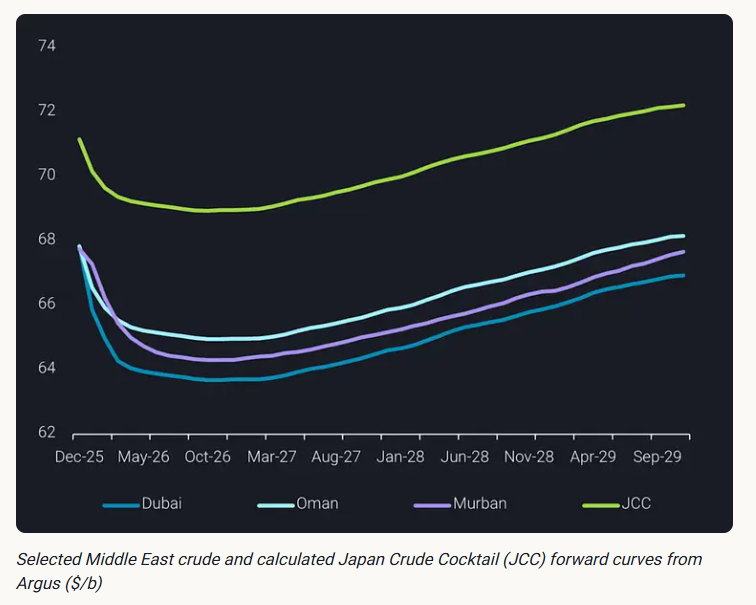

# JCC poised to closely follow Dubai, Oman and Murban prices

**Date:** October 29, 2025  
**Publisher:** Breakwave Advisors | **Category:** Market Insights  
**Original URL:** [https://www.breakwaveadvisors.com/insights/2025/10/29/jcc-poised-to-closely-follow-dubai-oman-and-murban-prices](https://www.breakwaveadvisors.com/insights/2025/10/29/jcc-poised-to-closely-follow-dubai-oman-and-murban-prices)  

---

JCC poised to closely follow Dubai, Oman and Murban prices in the long-run as Japan mostly imports Arab Extra Light, Arab Light, Murban and Das crude

*By*[*Ivan Mathews*](https://www.linkedin.com/in/ivan-m-255689137/)

Japan crude imports declined on a multi-year structural trend between 2016 and 2024 as refinery runs fell and several refineries faced planned and unplanned closures. The contraction in crude throughput reflected weakening demand for road‑transportation fuels amid an ageing and shrinking population, alongside broader shifts toward lower‑carbon fuels in the power generation and industrial sectors. Onshore commercial crude stocks also trended down from 2019 to 2024 as fewer operating refineries led to reduced storage needs.

The last planned closure was by Japan’s second-biggest oil refiner, Idemitsu Kosan, who permanently shut its 120kbd Yamaguchi refinery in March 2024. The company has signalled plans to turn the site into a hub of carbon-free energy such as solar power and hydrogen by the 2030s. Vortexa cargo and arrival data show crude arrivals into Japan in 2025 year‑to‑date are broadly stable relative to 2024 on a 3-month moving average basis, though monthly volatility remains and seasonal patterns persist.

> **Figure 1: Στιγμιότυπο Οθόνης 2025 10 29 113603**  
> **Interactive Data & Source:** [Vortexa](https://www.vortexa.com//oil-gas-data-traders-analysts-data-scientists?gclid=Cj0KCQjw8_qRBhCXARIsAE2AtRZKOvMnbilZ_6_91d7huSFFy71pWLrnPwGwOHVzXsmsG-1a1mZnQw8aAt89EALw_wcB&hsa_acc=1782073842&hsa_ad=548425387665&hsa_cam=14746637662&hsa_grp=125038601902&hsa_kw=&hsa_mt=&hsa_net=adwords&hsa_src=g&hsa_tgt=dsa-1431852288425&hsa_ver=3&utm_campaign=%5BCD%5D%20-%20DSA%20-%20EMEA&utm_medium=cpc&utm_medium=ppc&utm_source=google&utm_source=adwords&utm_term=) | [Local Asset](file:///C:/Users/Dell/Github/Shipping/corpus/03-breakwave/insights/2025/assets/2025-10-29_jcc-poised-to-closely-follow-dubai-oman-and-murban-prices_img_cea3cf84ceb9ceb3cebcceb9cf8ccf84cf85_de81d0141bc9.png)

Crude flows have shifted in line with the decline in overall import volumes. Deliveries from Kuwait and Qatar have fallen in aggregate since 2016 and several smaller suppliers have reduced shipments, while Saudi volumes have declined more moderately as some Japanese refineries continue to take Arab Extra Light and Arab Light grades. UAE volumes have edged up modestly over recent years, and US arrivals have shown limited secular change as we understand that long‑haul arbitrage economics primarily determine purchases.

> **Figure 2: Στιγμιότυπο Οθόνης 2025 10 29 113646**  
> **Interactive Data & Source:** [Vortexa](https://www.vortexa.com//oil-gas-data-traders-analysts-data-scientists?gclid=Cj0KCQjw8_qRBhCXARIsAE2AtRZKOvMnbilZ_6_91d7huSFFy71pWLrnPwGwOHVzXsmsG-1a1mZnQw8aAt89EALw_wcB&hsa_acc=1782073842&hsa_ad=548425387665&hsa_cam=14746637662&hsa_grp=125038601902&hsa_kw=&hsa_mt=&hsa_net=adwords&hsa_src=g&hsa_tgt=dsa-1431852288425&hsa_ver=3&utm_campaign=%5BCD%5D%20-%20DSA%20-%20EMEA&utm_medium=cpc&utm_medium=ppc&utm_source=google&utm_source=adwords&utm_term=) | [Local Asset](file:///C:/Users/Dell/Github/Shipping/corpus/03-breakwave/insights/2025/assets/2025-10-29_jcc-poised-to-closely-follow-dubai-oman-and-murban-prices_img_cea3cf84ceb9ceb3cebcceb9cf8ccf84cf85_5503b3fe0a2a.png)

Japan’s import mix is concentrated in light and medium Middle East grades. Using Vortexa’s grade‑level arrivals, Arab Extra Light, Arab Light, Murban and Das together account for roughly 70% of delivered import volumes since 2024. If this grade composition persists, the Japan Crude Cocktail (JCC) - which represents the monthly average price of crude delivered to Japan - will be heavily exposed to Dubai, Oman and Murban prices in the long-term.

> **Figure 3: Στιγμιότυπο Οθόνης 2025 10 29 113730**  
> **Interactive Data & Source:** [Vortexa](https://www.vortexa.com//oil-gas-data-traders-analysts-data-scientists?gclid=Cj0KCQjw8_qRBhCXARIsAE2AtRZKOvMnbilZ_6_91d7huSFFy71pWLrnPwGwOHVzXsmsG-1a1mZnQw8aAt89EALw_wcB&hsa_acc=1782073842&hsa_ad=548425387665&hsa_cam=14746637662&hsa_grp=125038601902&hsa_kw=&hsa_mt=&hsa_net=adwords&hsa_src=g&hsa_tgt=dsa-1431852288425&hsa_ver=3&utm_campaign=%5BCD%5D%20-%20DSA%20-%20EMEA&utm_medium=cpc&utm_medium=ppc&utm_source=google&utm_source=adwords&utm_term=) | [Local Asset](file:///C:/Users/Dell/Github/Shipping/corpus/03-breakwave/insights/2025/assets/2025-10-29_jcc-poised-to-closely-follow-dubai-oman-and-murban-prices_img_cea3cf84ceb9ceb3cebcceb9cf8ccf84cf85_02d1bb675330.png)

The pricing mechanics of term formulas reinforce this view. Saudi OSPs for Arab Extra Light and Arab Light are typically announced with reference to Dubai and Oman benchmarks plus a premium or discount, and many term cargos for those grades are priced accordingly. Murban is the established benchmark for many crude exports from the UAE, and Das term cargoes can be priced with reference to Murban. From discussions with market players, majority of the crude imported by Japan are based on term contracts.

Factors such as fluctuations in premiums to the benchmarks, long-haul arbitrage crude economics and freight costs will also influence the JCC. That said, we expect Dubai, Oman and Murban flat prices to have the largest impact on the JCC as term crude are priced based these key Middle East grades. Indeed, Argus forward curves show the calculated JCC closely tracking the named benchmarks. Therefore, should Japan’s delivered import mix remain dominated by Arab Extra Light, Arab Light, Murban and Das, the JCC is expected to closely follow Dubai, Oman and Murban prices over the long-run.

> **Figure 4: Στιγμιότυπο Οθόνης 2025 10 29 113811**  
> **Interactive Data & Source:** [Vortexa](https://www.vortexa.com//oil-gas-data-traders-analysts-data-scientists?gclid=Cj0KCQjw8_qRBhCXARIsAE2AtRZKOvMnbilZ_6_91d7huSFFy71pWLrnPwGwOHVzXsmsG-1a1mZnQw8aAt89EALw_wcB&hsa_acc=1782073842&hsa_ad=548425387665&hsa_cam=14746637662&hsa_grp=125038601902&hsa_kw=&hsa_mt=&hsa_net=adwords&hsa_src=g&hsa_tgt=dsa-1431852288425&hsa_ver=3&utm_campaign=%5BCD%5D%20-%20DSA%20-%20EMEA&utm_medium=cpc&utm_medium=ppc&utm_source=google&utm_source=adwords&utm_term=) | [Local Asset](file:///C:/Users/Dell/Github/Shipping/corpus/03-breakwave/insights/2025/assets/2025-10-29_jcc-poised-to-closely-follow-dubai-oman-and-murban-prices_img_cea3cf84ceb9ceb3cebcceb9cf8ccf84cf85_428bbb6d67f7.png)

Data Source:[Vortexa](https://www.vortexa.com//oil-gas-data-traders-analysts-data-scientists?gclid=Cj0KCQjw8_qRBhCXARIsAE2AtRZKOvMnbilZ_6_91d7huSFFy71pWLrnPwGwOHVzXsmsG-1a1mZnQw8aAt89EALw_wcB&hsa_acc=1782073842&hsa_ad=548425387665&hsa_cam=14746637662&hsa_grp=125038601902&hsa_kw=&hsa_mt=&hsa_net=adwords&hsa_src=g&hsa_tgt=dsa-1431852288425&hsa_ver=3&utm_campaign=%5BCD%5D%20-%20DSA%20-%20EMEA&utm_medium=cpc&utm_medium=ppc&utm_source=google&utm_source=adwords&utm_term=)

---

**Tags:** Crude, Markets, Tankers  
