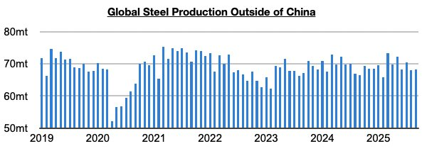
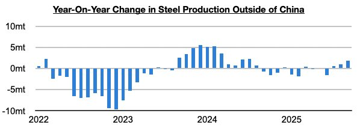

# Return of Steel Production Growth Ex-China Continues

**Date:** October 31, 2025  
**Publisher:** Breakwave Advisors | **Category:** Market Insights  
**Original URL:** [https://www.breakwaveadvisors.com/insights/2025/10/31/return-of-steel-production-growth-ex-china-continues](https://www.breakwaveadvisors.com/insights/2025/10/31/return-of-steel-production-growth-ex-china-continues)  

---

*By*[*Jeffrey Landsberg*](https://www.linkedin.com/in/jeffrey-landsberg-70ab957/)

As we discussed in Commodore Research's most recent Weekly Executive Report, global steel production totaled approximately 141.8 million tons in September. This is down month-on-month by 3.5 million tons (-2%) and is down year-on-year by 1.8 million tons (-1%). Steel production outside of China totaled approximately 68.3 million tons. This is up month-on-month by 400,000 tons (1%) and is up year-on-year by 1.8 million tons (3%).

> **Figure 1: Chart 1**  
> [Local Asset](file:///C:/Users/Dell/Github/Shipping/corpus/03-breakwave/insights/2025/assets/2025-10-31_return-of-steel-production-growth-ex-china-continues_img_chart1_a4d8e55b999c.jpg)

Steel production ex-China has now grown on a year-on-year basis for three straight months. Previously, it had contracted during eight of the prior ten months.

> **Figure 2: Chart 2**  
> [Local Asset](file:///C:/Users/Dell/Github/Shipping/corpus/03-breakwave/insights/2025/assets/2025-10-31_return-of-steel-production-growth-ex-china-continues_img_chart2_026e8ab196c7.jpg)

However, taking India out of the equation, it has contracted on a year-on-year basis during each of the last thirteen months. That contraction is narrowing sharply however. Global steel production ex-China ex-India last month contracted year-on-year by just 100,000 tons.

Overall, it remains helpful for the dry bulk shipping market that steel production ex-China is enjoying year-on-year growth (in China, production levels are also now down slightly year-on-year). This remains a relatively new development that has been underway since July. Remaining significant, too, is that iron ore prices have stayed at a firm level and global iron ore producers are still not close to lowering production. As we continue to stress in our work, healthy global steel production, iron ore prices, iron ore production, and most importantly iron ore exports collectively remains a tailwind for the capesize market.

---

**Tags:** China, Drybulk, Ironore  
