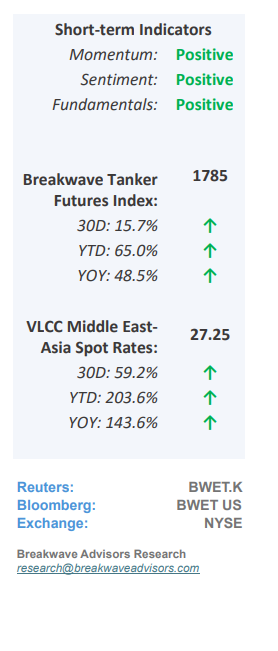
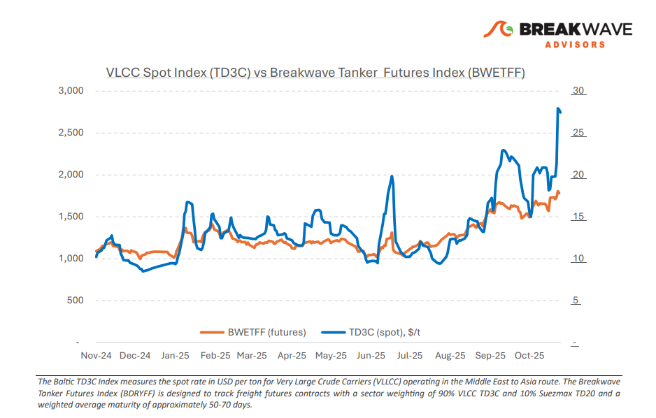
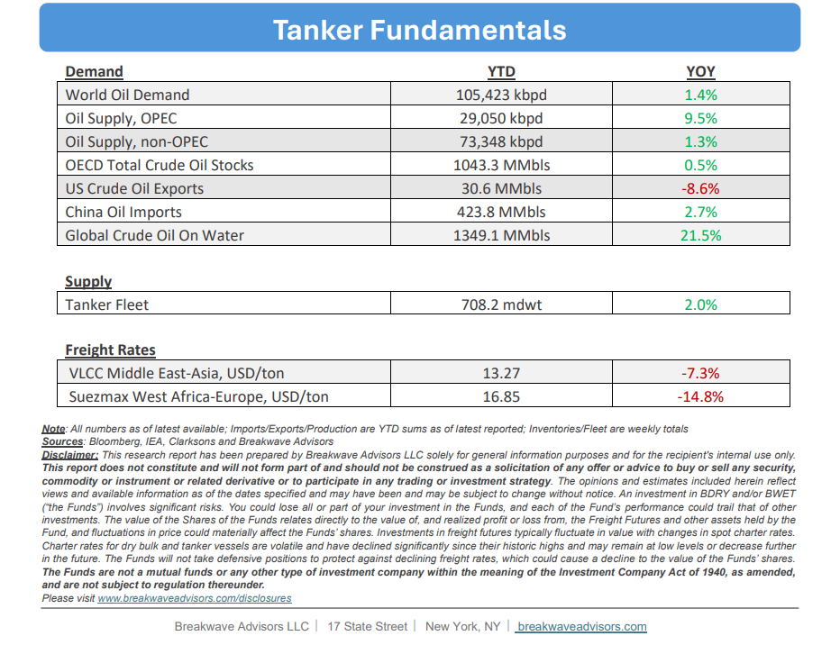

# Breakwave Bi-Weekly Tanker Report - November 4, 2025

**Date:** November 04, 2025  
**Publisher:** Breakwave Advisors | **Category:** Market Insights  
**Original URL:** [https://www.breakwaveadvisors.com/insights/2025114wetreport5kji24-kk875](https://www.breakwaveadvisors.com/insights/2025114wetreport5kji24-kk875)  

---

•**VLCCs Go from Strength to Strength as Sanctions Drive Strong Sentiment**– VLCC rates continued their**surge into late October**, led by the Arabian Gulf–China and West Africa–China routes. Strength in these two major eastbound benchmarks has spilled over to the broader VLCC segment, with all regions posting gains as charterers secured coverage across basins amid a thinning vessel list. The rally, initially driven by**regulatory and geopolitical developments**in mid-October, gained further momentum as China’s port-fee regime on U.S.-linked vessels and the new wave of U.S. sanctions on Russian crude bolstered sentiment and fixing activity. Although both China and the U.S. have since paused their respective portfee regimes, short-term relief from compliance has not reversed the upward trend. From a trade perspective, sanctions and regulatory volatility may accelerate shifts in Chinese and Indian crude sourcing. Any**sustained****decline in Russian imports**in favor of Arabian Gulf or U.S. Gulf barrels**would increase tonne-mile exposure,**supporting VLCC utilization into Q4. The market enters November with some of the strongest momentum seen since early 2022. The key**question**is whether geopolitical volatility and sourcing rebalancing can**sustain this structural upswing**through the winter.

> **Figure 1: Στιγμιότυπο Οθόνης 2025 11 04 103227**  
> [Local Asset](file:///C:/Users/Dell/Github/Shipping/corpus/03-breakwave/insights/2025/assets/2025-11-04_2025114wetreport5kji24-kk875_img_cea3cf84ceb9ceb3cebcceb9cf8ccf84cf85_efde8a719c9e.png)

•**OPEC Continues to Add Barrels in what Seems as an Oversupplied Market**– We continue to believe that the oil market balance has shifted toward oversupply, with only Chinese storage builds preventing a sharper decline in prices into the low $50s.**Geopolitical developments affecting Russia’s exports**and oil marketing will play a significant role in the coming months; however, barring any substantial disruption to Russian crude flows, it is difficult to view the market as balanced given weak to**steady transportation-fuel demand**from China and modest, sustained demand growth in other regions. Last weekend's decision by OPEC+ to increase production, while modest, just over 100 thousand barrels per day, suggests the**ongoing trend of more oil reaching**the market. With oil in transit at record levels, tankers are benefiting, and prices are likely to continue drifting lower as the futures curve flattens and may shift into contango in the months ahead.

•**Our Long-term View**– The tanker market is recovering from a long period of staggered rates as the growth in new vessel supply shrinks while oil demand remains elevated in line with the global economy. A historically low orderbook combined with favorable shifting trade patterns should continue to support increased spot rate volatility, which combined with the ongoing geopolitical turmoil, should sustain freight rates in the medium to long term.

> **Figure 2: Στιγμιότυπο Οθόνης 2025 11 04 090247**  
> [Local Asset](file:///C:/Users/Dell/Github/Shipping/corpus/03-breakwave/insights/2025/assets/2025-11-04_2025114wetreport5kji24-kk875_img_cea3cf84ceb9ceb3cebcceb9cf8ccf84cf85_87fe1462011c.png)

> **Figure 3: Στιγμιότυπο Οθόνης 2025 11 04 103214**  
> [Local Asset](file:///C:/Users/Dell/Github/Shipping/corpus/03-breakwave/insights/2025/assets/2025-11-04_2025114wetreport5kji24-kk875_img_cea3cf84ceb9ceb3cebcceb9cf8ccf84cf85_bc9e7f71c5f8.png)

### Subscribe:
