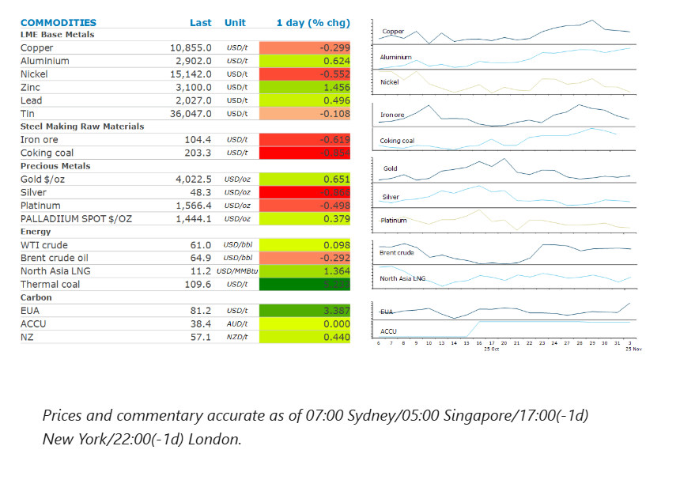
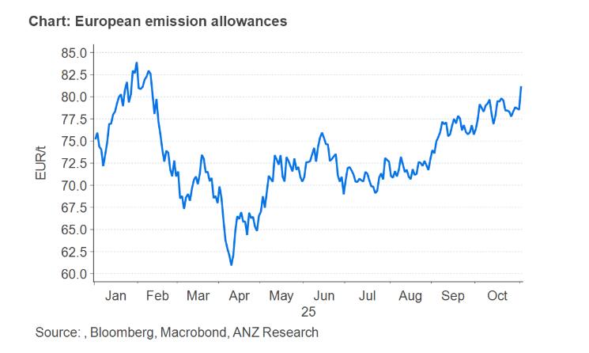

# Oil gains after OPEC pauses production hikes

**Date:** November 04, 2025  
**Publisher:** Breakwave Advisors | **Category:** Market Insights  
**Original URL:** [https://www.breakwaveadvisors.com/insights/2025/11/4/oil-gains-after-opec-pauses-production-hikes](https://www.breakwaveadvisors.com/insights/2025/11/4/oil-gains-after-opec-pauses-production-hikes)  

---

Renewed supply side issues helped push energy markets higher. Industrial metals were mixed as supply tightness was offset by concerns over weaker economic data.

*By*[*Daniel Hynes*](https://www.linkedin.com/in/dahynes/)

> **Figure 1: Στιγμιότυπο Οθόνης 2025 11 04 111814**  
> **Interactive Data & Source:** [Linkedin](https://www.linkedin.com/newsletters/commodities-wrap-6692196755876012032/?fbclid=IwAR3kiXJqZdxmp9ZcRwBNI7FsBySI-XSC0pfPur1qzjt7OZp7PTE59Tsl1QI) | [Local Asset](file:///C:/Users/Dell/Github/Shipping/corpus/03-breakwave/insights/2025/assets/2025-11-04_oil-gains-after-opec-pauses-production-hikes_img_cea3cf84ceb9ceb3cebcceb9cf8ccf84cf85_365318fa65eb.png)

### Market Commentary

**Crude oil**prices edged higher as the market contemplated OPEC’s decision to pause production increases. The oil producing group met over the weekend as part of its monthly review of its supply strategy and announced that after a 137kb/d increase in December, it would pause any further increases for at least the first quarter of 2026. The move comes amid uncertainty over Russian supplies after the US sanctioned Rosneft and Lukoil, two of the largest Russian oil producers who export around 3mb/d of crude oil (~55% of Russia’s crude and condensate supply). A Ukrainian drone yesterday hit a tanker in the Black Sea and damaged loading facilities in the Russian port city of Tuapse halting oil intake at a refinery there. Concerns over supply were echoed at an industry conference in Abu Dhabi. TotalEnergies ECO, Patrick Pouyanne, said sanctions will delay oil cargoes and slow down trade. BP boss, Murray Auchincloss, warned the restrictions are dampening supply. Expectations of a large surplus have been priced into the market, so this move by OPEC should provide some price support. OPEC is aware of the impact its rising output will have on the market and will remain flexible so that the market remains balanced.

**European gas**rose as the prospect of cooler weather boosted the outlook for demand. Temperatures are set to drop later this month after the current warm spell. This could increase heating demand for the fuel and test inventories that remain below historical levels. In addition, supply side issues provided some support. Pipeline flows from Algeria fell, with shipments via the Mazara del Valle entry point in Italy dropping to their lowest level in a month over the weekend. In the US, the Freeport LNG export facility in Texas suffered power disruption issues, resulting in a halt to production. Geopolitical risks are also rising. The US has threatened military strikes against militants in Nigeria if the country’s government doesn’t halt their attacks. Nigeria has supplied about 5% of western Europe’s LNG imports so far this year, according to ship tracking data.**North Asia LNG**prices also gained amid rising supply risks.

**Aluminium**extended its recent rally, as the prospect of waning growth in Chinese output threatens to tighten the market. In 2022, Beijing announced that it was capping aluminium capacity at 45mt. After strong growth in recent years, it’s now bouncing against the ceiling. In the first half of this year, monthly production ben averaged 44.9mt on an annualised basis. Growth has already slowed to around 1% y/y, with expectations of further declines. This comes as last week’s trade truce between the US and China brightened prospect for demand, although that was tempered after a private survey of manufacturing activity in China fell by more than expected in October.**Copper**failed to follow aluminium higher after Codelco said it expects copper output for this year and next to come in just ahead of last year’s levels. This is despite recent issues at several mining operations, such as the July accident at its El Teniente mine that upended production plans.

**Gold**held above USD4,000/oz as traders weighed up the impact of the scrapping of China’s tax rebate for gold retailers. The new policy allows companies production non-investment gold to offset only 6% of the VAT, down from 13% previously.

### Chart of the Day

European carbon futures rose above EUR80/t, after Germany announced new support for energy intensive industries. The country is introducing a mechanism for subsidised electricity costs for heavy industrial users through 2029. Its expected to be rolled out at the start of next year. The subsequent boost to industrial activity is likely to increase demand for carbon permits that companies need to surrender for each tonne of CO2 they release. Carbon prices had already been well supported by stronger demand after a cut to available allowances in upcoming auctions. In addition, demand from the maritime sector has also been strong.

> **Figure 2: Στιγμιότυπο Οθόνης 2025 11 04 111912**  
> **Interactive Data & Source:** [Linkedin](https://www.linkedin.com/newsletters/commodities-wrap-6692196755876012032/?fbclid=IwAR3kiXJqZdxmp9ZcRwBNI7FsBySI-XSC0pfPur1qzjt7OZp7PTE59Tsl1QI) | [Local Asset](file:///C:/Users/Dell/Github/Shipping/corpus/03-breakwave/insights/2025/assets/2025-11-04_oil-gains-after-opec-pauses-production-hikes_img_cea3cf84ceb9ceb3cebcceb9cf8ccf84cf85_2729808ff404.png)

Data source:[Commodities Wrap](https://www.linkedin.com/newsletters/commodities-wrap-6692196755876012032/?fbclid=IwAR3kiXJqZdxmp9ZcRwBNI7FsBySI-XSC0pfPur1qzjt7OZp7PTE59Tsl1QI)

---

**Tags:** Shipping, Commodities, Markets  
