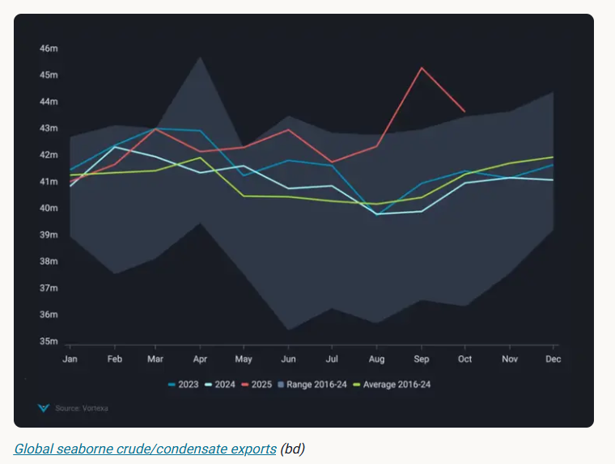
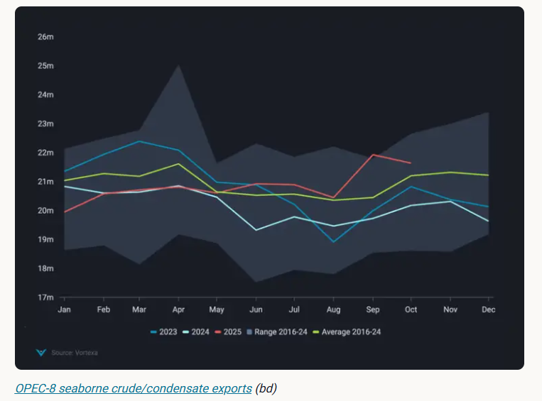
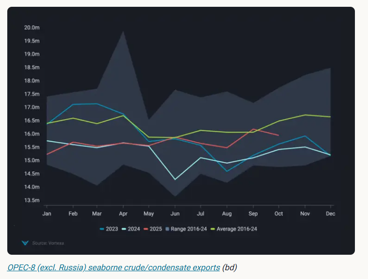
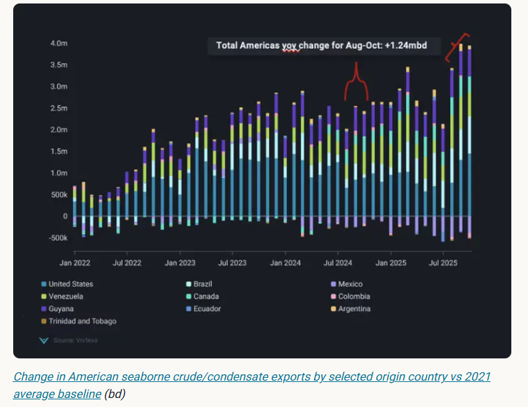

# In an oversupplied oil market, who backs off first?

**Date:** November 06, 2025  
**Publisher:** Breakwave Advisors | **Category:** Market Insights  
**Original URL:** [https://www.breakwaveadvisors.com/insights/2025/11/6/in-an-oversupplied-oil-market-who-backs-off-first](https://www.breakwaveadvisors.com/insights/2025/11/6/in-an-oversupplied-oil-market-who-backs-off-first)  

---

OPEC-8 and the Americas have kept crude exports high and markets oversupplied, we take a look at these factors in this insight piece.

*By*[*Rohit Rathod*](https://www.linkedin.com/in/rathodrohit/)

Global seaborne crude exports remain at seasonally high levels in October despite a comedown from September levels, when global exports crossed ~45mbd. But who is putting these barrels out on water and -- in an oversupplied market -- who will be the first to tap out? As far as supply is concerned, OPEC-8 seaborne exports have been ramping up significantly over the past two months, while on the non-OPEC side, it is the Americas that have seen strong crude export growth over the past three months.

> **Figure 1: Στιγμιότυπο Οθόνης 2025 11 06 102827**  
> **Interactive Data & Source:** [Vortexa](https://www.vortexa.com//oil-gas-data-traders-analysts-data-scientists?gclid=Cj0KCQjw8_qRBhCXARIsAE2AtRZKOvMnbilZ_6_91d7huSFFy71pWLrnPwGwOHVzXsmsG-1a1mZnQw8aAt89EALw_wcB&hsa_acc=1782073842&hsa_ad=548425387665&hsa_cam=14746637662&hsa_grp=125038601902&hsa_kw=&hsa_mt=&hsa_net=adwords&hsa_src=g&hsa_tgt=dsa-1431852288425&hsa_ver=3&utm_campaign=%5BCD%5D%20-%20DSA%20-%20EMEA&utm_medium=cpc&utm_medium=ppc&utm_source=google&utm_source=adwords&utm_term=) | [Local Asset](file:///C:/Users/Dell/Github/Shipping/corpus/03-breakwave/insights/2025/assets/2025-11-06_in-an-oversupplied-oil-market-who-backs-off-first_img_cea3cf84ceb9ceb3cebcceb9cf8ccf84cf85_0d31f5a84b09.png)

### Russia Remains the Driver Behind OPEC-8 Exports

The coalition of eight OPEC+ members (OPEC-8) had announced a voluntary production cut in April 2023. Two years on, since April 2025, OPEC-8 have been gradually unwinding these cuts – around 2.9mbd of production cuts thus far. However, the amount of crude that has been put out on water remains below what was announced. It is only over the past two months that an increase in seaborne crude exports from OPEC-8 has been observed.

> **Figure 2: Στιγμιότυπο Οθόνης 2025 11 06 102914**  
> **Interactive Data & Source:** [Vortexa](https://www.vortexa.com//oil-gas-data-traders-analysts-data-scientists?gclid=Cj0KCQjw8_qRBhCXARIsAE2AtRZKOvMnbilZ_6_91d7huSFFy71pWLrnPwGwOHVzXsmsG-1a1mZnQw8aAt89EALw_wcB&hsa_acc=1782073842&hsa_ad=548425387665&hsa_cam=14746637662&hsa_grp=125038601902&hsa_kw=&hsa_mt=&hsa_net=adwords&hsa_src=g&hsa_tgt=dsa-1431852288425&hsa_ver=3&utm_campaign=%5BCD%5D%20-%20DSA%20-%20EMEA&utm_medium=cpc&utm_medium=ppc&utm_source=google&utm_source=adwords&utm_term=) | [Local Asset](file:///C:/Users/Dell/Github/Shipping/corpus/03-breakwave/insights/2025/assets/2025-11-06_in-an-oversupplied-oil-market-who-backs-off-first_img_cea3cf84ceb9ceb3cebcceb9cf8ccf84cf85_de9dc880bf56.png)

In September, their seaborne crude exports reached ~22mbd, a 7% increase m-o-m, which then decreased to ~21.6mbd in October, which is still strong compared to the rest of 2025. While the aggregate volumes do sound promising, most of this growth came from Russia which had to push crude barrels to export markets as drone strikes impacted their refining capacity and freed up these barrels. If we take Russia out of the equation, then the OPEC-8 (excl. Russia) seaborne crude exports will trend below the seasonal average, essentially negating any of the announced unwinding of cuts.

> **Figure 3: Στιγμιότυπο Οθόνης 2025 11 06 103030**  
> **Interactive Data & Source:** [Vortexa](https://www.vortexa.com//oil-gas-data-traders-analysts-data-scientists?gclid=Cj0KCQjw8_qRBhCXARIsAE2AtRZKOvMnbilZ_6_91d7huSFFy71pWLrnPwGwOHVzXsmsG-1a1mZnQw8aAt89EALw_wcB&hsa_acc=1782073842&hsa_ad=548425387665&hsa_cam=14746637662&hsa_grp=125038601902&hsa_kw=&hsa_mt=&hsa_net=adwords&hsa_src=g&hsa_tgt=dsa-1431852288425&hsa_ver=3&utm_campaign=%5BCD%5D%20-%20DSA%20-%20EMEA&utm_medium=cpc&utm_medium=ppc&utm_source=google&utm_source=adwords&utm_term=) | [Local Asset](file:///C:/Users/Dell/Github/Shipping/corpus/03-breakwave/insights/2025/assets/2025-11-06_in-an-oversupplied-oil-market-who-backs-off-first_img_cea3cf84ceb9ceb3cebcceb9cf8ccf84cf85_4911690c2c28.png)

### Americas Keep the Market Oversupplied

In the Americas, we have seen export growth from almost all the suppliers apart from Mexico. For the past three months, Americas crude exports have increased ~1.2mbd vs the same period in 2024. Most of this growth is driven by a recovery in US crude exports in the short term, but also production increases in Brazil, Guyana and Argentina, along with Trans Mountain expansion bringing more Western Canadian crude barrels to the market. Along with these mainstream supplies, we have also observed export growth from Venezuela, mainly going to China, but some volumes are ending up in the US as well after the re-granting of Chevron’s export license.

> **Figure 4: Στιγμιότυπο Οθόνης 2025 11 06 103125**  
> **Interactive Data & Source:** [Vortexa](https://www.vortexa.com//oil-gas-data-traders-analysts-data-scientists?gclid=Cj0KCQjw8_qRBhCXARIsAE2AtRZKOvMnbilZ_6_91d7huSFFy71pWLrnPwGwOHVzXsmsG-1a1mZnQw8aAt89EALw_wcB&hsa_acc=1782073842&hsa_ad=548425387665&hsa_cam=14746637662&hsa_grp=125038601902&hsa_kw=&hsa_mt=&hsa_net=adwords&hsa_src=g&hsa_tgt=dsa-1431852288425&hsa_ver=3&utm_campaign=%5BCD%5D%20-%20DSA%20-%20EMEA&utm_medium=cpc&utm_medium=ppc&utm_source=google&utm_source=adwords&utm_term=) | [Local Asset](file:///C:/Users/Dell/Github/Shipping/corpus/03-breakwave/insights/2025/assets/2025-11-06_in-an-oversupplied-oil-market-who-backs-off-first_img_cea3cf84ceb9ceb3cebcceb9cf8ccf84cf85_e6c6ca819bbf.png)

Going forward, the question is: which region sees its export growth slowing first? In the Americas, the growth in being driven by offshore projects, which have already been funded and have no incentive to shut or reduce production. US shale might cut back, but it is already doing so in every basin across the country except for the Permian. If the recent round of sanctions on Lukoil and Rosneft push buyers in India and China to look for replacement mainstream barrels, this would be a positive for the Americas as well as the OPEC+ (non-sanctioned) members. But there seems to be a possibility that if Brent prices continue to remain pressured and fall below $60/bbl we might see OPEC+ step in and announce production cuts (having already announced a pause in production quotas in Q1 2026 after increasing ~137kbd in Dec-25) to arrest this fall in prices, a repeat of what we have seen before.

Data Source:[Vortexa](https://www.vortexa.com//oil-gas-data-traders-analysts-data-scientists?gclid=Cj0KCQjw8_qRBhCXARIsAE2AtRZKOvMnbilZ_6_91d7huSFFy71pWLrnPwGwOHVzXsmsG-1a1mZnQw8aAt89EALw_wcB&hsa_acc=1782073842&hsa_ad=548425387665&hsa_cam=14746637662&hsa_grp=125038601902&hsa_kw=&hsa_mt=&hsa_net=adwords&hsa_src=g&hsa_tgt=dsa-1431852288425&hsa_ver=3&utm_campaign=%5BCD%5D%20-%20DSA%20-%20EMEA&utm_medium=cpc&utm_medium=ppc&utm_source=google&utm_source=adwords&utm_term=)

---

**Tags:** Crude, Markets, Tankers  
