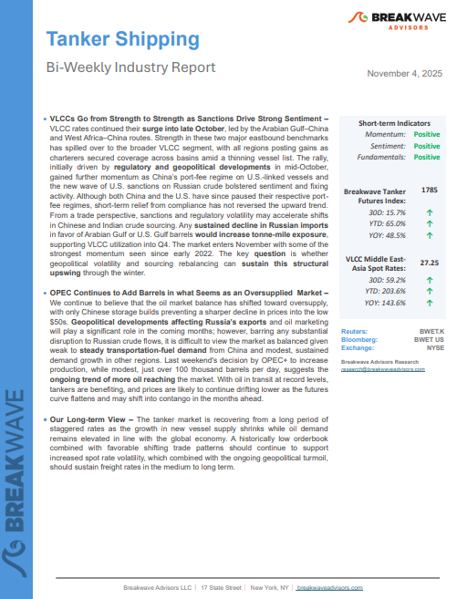
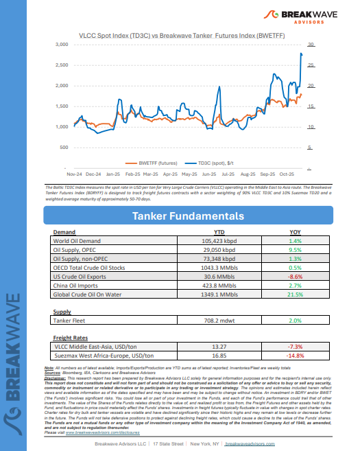
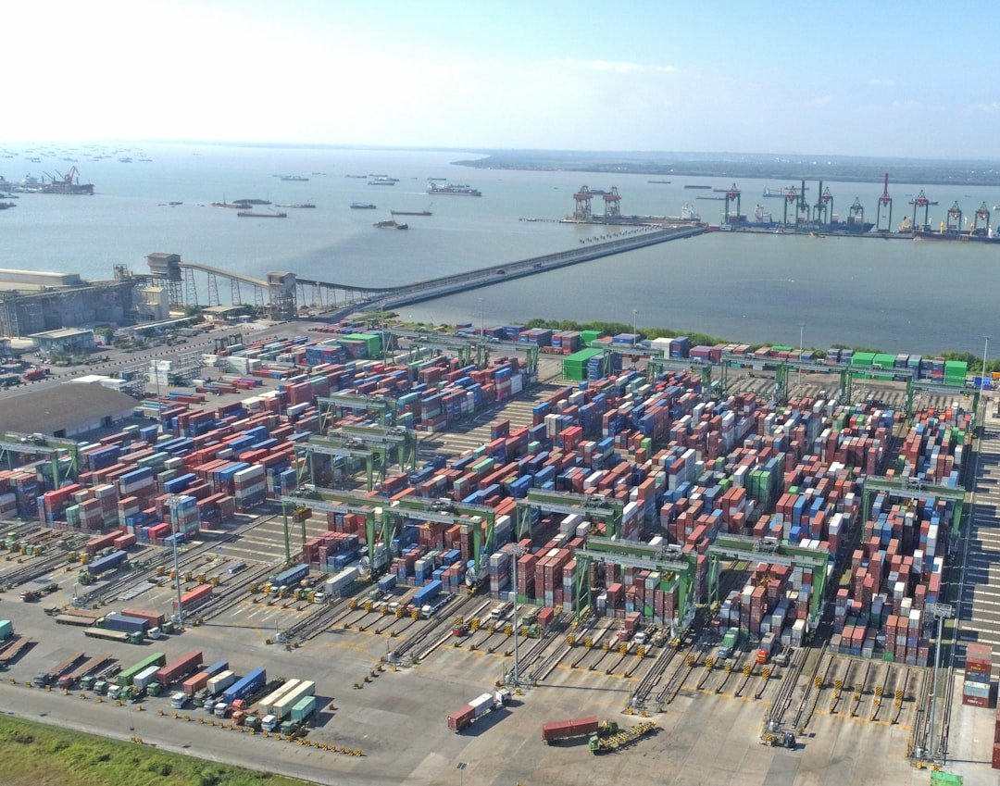

# Breakwave Weekend Read

**Date:** November 07, 2025  
**Publisher:** Breakwave Advisors | **Category:** Market Insights  
**Original URL:** [https://www.breakwaveadvisors.com/insights/2025310-weekly-gytlo115-xhbxa-ycgyh](https://www.breakwaveadvisors.com/insights/2025310-weekly-gytlo115-xhbxa-ycgyh)  

---

## Welcome Tobreakwave Advisorsweekend Read

***As the week comes to a close, take a moment to review the key insights from the past few days. Missed something? We've gathered all the top insights for you to catch up at your convenience.***

## Breakwave Shipping Report

**VLCCs Go from Strength to Strength as Sanctions Drive Strong Sentiment**– VLCC rates continued their**surge into late October**, led by the Arabian Gulf–China and West Africa–China routes.

[Read More](https://www.breakwaveadvisors.com/insights/2025114wetreport5kji24-kk875)

> **Figure 1: Στιγμιότυπο Οθόνης 2025 11 05 144806**  
> **Interactive Data & Source:** [Breakwave Advisors Market Insights](https://www.breakwaveadvisors.com/insights/2025/11/3/stability-rather-than-reconciliation) | [Local Asset](file:///C:/Users/Dell/Github/Shipping/corpus/03-breakwave/insights/2025/assets/2025-11-07_2025310-weekly-gytlo115-xhbxa-ycgyh_img_cea3cf84ceb9ceb3cebcceb9cf8ccf84cf85_55213fda09d7.png)

> **Figure 2: Στιγμιότυπο Οθόνης 2025 11 05 144836**  
> **Interactive Data & Source:** [Breakwave Advisors Market Insights](https://www.breakwaveadvisors.com/insights/2025/11/3/stability-rather-than-reconciliation) | [Local Asset](file:///C:/Users/Dell/Github/Shipping/corpus/03-breakwave/insights/2025/assets/2025-11-07_2025310-weekly-gytlo115-xhbxa-ycgyh_img_cea3cf84ceb9ceb3cebcceb9cf8ccf84cf85_1477199a8694.png)

## Stability Rather Than Reconciliation

> **Figure 3: Unsplash Image Jjcrti0lvts**  
> **Interactive Data & Source:** [Breakwave Advisors Market Insights](https://www.breakwaveadvisors.com/insights/2025/11/3/stability-rather-than-reconciliation) | [Local Asset](file:///C:/Users/Dell/Github/Shipping/corpus/03-breakwave/insights/2025/assets/2025-11-07_2025310-weekly-gytlo115-xhbxa-ycgyh_img_unsplash-image-jjcrti0lvts_f287d11566b3.jpg)

For the global economy, the latest summit offers stability rather than reconciliation, predictability rather than peace.

Doric Weekly Market Insights

## Philippines Dry Bulk Import Matrix - From Coal to Ore

> **Figure 4: Unsplash Image Bshbapilklq**  
> **Interactive Data & Source:** [Breakwave Advisors Market Insights](https://www.breakwaveadvisors.com/insights/2025/11/3/philippines-dry-bulk-import-matrix-from-coal-to-ore) | [Local Asset](file:///C:/Users/Dell/Github/Shipping/corpus/03-breakwave/insights/2025/assets/2025-11-07_2025310-weekly-gytlo115-xhbxa-ycgyh_img_unsplash-image-bshbapilklq_721e7525050e.jpg)

In the first three quarters of 2025, the Philippines imported around 55 mln mt of dry bulk cargo, reflecting a shift in composition rather than a fall in activity.

BRS Weekly Dry Bulk Newsletter

## Oil Gains After OPEC Pauses Production Hikes

> **Figure 5: Unsplash Image Nrfne4ys Bm**  
> **Interactive Data & Source:** [Breakwave Advisors Market Insights](https://www.breakwaveadvisors.com/insights/2025/11/4/oil-gains-after-opec-pauses-production-hikes) | [Local Asset](file:///C:/Users/Dell/Github/Shipping/corpus/03-breakwave/insights/2025/assets/2025-11-07_2025310-weekly-gytlo115-xhbxa-ycgyh_img_unsplash-image-nrfne4ys-bm_b7a99d18907b.jpg)

Renewed supply side issues helped push energy markets higher. Industrial metals were mixed as supply tightness was offset by concerns over weaker economic data.

Commodities Wrap

## Russian Crude Oil Glut Emerging As India Shuns Volumes

> **Figure 6: Unsplash Image 1a1sbme8ovi**  
> **Interactive Data & Source:** [Breakwave Advisors Market Insights](https://www.breakwaveadvisors.com/insights/2025/11/5/russian-crude-oil-glut-emerging-as-india-shuns-volumes) | [Local Asset](file:///C:/Users/Dell/Github/Shipping/corpus/03-breakwave/insights/2025/assets/2025-11-07_2025310-weekly-gytlo115-xhbxa-ycgyh_img_unsplash-image-1a1sbme8ovi_ab058a0cb9cb.jpg)

Russian crude exports are continuing unabated and hit a war-time high of around 3.89 m/bd in October according to Vortexa data.

Braemar Research

## Dry Bulk Fleet Composition in the First Nine Months of 2025

> **Figure 7: Unsplash Image Cy Hgrtdov0k**  
> **Interactive Data & Source:** [Breakwave Advisors Market Insights](https://www.breakwaveadvisors.com/insights/2025/11/5/dry-bulk-fleet-composition-in-the-first-nine-months-of-2025) | [Local Asset](file:///C:/Users/Dell/Github/Shipping/corpus/03-breakwave/insights/2025/assets/2025-11-07_2025310-weekly-gytlo115-xhbxa-ycgyh_img_unsplash-image-cy-hgrtdov0k_18c518ec8e00.jpg)

This week, Allied Quantumsea Research reviews the dry bulk fleet composition for the first nine months of the year, analyzing growth trends across vessel size segments while considering the persistent age-related challenges that hinder shipping's transition to a greener future.

Allied Weekly Report

## In an Oversupplied Oil Market, Who Backs Off First?

> **Figure 8: Στιγμιότυπο Οθόνης 2025 11 06 102537**  
> **Interactive Data & Source:** [Breakwave Advisors Market Insights](https://www.breakwaveadvisors.com/insights/2025/11/6/in-an-oversupplied-oil-market-who-backs-off-first) | [Local Asset](file:///C:/Users/Dell/Github/Shipping/corpus/03-breakwave/insights/2025/assets/2025-11-07_2025310-weekly-gytlo115-xhbxa-ycgyh_img_cea3cf84ceb9ceb3cebcceb9cf8ccf84cf85_869bf91ccef9.png)

OPEC-8 and the Americas have kept crude exports high and markets oversupplied, we take a look at these factors in this insight piece.

Vortexa Freight Weekly

## Sanctions Tickle the Chinese Giants, Favour the Teapots

> **Figure 9: Στιγμιότυπο Οθόνης 2025 11 07 115455**  
> **Interactive Data & Source:** [Breakwave Advisors Market Insights](https://www.breakwaveadvisors.com/insights/2025/11/7/sanctions-tickle-the-chinese-giants-favour-the-teapots) | [Local Asset](file:///C:/Users/Dell/Github/Shipping/corpus/03-breakwave/insights/2025/assets/2025-11-07_2025310-weekly-gytlo115-xhbxa-ycgyh_img_cea3cf84ceb9ceb3cebcceb9cf8ccf84cf85_39718c1293c1.png)

This blog highlights the recent sanctions’ impact on China’s mainstream crude imports.

Vortexa Freight Weekly

## Structural Market Shifts, Not Just Barrels, Powering the Dirty Rally

> **Figure 10: Crude Freight Markets Are Experiencing a Surge**  
> *Crude freight markets are experiencing a surge, which available data suggests is not solely attributable to extended voyages or an oversupply of crude.*  
> **Interactive Data & Source:** [Breakwave Advisors Market Insights](https://www.breakwaveadvisors.com/insights/2025/11/7/structural-market-shifts-not-just-barrels-powering-the-dirty-rally) | [Local Asset](file:///C:/Users/Dell/Github/Shipping/corpus/03-breakwave/insights/2025/assets/2025-11-07_2025310-weekly-gytlo115-xhbxa-ycgyh_img_pexels-bahadir-civan-209659-672460_2498fcc3b388.jpg)

[Read More](https://www.breakwaveadvisors.com/insights/2025/11/7/structural-market-shifts-not-just-barrels-powering-the-dirty-rally)

Signal Ocean Tanker Weekly Market Monitor

---

**Tags:** Shipping, Tankers, Drybulk  
