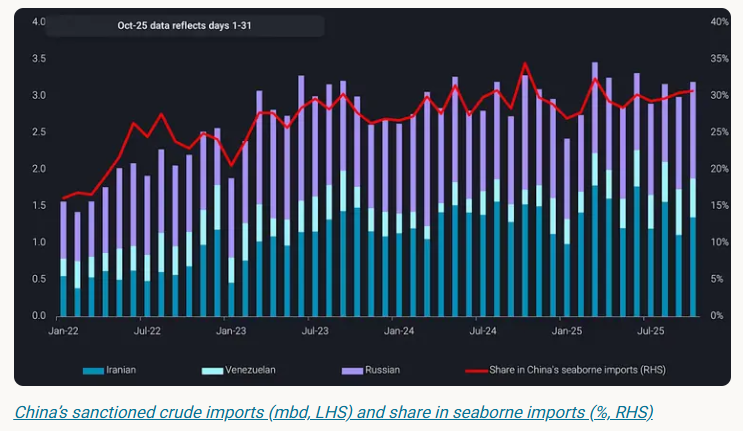
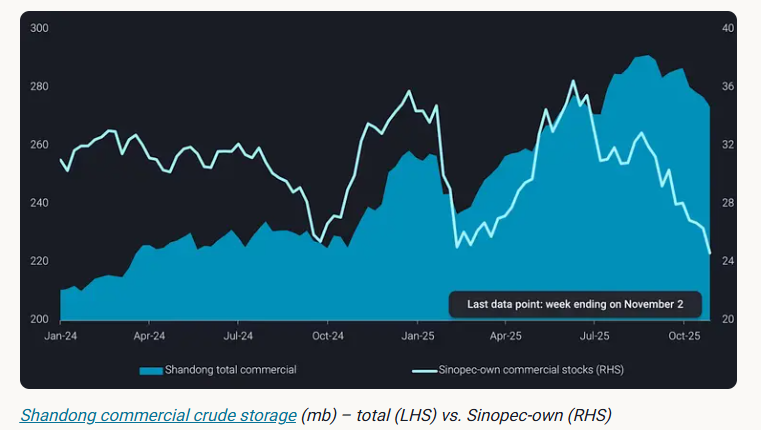
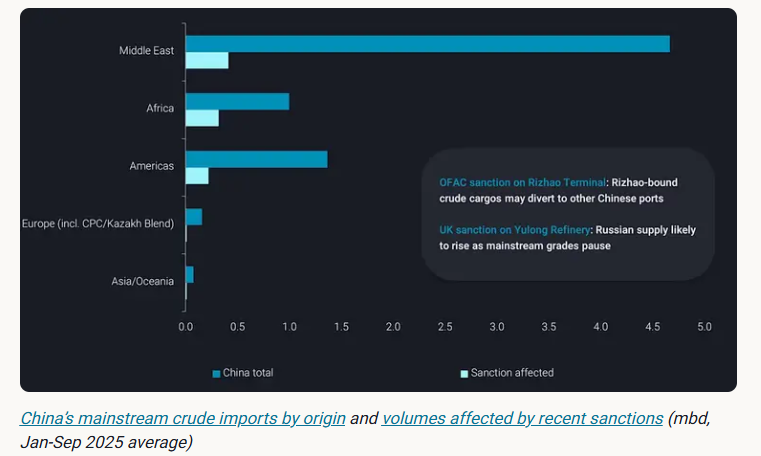
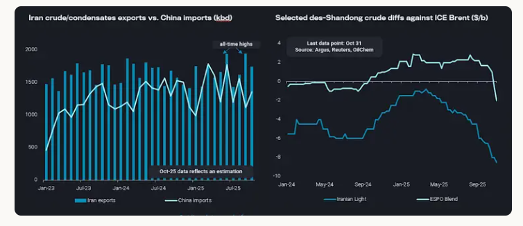

# Sanctions tickle the Chinese giants, favour the teapots

**Date:** November 07, 2025  
**Publisher:** Breakwave Advisors | **Category:** Market Insights  
**Original URL:** [https://www.breakwaveadvisors.com/insights/2025/11/7/sanctions-tickle-the-chinese-giants-favour-the-teapots](https://www.breakwaveadvisors.com/insights/2025/11/7/sanctions-tickle-the-chinese-giants-favour-the-teapots)  

---

This blog highlights the recent sanctions’ impact on China’s mainstream crude imports.

*By*[*Emma Li*](https://www.linkedin.com/in/emma-li-73003443/)

China’s seaborne crude imports rose to 10.4 mbd in October, up 6% m-o-m and 9% y-o-y, as refiners ramped up throughput on improving margins. In particular, state-run refiners have increased runs in the second half of the year to capture domestic market share from private refiners and maximise fuel export quota utilisation amid improving margins, leading to[a visible slowdown in onshore crude stockpiles](https://analytics.vortexa.com/OnShoreCrudeInventories?dateRange=2024-01-01T00%3A00%3A00.000Z__2025-11-02T23%3A59%3A59.999Z&hiddenSeries=%5B%22total_capacity%22%5D&onshoreInventoriesLocations=%5B%22b5fafce6e20de2dc307fb7e0b89978ee91a49a7b6ec6f5461daf2633f3c56674%22%2C%220fddbfd0d90bad306a92fcb483a19276f101a5f7f0783363f9f2a9d40c10558d%22%5D&owners=%5B%220378fb82d2401de13a59bd08bb385f1a20adf21e2da07db44a946af23130f729%22%2C%22f78558ef7c9b9f162545a56b330111c274d578a2933f46ec82ee004ca4f449bd%22%2C%225973f00db1db3a658ee24b7e061503949b8c93d845d6f11a8c9ed059b377b3d7%22%2C%229cc2c2bd3dd7dd76abc9c2f444f9f9982f35f1a351d7063b1b10d96b5b5ad930%22%2C%2283752cdf35981ccf2eb235ff37a86354de4b66e32511a822a5442a8f9a636f63%22%2C%22656b4e8dc3c37a0efdd7a38c901d4f215dbcae10c19687c16de1ab8455cf127a%22%2C%22903d7fa5b285c811e1194e6fb82f6556ed6f2f20c8824630d16ae5c27460ba88%22%5D&page=OnShoreCrudeInventories&selectedRegion=%5B%22b5fafce6e20de2dc307fb7e0b89978ee91a49a7b6ec6f5461daf2633f3c56674%22%5D&tabId=8a116b28-21cc-4e42-92d5-7004f6a63918&tankCrude=%5B%22confirmed%22%2C%22probable%22%5D).

> **Figure 1: Στιγμιότυπο Οθόνης 2025 11 07 114926**  
> **Interactive Data & Source:** [Vortexa](https://www.vortexa.com//oil-gas-data-traders-analysts-data-scientists?gclid=Cj0KCQjw8_qRBhCXARIsAE2AtRZKOvMnbilZ_6_91d7huSFFy71pWLrnPwGwOHVzXsmsG-1a1mZnQw8aAt89EALw_wcB&hsa_acc=1782073842&hsa_ad=548425387665&hsa_cam=14746637662&hsa_grp=125038601902&hsa_kw=&hsa_mt=&hsa_net=adwords&hsa_src=g&hsa_tgt=dsa-1431852288425&hsa_ver=3&utm_campaign=%5BCD%5D%20-%20DSA%20-%20EMEA&utm_medium=cpc&utm_medium=ppc&utm_source=google&utm_source=adwords&utm_term=) | [Local Asset](file:///C:/Users/Dell/Github/Shipping/corpus/03-breakwave/insights/2025/assets/2025-11-07_sanctions-tickle-the-chinese-giants-favour-the-teapots_img_cea3cf84ceb9ceb3cebcceb9cf8ccf84cf85_7d2f633d6bb6.png)

Imports of sanctioned crude — barrels from Iran, Venezuela, and Russia — also edged higher during the month. However, buying momentum among private refiners is expected to slow toward year-end as they approach their crude import quota limits. Despite heightened enforcement measures targeting entities across the supply chain, sanctioned crude still accounted for about 30% of China’s seaborne arrivals, underscoring the resilience of private-sector demand and the adaptability of the dark fleet logistics supporting these flows.

## Sanctions Disrupt Mainstream Crude Flows Into China

Recent sanctions on Chinese entities have had a more immediate and tangible impact on mainstream crude logistics than on sanctioned oil flows.

In October, the U.S. OFAC sanctioned Rizhao Shihua Terminal in Shandong — a key import hub for Sinopec, China’s largest state-run refiner — for handling Iranian crude. While Sinopec itself does not import sanctioned barrels, it typically moves about 800kbd of mainstream crude through Rizhao, accounting for roughly 20% of its total import volume.

With the terminal now blacklisted, Rizhao-fed refineries have been drawing down existing crude inventories in Shandong while arranging alternative import routes. As of early November, Sinopec’s commercial storage utilisation in Shandong dropped below 40%, compared with 55–65% at other commercial facilities.

Overall Shandong commercial stocks, however, remain elevated, supported by steady inflows of Iranian crude near year-to-date averages — indicating that the Rizhao sanction has done little to curb Iranian shipments, while mainstream crude logistics faced greater disruption.

> **Figure 2: Στιγμιότυπο Οθόνης 2025 11 07 115058**  
> **Interactive Data & Source:** [Vortexa](https://www.vortexa.com//oil-gas-data-traders-analysts-data-scientists?gclid=Cj0KCQjw8_qRBhCXARIsAE2AtRZKOvMnbilZ_6_91d7huSFFy71pWLrnPwGwOHVzXsmsG-1a1mZnQw8aAt89EALw_wcB&hsa_acc=1782073842&hsa_ad=548425387665&hsa_cam=14746637662&hsa_grp=125038601902&hsa_kw=&hsa_mt=&hsa_net=adwords&hsa_src=g&hsa_tgt=dsa-1431852288425&hsa_ver=3&utm_campaign=%5BCD%5D%20-%20DSA%20-%20EMEA&utm_medium=cpc&utm_medium=ppc&utm_source=google&utm_source=adwords&utm_term=) | [Local Asset](file:///C:/Users/Dell/Github/Shipping/corpus/03-breakwave/insights/2025/assets/2025-11-07_sanctions-tickle-the-chinese-giants-favour-the-teapots_img_cea3cf84ceb9ceb3cebcceb9cf8ccf84cf85_044382cb0a5a.png)

To mitigate the impact, Sinopec has diverted VLCCs to alternative ports such as Tianjin and Zhoushan, where it also operates refining and storage facilities. The oil giant is balancing operations by raising throughput at nearby refineries to offset reduced runs at plants dependent on Rizhao.

Also in October, the UK and EU sanctioned Yulong Petrochemical, a 400kbd private refinery in northern Shandong. Yulong typically sources around 150kbd of Russian Far East ESPO Blend and an additional 200–300kbd of mainstream grades from the Middle East, Atlantic Basin, and Canada (TMX). Following the sanctions, mainstream supplies to the refinery have effectively halted, forcing Yulong to increase Russian crude intake, seek alternative heavy feedstocks such as domestic crude, or curtail run rates.

> **Figure 3: Στιγμιότυπο Οθόνης 2025 11 07 115146**  
> **Interactive Data & Source:** [Vortexa](https://www.vortexa.com//oil-gas-data-traders-analysts-data-scientists?gclid=Cj0KCQjw8_qRBhCXARIsAE2AtRZKOvMnbilZ_6_91d7huSFFy71pWLrnPwGwOHVzXsmsG-1a1mZnQw8aAt89EALw_wcB&hsa_acc=1782073842&hsa_ad=548425387665&hsa_cam=14746637662&hsa_grp=125038601902&hsa_kw=&hsa_mt=&hsa_net=adwords&hsa_src=g&hsa_tgt=dsa-1431852288425&hsa_ver=3&utm_campaign=%5BCD%5D%20-%20DSA%20-%20EMEA&utm_medium=cpc&utm_medium=ppc&utm_source=google&utm_source=adwords&utm_term=) | [Local Asset](file:///C:/Users/Dell/Github/Shipping/corpus/03-breakwave/insights/2025/assets/2025-11-07_sanctions-tickle-the-chinese-giants-favour-the-teapots_img_cea3cf84ceb9ceb3cebcceb9cf8ccf84cf85_77550b4ee892.png)

Combined, the sanctions on Rizhao Terminal and Yulong Petrochemical have disrupted roughly 1mbd of mainstream crude inflows into Shandong. The result has been slower tanker discharges, rising offshore congestion, and tighter VLCC availability for mainstream grades in the near term.

## Too Many Sanctioned Barrels, Too Little Quota Space

While sanctions have not significantly curtailed China’s Iranian crude imports, volumes are increasingly constrained by high onshore inventories in Shandong and tightening import quotas among teapot refiners.

October arrivals rebounded from September’s trough to around 1.3mbd, broadly in line with the YTD average. Meanwhile, Iranian crude exports stayed elevated above 1.7mbd in October, following a record near 2mbd in September. This widening gap—strong outbound flows but constrained Chinese intake—has resulted in a growing build-up of unsold cargoes at sea, exerting renewed downward pressure on delivered-to-Shandong prices.

> **Figure 4: Στιγμιότυπο Οθόνης 2025 11 07 115229**  
> **Interactive Data & Source:** [Vortexa](https://www.vortexa.com//oil-gas-data-traders-analysts-data-scientists?gclid=Cj0KCQjw8_qRBhCXARIsAE2AtRZKOvMnbilZ_6_91d7huSFFy71pWLrnPwGwOHVzXsmsG-1a1mZnQw8aAt89EALw_wcB&hsa_acc=1782073842&hsa_ad=548425387665&hsa_cam=14746637662&hsa_grp=125038601902&hsa_kw=&hsa_mt=&hsa_net=adwords&hsa_src=g&hsa_tgt=dsa-1431852288425&hsa_ver=3&utm_campaign=%5BCD%5D%20-%20DSA%20-%20EMEA&utm_medium=cpc&utm_medium=ppc&utm_source=google&utm_source=adwords&utm_term=) | [Local Asset](file:///C:/Users/Dell/Github/Shipping/corpus/03-breakwave/insights/2025/assets/2025-11-07_sanctions-tickle-the-chinese-giants-favour-the-teapots_img_cea3cf84ceb9ceb3cebcceb9cf8ccf84cf85_63b5dbfdb430.png)

The sharp drop in Russian crude prices, triggered by buying hesitations among Indian refiners and Chinese NOCs, has deepened the pressure on Iranian grades, pushing both Iranian and Russian barrels to two-year price lows by late October. A recovery in des-Shandong prices is likely only once teapot refiners receive new import quotas — typically a 2–3mt batch announced in late November for December consumption, followed by the 2026 quotas usually issued in late December — and other Asian buyers resume Russian crude purchases.

**In summary**, October sanctions have disrupted China’s mainstream crude flows, creating logistical challenges for Chinese NOCs, while teapots remain resilient and benefit from wider discounts. The coming weeks — with new import quotas and potentially wider resumption of Russian crude purchases — will be key in shaping price trends and on-water crude volumes.

Data Source:[Vortexa](https://www.vortexa.com//oil-gas-data-traders-analysts-data-scientists?gclid=Cj0KCQjw8_qRBhCXARIsAE2AtRZKOvMnbilZ_6_91d7huSFFy71pWLrnPwGwOHVzXsmsG-1a1mZnQw8aAt89EALw_wcB&hsa_acc=1782073842&hsa_ad=548425387665&hsa_cam=14746637662&hsa_grp=125038601902&hsa_kw=&hsa_mt=&hsa_net=adwords&hsa_src=g&hsa_tgt=dsa-1431852288425&hsa_ver=3&utm_campaign=%5BCD%5D%20-%20DSA%20-%20EMEA&utm_medium=cpc&utm_medium=ppc&utm_source=google&utm_source=adwords&utm_term=)

---

**Tags:** Tankers, Markets, Shipping  
