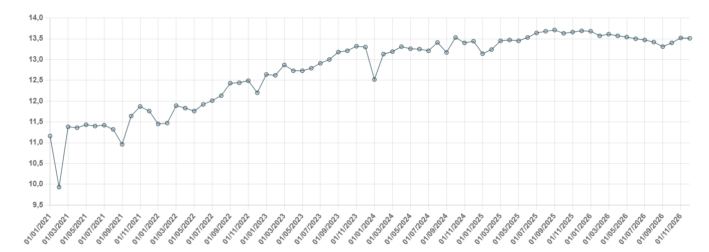

# Trump’s Energy Agenda 2.0

**Date:** November 10, 2025  
**Publisher:** Breakwave Advisors | **Category:** Market Insights  
**Original URL:** [https://www.breakwaveadvisors.com/insights/2025/11/10/trumps-energy-agenda-20](https://www.breakwaveadvisors.com/insights/2025/11/10/trumps-energy-agenda-20)  

---

> **Figure 1: Tankerrr 2**  
> **Interactive Data & Source:** [Gibsons Co](https://www.gibsons.co.uk/market-reports) | [Local Asset](file:///C:/Users/Dell/Github/Shipping/corpus/03-breakwave/insights/2025/assets/2025-11-10_trumps-energy-agenda-20_img_tankerrr-2_89290ba50318.jpg)

Trump’s second presidency started with a strong push to change US environmental policy. Right at the start, the president put in motion the plan to re-exit the Paris Agreement and signed an executive order to “unleash American energy,” which established a framework to encourage domestic energy production and weaken the electric vehicle (EV) mandate.

In the months that followed, federal lands and offshore areas previously off-limits to drilling were reopened for leasing, and several LNG export projects were reapproved. The Interior Department cleared new exploration in Alaska’s Arctic zones, while the Bureau of Land Management simplified environmental reviews for oil and gas projects in the western states. Still, several of these actions are facing ongoing legal challenges from environmental groups, and whilst headlines show US crude production reaching record levels this year, the bigger picture is that growth in output is slowing, with production expected to remain largely flat year-on-year in 2026. Companies remain cautious about spending on the back of lower oil prices and expectations of rising oversupply. The oil rig count declined in August to its lowest level in nearly four years, although a modest uptick has been seen since then. The Energy Information Agency (EIA) has recently warned that new wells are needed in order to sustain (or increase) production levels.

Trump’s administration has also taken several steps targeting vehicle emissions. The Environmental Protection Agency (EPA) is moving to roll back rules finalised in 2024 that require carmakers to sell more electric or low-emission cars from model year 2027 onward, with the process well underway. The National Highway Traffic Safety Administration (NHTSA) has begun relaxing fuel efficiency targets. Separately, the “One Big Beautiful Bill” reduced or cancelled several clean-energy incentives introduced under Biden’s “Inflation Reduction Act.” In particular, tax credits for the purchase of new and used EVs are no longer available after September 30. While the reversal of these policies is being legally challenged on many fronts, the industry response is already visible. Several automakers have slowed their EV rollout plans. For example, General Motors, the largest US carmaker, recently acknowledged it is scaling back its EV ambitions by slowing production at EV plants and shifting investment toward hybrids and gasoline vehicles in response to the changing regulatory framework and weaker demand.

Changes to EV targets are expected to slow the decline in US oil demand. Ernst & Young now expects EVs to account for half of new US car sales by 2038, five years later than initially projected. The decline in US refining runs will also be shallower than previously envisaged, which will have implications for tanker trade. It will reduce US crude export potential, with more barrels retained domestically. At the same time, this will also add an element of support to US crude imports, mainly sourced from the Atlantic Basin. On the products side, stronger runs suggest additional CPP export potential; however, much will depend on underlying domestic demand levels.

Trump’s environmental policy is also reaching beyond domestic borders. The International Energy Agency (IEA) has come under increasing criticism, as Trump’s administration rejects the peak oil demand theory. The agency is due to publish its long-term view of energy markets next week, where it will reintroduce the Current Policies Scenario (CPS), last published in 2019. This scenario reflects only policies already in place, without assuming new measures, announcements, or enhanced targets. The agency will continue publishing its Stated Policies Scenario (STEPS), which goes one step further and includes both implemented policies and officially announced plans or targets that are likely to be implemented.

In the maritime sector, strong US opposition to the IMO’s Net Zero Framework (NZF) was perhaps the key reason why the final vote on the agreed plan has been delayed by twelve months. In the weeks preceding the vote, the Trump administration warned that nations supporting the NZF could face retaliatory measures, including sanctions, visa restrictions, and commercial penalties. As a result, the industry is now facing an increased level of uncertainty – it is unlikely that the framework will be adopted in its current form next year.

To conclude, so far Trump’s policies have clearly offered some support to oil demand, likely delaying the inevitable decline in consumption. In terms of supply, higher demand levels should, in theory, encourage new exploration and investment; however, in reality, market fundamentals remain the key drivers behind investment decisions. Besides, with the exception of short-turnaround projects such as shale, new energy developments have long investment horizons, stretching well beyond the end of Trump’s second presidency.

### Outlook for Us Crude Oil Production (Mbd)

> **Figure 2: Στιγμιότυπο Οθόνης 2025 11 10 111125**  
> **Interactive Data & Source:** [Gibsons Co](https://www.gibsons.co.uk/market-reports) | [Local Asset](file:///C:/Users/Dell/Github/Shipping/corpus/03-breakwave/insights/2025/assets/2025-11-10_trumps-energy-agenda-20_img_cea3cf84ceb9ceb3cebcceb9cf8ccf84cf85_0c7ff492dcc3.png)

Data source:[Gibson Shipbrokers](https://www.gibsons.co.uk/market-reports)

---

**Tags:** Crude, Tankers, Markets  
