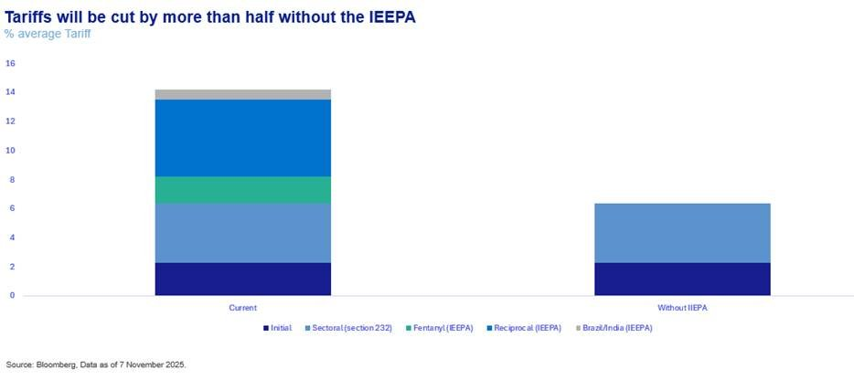
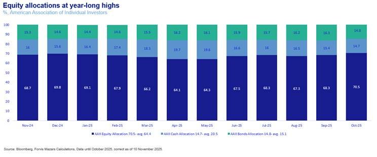
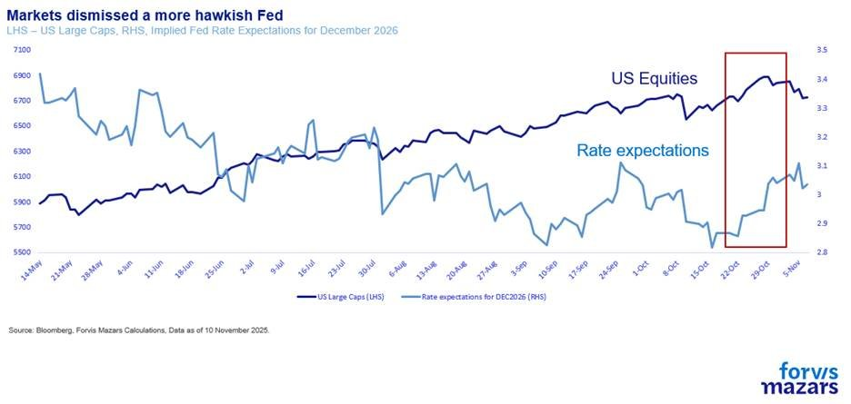
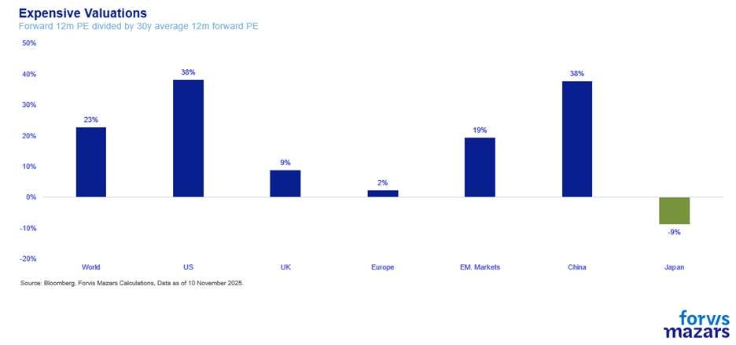
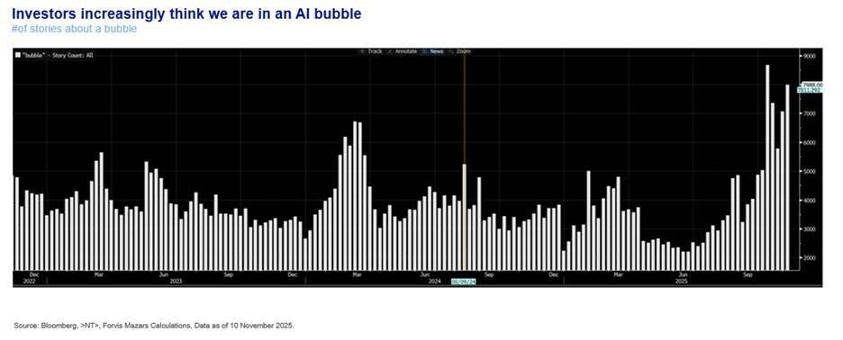
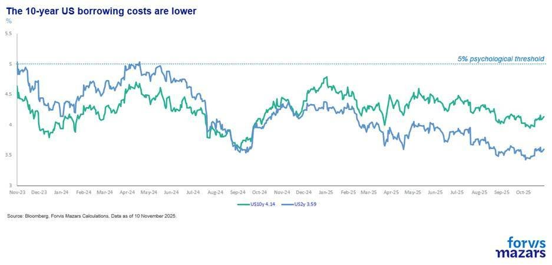

# The geopolitical centre doesn’t hold. Why you should care.

**Date:** November 11, 2025  
**Publisher:** Breakwave Advisors | **Category:** Market Insights  
**Original URL:** [https://www.breakwaveadvisors.com/insights/2025/11/11/the-geopolitical-centre-doesnt-hold-why-you-should-care](https://www.breakwaveadvisors.com/insights/2025/11/11/the-geopolitical-centre-doesnt-hold-why-you-should-care)  

---

The three things investors should know this week

1. The US Supreme Court apparently leans towards dismissing some tariffs, the US and China reached a tentative 1-year deal on trade, while the US government shutdown, so far 40 days long, is closer to ending.
2. A “return to normality” theme is fuelling markets; however, we believe that political, geopolitical and geoeconomic tensions will linger for a long time.
3. We think that in terms of both portfolios and corporate decisions, it is important to find a formula that helps successfully participate in a transforming global economy and, at the same time, remain resilient against uncertainty and possibly more shocks than in the past.

*By*[*George Lagarias*](https://www.linkedin.com/in/george-lagarias-mba-3baa769/)

-----------------------------------

Summary

Markets are happy to acknowledge a US-China trade truce, potential SCOTUS tariff curbs, and a maybe shutdown end, betting on “mean reversion” to stability. Yet history shows that superpower-driven geopolitical tensions don’t de-escalate; they pivot. Investors and boards must abandon hope for a neat mean reversion. Build resilient portfolios and flexible operations to capture AI and global growth upside while stress-tested against shocks. Embrace uncertainty, weigh risks and seize fluid opportunities.

---------------------------------

A pervasive narrative in the past few weeks is the assumed return to some sort of mean. America’s trade truce with China (maybe it will last a year, maybe it will not), puts global trade on a more secure footing. And a possible negative Supreme Court ruling (maybe before the end of the year) would make tariff imposition even harder. The IEEPA (International Emergency Economic Powers Act) tariffs account for nearly 2/3 of all tariff income, and, if they are stricken down, it could force the government to return c/ $140bn to importers.

> **Figure 1: Market Chart 1**  
> [Local Asset](file:///C:/Users/Dell/Github/Shipping/corpus/03-breakwave/insights/2025/assets/2025-11-11_the-geopolitical-centre-doesnt-hold-why-you-should-care_img_image008_8a387c07c5b0.jpg)

Additionally, at the time of writing, the US government shutdown, the longest in history, was close to ending.

The theme is “Mean Reversion”, a return to some sort of normality as geopolitical reality and the rule of law limit the governments’ ability and appetite to exacerbate geopolitical and geoeconomic uncertainty. Markets, emboldened by strong corporate earnings (82% of companies beat earnings expectations), bulls argue, can afford to be more optimistic as the US President’s disruptive impetus is grinding down.

Thucydides, the Greek historian, would probably scoff at the notion. While themes don’t necessarily play out very quickly, clashes between rival superpowers are inevitable. Athens-Sparta, Carthage-Rome, England/Britain-France, Byzantium-Ottoman Empire, and Germany-Russia are just some of the world’s inevitable rivalries that defined history.

More modern rivalries, US-Soviet Union and US-China, which took place in the nuclear deterrent age, saw the definition of a win change and become more complex. With direct confrontation less of an option, the notion of a “hybrid war” has entered the mainstream. The scope is much wider than simple military wins. A superpower may emerge without a shot, if it gains significant technological, economic, and financial advantages, especially if it is backed by a moral high ground and a strong military. The 20th-century American Empire proved as much.

The US and China are simply locked in this struggle, and the mindset is clear: winning is everything.

We would, thus, be less supportive of the idea that an adverse SCOTUS decision (which is not guaranteed at all, as the President is usually allowed a very wide berth), or the temporary trade truce with China justify optimism about trade and economic stability. If the White House seeks geopolitical advantage by launching trade wars, then a legal roadblock would simply force the administration to seek out other, more complicated routes towards the same result. It would take a clear win or an undeniable economic catastrophe to change route, and still, it might be difficult to do so.

What makes the present US-China rivalry more complicated than ever before is that for the first time in history, the two rival superpowers have become economically co-dependent. The US might be trying ot wean itself off Chinese deflation (partly by agreeing with some OPEC countries to keep energy costs down), but it still needs rare earths and soybean demand as desperately as China needs the world’s biggest consumer market to remain open and absorb some of its manufacturing overcapacity.

As for the trade truce? It is simply time to rethink and reposition some pawns.

Yet, equity allocations are at year-long highs.

> **Figure 2: Market Chart 2**  
> [Local Asset](file:///C:/Users/Dell/Github/Shipping/corpus/03-breakwave/insights/2025/assets/2025-11-11_the-geopolitical-centre-doesnt-hold-why-you-should-care_img_image011_79539cfbcba3.jpg)

And equity markets seem to eagerly dismiss a more hawkish Fed.

> **Figure 3: Market Chart 3**  
> [Local Asset](file:///C:/Users/Dell/Github/Shipping/corpus/03-breakwave/insights/2025/assets/2025-11-11_the-geopolitical-centre-doesnt-hold-why-you-should-care_img_image012_b2efdd5d62c9.jpg)

> **Figure 4: Even As Valuations Are Expensive**  
> [Local Asset](file:///C:/Users/Dell/Github/Shipping/corpus/03-breakwave/insights/2025/assets/2025-11-11_the-geopolitical-centre-doesnt-hold-why-you-should-care_img_image013_b75e9fe3d150.jpg)

and worries about an AI-stock bubble grow louder.

> **Figure 5: Source: Bloomberg**  
> *Source: Bloomberg, # of stories about a “bubble”*  
> [Local Asset](file:///C:/Users/Dell/Github/Shipping/corpus/03-breakwave/insights/2025/assets/2025-11-11_the-geopolitical-centre-doesnt-hold-why-you-should-care_img_image014_b66cb5fdff3b.jpg)

The US 10-year Treasury, which was just a few weeks ago at the epicentre of global news as an asset endangered in the age of debt, is not yielding 5% but a relatively benign 4% and, if anything, it is on a downward trajectory since January.

> **Figure 6: Market Chart 6**  
> [Local Asset](file:///C:/Users/Dell/Github/Shipping/corpus/03-breakwave/insights/2025/assets/2025-11-11_the-geopolitical-centre-doesnt-hold-why-you-should-care_img_image015_afe917cfecc6.jpg)

Are markets being too complacent? Are they so well-equipped to see through the noise that none of this matters?

### What Does a Fractured Geopolitical Landscape Mean for Investors and Businesses?

Investors' mindsets are trained to focus on economic data and corporate earnings. Earnings are good, and economic data are not signalling danger (expect some surprises when the US government shutdown officially ends). But markets and economic think tanks have a poor track record in predicting recessions. Markets don’t forecast the future as much as they project an average consensus version of the current state of affairs into the future. There are limits to what portfolio managers can do. Even if there are asset allocators prescient enough to see a higher probability of systemic risks materialising, they still have the dilemma of going with their gut instinct, risking medium-term underperformance, or following the present market trend and hoping they are informed enough to be first out of the door when a crisis erupts. “Markets can stay irrational longer than you can stay solvent” John Maynard Keynes (allegedly) said. Michael Burry, the market guru who bet heavily on the subprime mortgage collapse in 2007-2008 (and is now shorting Nvidia and Palantir), was almost insolvent by the time his bet finally paid off. A few more weeks, and we might have never heard of him. It’s the stuff of movies, but only very risky investors behave like that. And a lot fail completely. The best course for most money managers, especially those entrusted with other people’s savings, is to create portfolios that will benefit their owners on the upside, but be**resilient**enough to allow for adjustments in case a sharp downside occurs.

**Corporate boards**should think along similar lines.**Resilience remains key.**They need to train their organisation for flexibility and the forward-thinking needed to benefit from the upside of the global economy and the promises of the fifth industrial revolution, while at the same time building on strengths to create the necessary resilience to withstand shocks.

The Second Law of Thermodynamics suggests that perfect order is only possible momentarily, and that disorder is, for most of the time, dominant. Instead of waiting for the world to be reordered to its pre-disruption mean, investors and businesses would do a lot better if they embrace the geopolitical and geoeconomic uncertainty, weigh and prepare for risks, but always, always, remember to seek opportunity in fluidity.

---

**Tags:** Macro, Economy, Markets  
