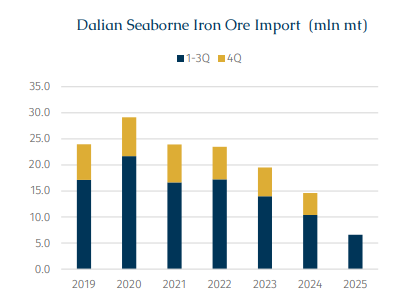
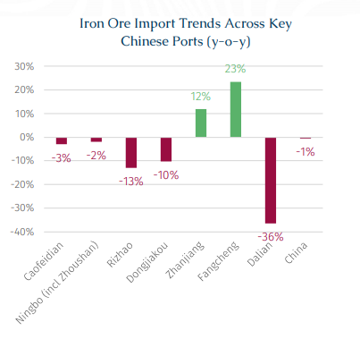
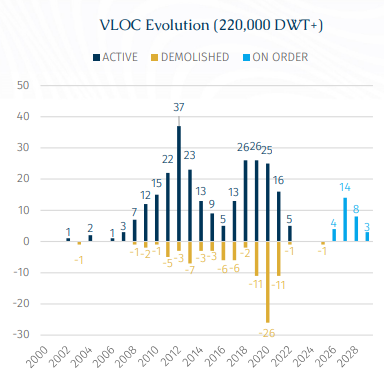

# Transformation of China’s Iron Ore Arrivals

**Date:** November 12, 2025  
**Publisher:** Breakwave Advisors | **Category:** Market Insights  
**Original URL:** [https://www.breakwaveadvisors.com/insights/2025/11/12/transformation-of-chinas-iron-ore-arrivals](https://www.breakwaveadvisors.com/insights/2025/11/12/transformation-of-chinas-iron-ore-arrivals)  

---

> **Figure 1: Rgb Color Brs Shipbrokers Monogram L**  
> [Local Asset](file:///C:/Users/Dell/Github/Shipping/corpus/03-breakwave/insights/2025/assets/2025-11-12_transformation-of-chinas-iron-ore-arrivals_img_rgb-color-brs-shipbrokers-monogram-l_c365f35f1de5.png)

On 27 October, the 324,972 Dwt bulk carrier SM GEMINI1 on completing a voyage from Brazil, berthed at the second Dongjiakou Port iron ore terminal, Qingdao, thereby marking the commissioning this 400,000-ton ore terminal, which began construction in December 2022. Dongjiakou thus became the second port, after Zhoushan, to have a dual 400,000-ton ore terminal configuration, and the first in northern China.

In its never-ending quest to achieve economies of scale, the shipping market has continuously pursued vessel enlargement, giving birth to 400,000 Dwt Valemax bulk carriers, specifically designed to transport long-haul iron ore from Brazil to China. Meanwhile, this has also driven upgrades and expansions at numerous Chinese ports, Since the first 400,000-ton ore carrier was handled at Dongjiakou in 2015, the terminal’s capacity has approached saturation. According to port data, in 2024, the terminal handled over 40 mln mt of dry cargo, with berth utilization reaching 90%. With the commissioning of the second terminal, the port will add an annual throughput capacity of 16 mln mt, leading to a combined annual throughput of over 56 mln mt, effectively eliminating potential logistical bottlenecks, and thus providing stable supply assurance to steel mills, especially those in northern China.

The latest development of the new 400,000-Dwt iron ore terminal has drawn attention not only for its engineering scale but also for what it symbolizes: the gradual restructuring of iron ore arrivals among Chinese ports. While most players, understandably, tend to view China as a single, massive demand center, the reality is far from different, as its import structure and regional distribution are evolving in meaningful ways that will reshape shipping patterns in the years ahead.

According to AXSMarine data, China imported 923 mln mt of iron ore via sea in the first three quarters of 2025, down only 5 mln mt or 0.5% y-o-y, a relatively stable figure suggesting steady overall supply. However, a closer look reveals that the gains are not evenly distributed across all its ports. Dalian, once a key gateway for iron ore into northern China, has recorded a notable decline in imports this year. The data show that Dalian imported 6.6 mln mt of iron ore in the first three quarters of 2025, down 36% year-on-year. This change reflects more than just short-term fluctuations. It highlights how domestic supply, infrastructure adjustments, and regional demand centers are collectively redefining seaborne iron ore receipts within the country.

> **Figure 2: Στιγμιότυπο Οθόνης 2025 11 12 133531**  
> [Local Asset](file:///C:/Users/Dell/Github/Shipping/corpus/03-breakwave/insights/2025/assets/2025-11-12_transformation-of-chinas-iron-ore-arrivals_img_cea3cf84ceb9ceb3cebcceb9cf8ccf84cf85_419e20fa5f11.png)

The shift is closely tied to China’s ongoing efforts to enhance self-sufficiency and optimize logistics under national schemes such as the “Cornerstone” program, which encourages greater utilization of domestic iron ore. Dalian, once an important gateway for Ansteel to secure overseas iron ore resources, is now facing a decline in imports as the company’s local ore exploration and mining activities progress smoothly. Meanwhile, Zhanjiang and Fangcheng ranked among the top in terms of annual growth, with throughput rising by 12% and 23%, respectively, across the first three quarters. This reflects the broader trend of Chinese steel mills expanding their presence in the southern regions of Guangxi and Guangdong.

> **Figure 3: Στιγμιότυπο Οθόνης 2025 11 12 133540**  
> [Local Asset](file:///C:/Users/Dell/Github/Shipping/corpus/03-breakwave/insights/2025/assets/2025-11-12_transformation-of-chinas-iron-ore-arrivals_img_cea3cf84ceb9ceb3cebcceb9cf8ccf84cf85_1d4ebf329090.png)

In this context, Dongjiakou’s newly commissioned 400,000-Dwt terminal marks a critical milestone and enhance the competitiveness of iron ore imports in North China, potentially slowing the ongoing southward shift of import ports.

As the largest bulk carriers currently in operation worldwide, the VLOC fleet (above 220,000 Dwt) consists of 261 vessels with an average age of 10.2 years. In addition, 28 VLOCs are scheduled for delivery over the next four years. Although larger vessels mean lower freight per ton, their use is constrained by China’s limited number of ultra-large iron ore terminals. In response, Vale adopted a solution of building an ore blending and transshipment center in Teluk Rubiah, Malaysia where Brazil–China Valemax shipments will be split onto Capesizes for shorter-haul hauls into China.

Now, with more 400,000-Dwt terminals coming online in China, this solution may not be required to such an extent. Direct shipments from Brazil to China could become more frequent, potentially improving efficiency and further reduced voyage costs (on the Brazil–China route, VLOCs are conservatively estimated to offer an average freight cost advantage of around $3/t compared with Capesizes). However, from a shipping perspective, this might also lead to fewer short-haul Capesize voyages between Teluk Rubiah and Chinese ports, subtly reshaping the ton-mile demand structure in the Pacific basin. In 2024, a total of 9.2 mln mt of iron ore were shipped from Teluk Rubiah to China (representing 56% of Teluk Rubiah’s total iron ore export), all carried by Capesizes (172,000–185,000 DWT). Correspondingly, Teluk Rubiah imported a total of 18.8 mln mt of iron ore from Brazil in 2024, with vessel sizes ranging from 300,000 to 400,000 Dwt.

> **Figure 4: Στιγμιότυπο Οθόνης 2025 11 12 133549**  
> [Local Asset](file:///C:/Users/Dell/Github/Shipping/corpus/03-breakwave/insights/2025/assets/2025-11-12_transformation-of-chinas-iron-ore-arrivals_img_cea3cf84ceb9ceb3cebcceb9cf8ccf84cf85_8f5d94ef2e23.png)

In short, China’s iron ore import story is no longer just about volume, the forward narrative is all about optimizing distribution and efficiency. The completion of port infrastructure projects will undoubtedly further enhance the competitiveness of imported iron ore and expand its reach within the Chinese market, thereby supporting stronger import capability. However, as more large vessels such as Valemaxes are now able to call directly at Chinese ports, the need for transshipment shall diminish, which in turn weighs on the smaller Capesize segment. With the development of ultra-large terminals and China’s ongoing efforts to strengthen domestic mines and its overseas equity mines under its resource security policy, shifts in seaborne trade patterns are expected and warrant close attention.

---

**Tags:** Drybulk, China, Ironore  
