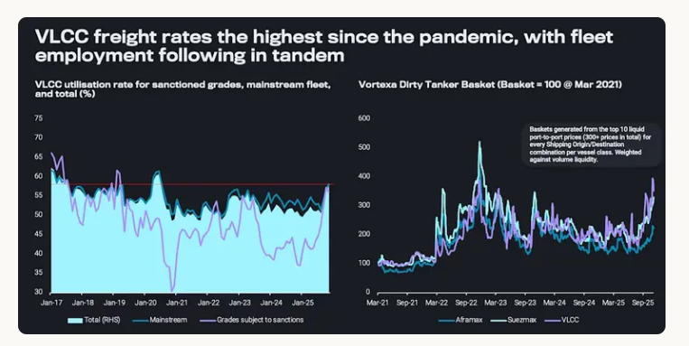
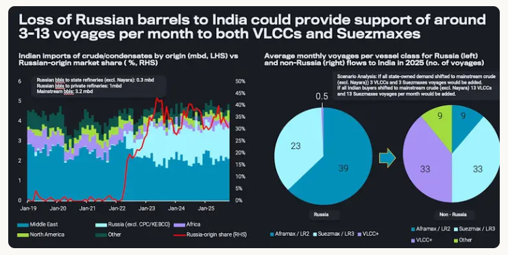

# Is the dirty tanker rally coming to an end?

**Date:** November 13, 2025  
**Publisher:** Breakwave Advisors | **Category:** Market Insights  
**Original URL:** [https://www.breakwaveadvisors.com/insights/2025/11/13/is-the-dirty-tanker-rally-coming-to-an-end](https://www.breakwaveadvisors.com/insights/2025/11/13/is-the-dirty-tanker-rally-coming-to-an-end)  

---

Direct effects from sanctions on Russian entities will protract voyages durations and support mainstream demand, keeping Q4 dirty rates robust.

*By*[*Ioannis Papadimitriou*](https://www.linkedin.com/in/ipapadimitriou/)

The dirty tanker market continues to ride strong momentum, supported by a[surge in oil on water](https://analytics.vortexa.com/InsightsHubPage?articleId=66zvz2hvCYAikSAJWxdkr7&articleType=report&categoryFilters=%5B%22report%22%5D&page=InsightsHubPage&searchTerm=&tabId=a4536c5a-652f-4e3a-abca-f6fed53814d1&topicFilters=%5B%22freightshipping%22%5D),[a divergence between laden and ballast speeds](https://analytics.vortexa.com/InsightsHubPage?articleId=5wdAL42GantN0izcxA0uLI&articleType=highlight&categoryFilters=%5B%22highlight%22%2C%22article%22%5D&page=InsightsHubPage&searchTerm=&tabId=a4536c5a-652f-4e3a-abca-f6fed53814d1&topicFilters=%5B%22freightshipping%22%5D), and an uptick in long-haul voyages heading East. At the forefront of this strength are the VLCCs, which remain the clear leaders in the current market rally.

VLCC utilisation now stands at around 57% — the highest level since 2020, when the price shock triggered a floating storage boom. Employment has been robust across both sanctioned and non-sanctioned grades, underscoring the market's buoyancy.

Freight rates tell a similar story. VLCC rates are hovering near their strongest levels since 2020, though they have recently eased by[about 20% from last week’s highs](https://analytics.vortexa.com/AnywhereFreightPricing?page=AnywhereFreightPricing&routes=%5B%222ef1b342-454e-47d0-8c09-f9ec8cad6e33-1%22%2C%22e981bd2e-943a-47ae-9fc8-fa5d575bffb2-2%22%2C%2298b7b3f8-b051-431a-82af-f45a67ba9257-2%22%2C%22a31d1c67-e9c1-4cd2-a36e-7a41249d87f6-2%22%5D&routesSelected=%5B0%2C1%2C2%2C3%5D&tabId=693f3224-be92-4532-9bb8-95ed4d551e94&timeSeriesDateRange=6-months). Is this signaling the beginning of the end for the dirty tanker freight rate rally?

> **Figure 1: Στιγμιότυπο Οθόνης 2025 11 13 153222**  
> **Interactive Data & Source:** [Vortexa](https://www.vortexa.com//oil-gas-data-traders-analysts-data-scientists?gclid=Cj0KCQjw8_qRBhCXARIsAE2AtRZKOvMnbilZ_6_91d7huSFFy71pWLrnPwGwOHVzXsmsG-1a1mZnQw8aAt89EALw_wcB&hsa_acc=1782073842&hsa_ad=548425387665&hsa_cam=14746637662&hsa_grp=125038601902&hsa_kw=&hsa_mt=&hsa_net=adwords&hsa_src=g&hsa_tgt=dsa-1431852288425&hsa_ver=3&utm_campaign=%5BCD%5D%20-%20DSA%20-%20EMEA&utm_medium=cpc&utm_medium=ppc&utm_source=google&utm_source=adwords&utm_term=) | [Local Asset](file:///C:/Users/Dell/Github/Shipping/corpus/03-breakwave/insights/2025/assets/2025-11-13_is-the-dirty-tanker-rally-coming-to-an-end_img_cea3cf84ceb9ceb3cebcceb9cf8ccf84cf85_7276eb1bbb6b.png)

Vessel availability has tightened notably. The current build-up in oil on water and a series of discharge delays linked to new regulatory and sanction-related complications. From USTR and China’s Special Port fees to Rizhao and Yulong sanctions, the factors have all constrained available tonnage.

That said, the direct impact of the latest sanctions on Russian entities will likely materialise following the 21st of November, extending voyage distances and keeping more dark fleet/sanctioned tonnage tied up. This is occurring at a point where increasingly more vessels are transitioning from the mainstream to the dark fleet — a move that is difficult to reverse and effectively reduces available tonnage for compliant trades. On the vessel demand side, buyers of Russian barrels are reportedly shifting towards mainstream grades, some of which involve long-haul trades from the Americas.

> **Figure 2: Στιγμιότυπο Οθόνης 2025 11 13 153231**  
> **Interactive Data & Source:** [Vortexa](https://www.vortexa.com//oil-gas-data-traders-analysts-data-scientists?gclid=Cj0KCQjw8_qRBhCXARIsAE2AtRZKOvMnbilZ_6_91d7huSFFy71pWLrnPwGwOHVzXsmsG-1a1mZnQw8aAt89EALw_wcB&hsa_acc=1782073842&hsa_ad=548425387665&hsa_cam=14746637662&hsa_grp=125038601902&hsa_kw=&hsa_mt=&hsa_net=adwords&hsa_src=g&hsa_tgt=dsa-1431852288425&hsa_ver=3&utm_campaign=%5BCD%5D%20-%20DSA%20-%20EMEA&utm_medium=cpc&utm_medium=ppc&utm_source=google&utm_source=adwords&utm_term=) | [Local Asset](file:///C:/Users/Dell/Github/Shipping/corpus/03-breakwave/insights/2025/assets/2025-11-13_is-the-dirty-tanker-rally-coming-to-an-end_img_cea3cf84ceb9ceb3cebcceb9cf8ccf84cf85_e971740efd86.png)

Together, these trends form a bullish backdrop for dirty freight. VLCCs and Suezmaxes are well-positioned to capitalize on longer-haul flows to India and China, while Aframaxes should also benefit from reduced competition, both from vessels moving into the dark fleet and from larger ships that captured a share of Atlantic trades earlier in 2025. Thus, short-term freight fundamentals seem to remain firmly on the bullish side.

From 2026, the landscape may begin to shift. Depending on the reactions of Russian crude buyers following the recent sanctions, OPEC+ could reduce exports to prevent oversupply and support prices, just as seasonal demand in Asia begins to soften. This could lead to a moderation in overall tanker demand,with the surge in supplies from Latin America supporting longer distances. Alternatively, in the case that we see a longer term shift of Russian crude buyers towards non-Russian barrels, fundamental support will be provided to the bigger vessels at the expense of their smaller counterparts.

Data Source:[Vortexa](https://www.vortexa.com//oil-gas-data-traders-analysts-data-scientists?gclid=Cj0KCQjw8_qRBhCXARIsAE2AtRZKOvMnbilZ_6_91d7huSFFy71pWLrnPwGwOHVzXsmsG-1a1mZnQw8aAt89EALw_wcB&hsa_acc=1782073842&hsa_ad=548425387665&hsa_cam=14746637662&hsa_grp=125038601902&hsa_kw=&hsa_mt=&hsa_net=adwords&hsa_src=g&hsa_tgt=dsa-1431852288425&hsa_ver=3&utm_campaign=%5BCD%5D%20-%20DSA%20-%20EMEA&utm_medium=cpc&utm_medium=ppc&utm_source=google&utm_source=adwords&utm_term=)

---

**Tags:** Tankers, Markets, Shipping  
