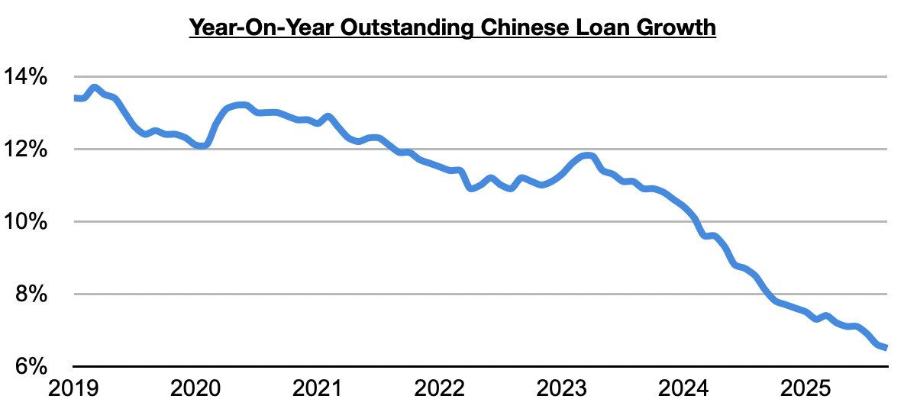
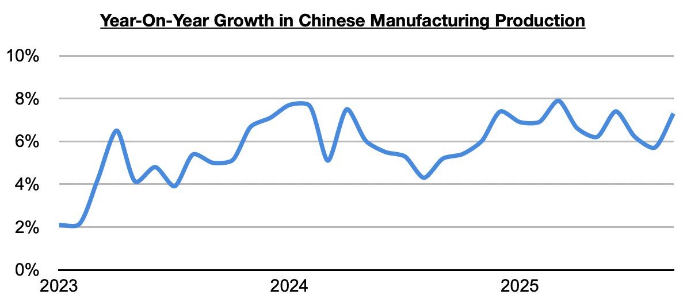

# China's Outstanding Loan Growth Sets Another Record Low

**Date:** November 14, 2025  
**Publisher:** Breakwave Advisors | **Category:** Market Insights  
**Original URL:** [https://www.breakwaveadvisors.com/insights/2025/11/14/chinas-outstanding-loan-growth-sets-another-record-low](https://www.breakwaveadvisors.com/insights/2025/11/14/chinas-outstanding-loan-growth-sets-another-record-low)  

---

*By*[*Jeffrey Landsberg*](https://www.linkedin.com/in/jeffrey-landsberg-70ab957/)

As we discussed for Commodore Research's subscribers earlier this week, Chinese lending data for October has been released and shows that outstanding loan growth came in at 6.5%. This has set another record low (over the last twenty-one months, outstanding loan growth has routinely come in at the lowest level seen since tracking began in 1998). Overall, we remain bullish for China in general -- and we continue to believe that China's central government will be further supporting the economy as the United States has re-entered an easing cycle.

> **Figure 1: Chart 1**  
> [Local Asset](file:///C:/Users/Dell/Github/Shipping/corpus/03-breakwave/insights/2025/assets/2025-11-14_chinas-outstanding-loan-growth-sets-another-record-low_img_chart1_afa579ac3f08.jpg)

Remaining very significant to us is that even with China's outstanding loan growth staying historically low, China's industrial sector has continued to fare well this year as we have continued to stress in Commodore Research's Weekly Executive Reports and Weekly China Reports. Manufacturing production growth, for example, has been flirting with multi-year highs during much of this year and has been strengthening even further in recent months. As we have discussed often in our reports, with China’s housing market remaining inundated with a huge amount of excess supply already available, Chinese banks are continuing to have difficulty in actually having lendees to lend to in the construction market. This remains a drag on loan growth. Fortunately for China's overall economy, though, manufacturing production (which is less capital intensive and requires less lending than construction) has remained strong and continues to help support the overall economy.

> **Figure 2: Chart 2**  
> [Local Asset](file:///C:/Users/Dell/Github/Shipping/corpus/03-breakwave/insights/2025/assets/2025-11-14_chinas-outstanding-loan-growth-sets-another-record-low_img_chart2_d6682d7a2de4.jpg)

---

**Tags:** China, Economy, Markets  
