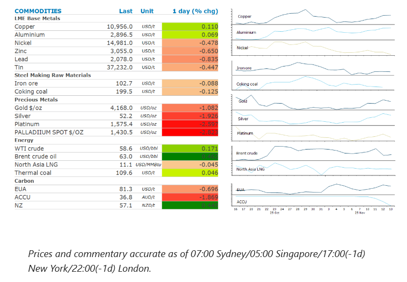
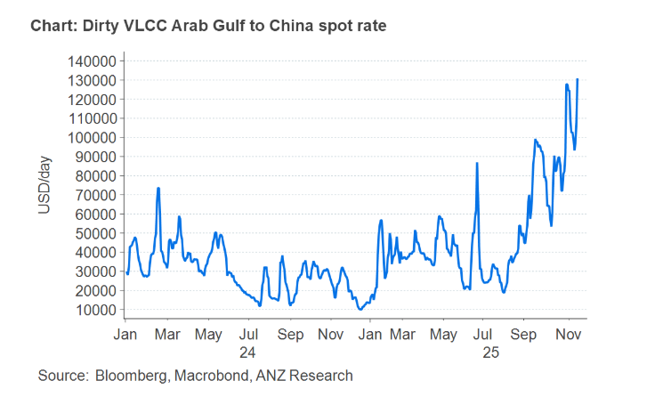

# Gold retreats as market contemplates no Fed rate cut

**Date:** November 14, 2025  
**Publisher:** Breakwave Advisors | **Category:** Market Insights  
**Original URL:** [https://www.breakwaveadvisors.com/insights/2025/11/14/gold-retreats-as-market-contemplates-no-fed-rate-cut](https://www.breakwaveadvisors.com/insights/2025/11/14/gold-retreats-as-market-contemplates-no-fed-rate-cut)  

---

Concerns that a lack of data will keep the Fed from cutting rates weighed on industrial and precious metal markets. Oil edged higher on disruption fears.

*By*[*Daniel Hynes*](https://www.linkedin.com/in/dahynes/)

> **Figure 1: Στιγμιότυπο Οθόνης 2025 11 14 102251**  
> [Local Asset](file:///C:/Users/Dell/Github/Shipping/corpus/03-breakwave/insights/2025/assets/2025-11-14_gold-retreats-as-market-contemplates-no-fed-rate-cut_img_cea3cf84ceb9ceb3cebcceb9cf8ccf84cf85_6c6c12d7ac83.png)

### Market Commentary

**Gold**fell on concerns that soon to be released economic data will not justify further monetary easing by the Fed. US President Donald Trump signed legislation to end the longest government shutdown in history. However, it may take days or even weeks for the federal bureaucracy to fully restart and issue long awaited economic data. Any delays could keep Fed governors relatively cautious. Mary Daly said it’s too early to decide on a December rate cut and she’s maintaining an open mind as she awaits more data. Swaps traders trimmed their bets on a December cut to about 50% from more than 60% earlier this week. That weighed on gold, which tends to perform well in a lower interest rate environment.

**Copper**steadied following a four-day run of gains amid the uncertainty around another rate cut by the US central bank. The metal has rallied more than 25% this year, buoyed by a series of disruptions at some of the world’s biggest mines. However, robust demand from manufacturing and construction sectors are also playing their part.**Aluminium**has also enjoyed strong gains in recent weeks amid concerns that supply may struggle to meet rising demand. China has played an important part in keeping the aluminium market well balanced. However, a self-imposed cap on capacity could hinder its ability to react to changes in demand. Environmental concerns, overcapacity control and industry consolidation drove China’s decision to limit its aluminium smelter capacity to 45mt. It wasn’t expected to reach that level until 2030. However, growth is now expected to tumble with output hitting that limit. This comes amid heightened risks to supply elsewhere. China’s investment in Indonesia is facing several challenges. There are also rising supply risks in existing operations amid mounting energy costs. This could inhibit[**the market’s ability to meet stronger demand**](../pdfs/2025-11-14_gold-retreats-as-market-contemplates-no-fed-rate-cut_commodity-call-aluminium-s-balancing_4ee2242dc79f.pdf)amid an improving macro backdrop. Manufacturing saw growth this year despite trade-induced concerns over economic activity. The construction sector has been supportive too as the energy transition continues to drive investment in infrastructure.

**Iron ore**futures edged lower amid concerns of stronger supply. The market has been fretting about the imminent startup of the Simandou iron ore mines in Guinea. At 10% of global demand at its peak, the mine could swamp the market. Recent trade data shows that current operations are also picking up. Iron ore shipments from Australia including Port Hedland totalled 8.1mt in the week to 31 October, up from 7.5mt in the previous week, according to Bloomberg data.

**Crude oil**prices rebounded late in the session as concerns mounted that US sanctions could offset gains in OPEC supply. The Trump administration has moved to raise the pressure on Russia to end the war in Ukraine by sanctioning Rosneft PJSC and Lukoil PJSC. The trading arm of Lukoil has already started terminating jobs with days to go before the sanctions fully kick in. The company also recently declared force majeure on oil shipments from its giant West Qurna 2 field in Iraq. Sentiment was weighed down earlier in the session after EIA’s weekly inventory report showed that crude oil stockpiles rose by 6.4mbbls last week, their biggest gain since July and much greater than expected.

European gas futures extended recent losses as ample supply eased concerns of shortages. The Netherlands said that despite storage levels being below their target of 80%, the shortfall poses no threat to energy security due to ample supply. North Asia LNG prices were steady as recent losses enticed buyers into the spot market.

### Chart of the Day

Oil tanker rates have climbed to a five year high as rising volumes of crude on the world’s oceans tighten the availability of vessels. The benchmark prices for chartering a ship that can haul 2mbbls of crude from Saudi Arabia to China is up more than USD36k in the last three days to almost USD130k a day. This is the highest level since April 2020. This is likely to result of sanctions on Russian oil producers forcing refiners to buy cargoes from further afield. However, there are also a growing volume of oil at sea eating up the supply.

> **Figure 2: Στιγμιότυπο Οθόνης 2025 11 14 102347**  
> **Interactive Data & Source:** [Linkedin](https://www.linkedin.com/newsletters/commodities-wrap-6692196755876012032/?fbclid=IwAR3kiXJqZdxmp9ZcRwBNI7FsBySI-XSC0pfPur1qzjt7OZp7PTE59Tsl1QI) | [Local Asset](file:///C:/Users/Dell/Github/Shipping/corpus/03-breakwave/insights/2025/assets/2025-11-14_gold-retreats-as-market-contemplates-no-fed-rate-cut_img_cea3cf84ceb9ceb3cebcceb9cf8ccf84cf85_324750c0d925.png)

Data source:[Commodities Wrap](https://www.linkedin.com/newsletters/commodities-wrap-6692196755876012032/?fbclid=IwAR3kiXJqZdxmp9ZcRwBNI7FsBySI-XSC0pfPur1qzjt7OZp7PTE59Tsl1QI)

---

**Tags:** Shipping, Commodities, Markets  
