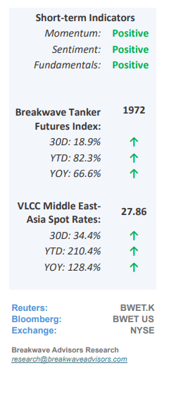
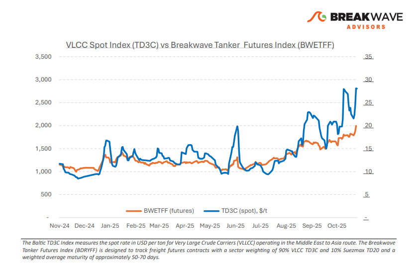
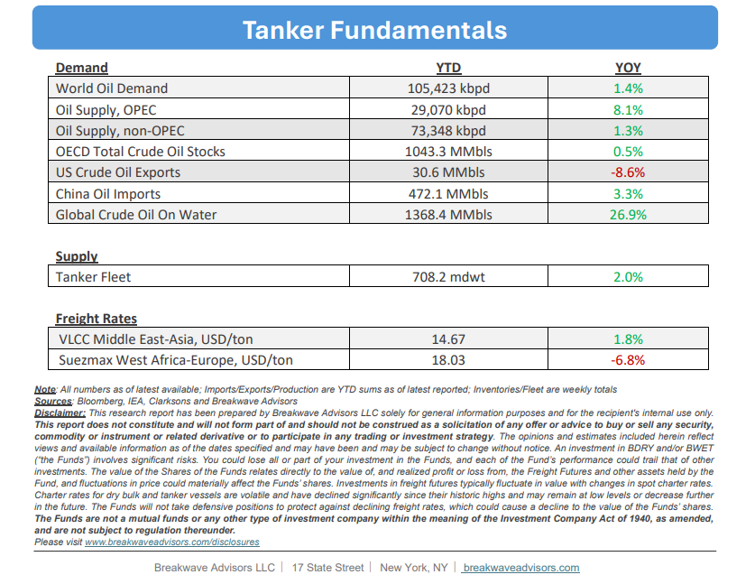

# Breakwave Bi-Weekly Tanker Report - November 18, 2025

**Date:** November 18, 2025  
**Publisher:** Breakwave Advisors | **Category:** Market Insights  
**Original URL:** [https://www.breakwaveadvisors.com/insights/20251118wetreport547lok547](https://www.breakwaveadvisors.com/insights/20251118wetreport547lok547)  

---

•**VLCC Market Overheats as Seasonality Tailwinds Kick in**– The VLCC market extended its**strong upward momentum**into mid-November, with rising enquiry levels driving a decisive tightening across major loading regions. Although the Bahri program briefly softened AG demand early in the month,**activity rebounded quickly**as position lists continued to shrink and sentiment strengthened across all long-haul routes. Shorter lists and stronger owner resistance tightened availability further, while cross-basin rebalancing between the AG and WAF continued to pull prompt tonnage out of the Atlantic.**Macro fundamentals remain firmly constructive.**Global crude supply is holding above 108 mb/d, over 6 mb/d higher than at the start of 2024, with further growth expected through 2025–26. Higher Saudi output and expanded Atlantic-to-Asia flows are lifting VLCC tonne-mile demand and reinforcing freight market resilience.**Sanctions**continue to act as the most significant**structural constraint**. Close to 200 million barrels of crude are currently afloat, roughly one-third of which is tied to sanctioned trades awaiting discharge or diversion. This floating inventory prolongs voyage durations and removes a meaningful share of the fleet from the spot market. Overall, midNovember data points to a market dominated by persistent tonnage scarcity and robust long-haul demand. Strength across all basins suggests that the current**upward trajectory is likely to extend**into December, barring a sharp shift in loading programs or a rapid release of floating barrels back into the commercial fleet.

> **Figure 1: Στιγμιότυπο Οθόνης 2025 11 18 122118**  
> [Local Asset](file:///C:/Users/Dell/Github/Shipping/corpus/03-breakwave/insights/2025/assets/2025-11-18_20251118wetreport547lok547_img_cea3cf84ceb9ceb3cebcceb9cf8ccf84cf85_66d826066001.png)

•**Oil Momentum Loses Steam as Upside Catalysts Remain Scarce**– There has been**little movement**in oil fundamentals as OPPEC continues to supply the market with enough oil to suppress any volatility arising from geopolitical events. The recent**attack on Russian oil exporting facilities**in the Black Sea was quickly dismissed as enough floating storage and oil in transit exists to absorb any potential short-term disruption. We continue to believe**the path of least resistance**is lower, unless a change in OPEC’s stance begins to point to slower supply in the coming months. Demand growth for**transportation fuels****seems stagnant**and while China remains the main area to absorb excess barrels and put them into onshore storage, there is a finite ability to do so. The oil futures curve continues to**slowly move closer to contango**, especially for longer dated contracts, in the process supporting the recent upwards move in freight rates.

•**Our Long-term View**– The tanker market is recovering from a long period of staggered rates as the growth in new vessel supply shrinks while oil demand remains elevated in line with the global economy. A historically low orderbook combined with favorable shifting trade patterns should continue to support increased spot rate volatility, which combined with the ongoing geopolitical turmoil, should sustain freight rates in the medium to long term.

> **Figure 2: Στιγμιότυπο Οθόνης 2025 11 18 122933**  
> [Local Asset](file:///C:/Users/Dell/Github/Shipping/corpus/03-breakwave/insights/2025/assets/2025-11-18_20251118wetreport547lok547_img_cea3cf84ceb9ceb3cebcceb9cf8ccf84cf85_4b4db54c2593.png)

> **Figure 3: Στιγμιότυπο Οθόνης 2025 11 18 122130**  
> [Local Asset](file:///C:/Users/Dell/Github/Shipping/corpus/03-breakwave/insights/2025/assets/2025-11-18_20251118wetreport547lok547_img_cea3cf84ceb9ceb3cebcceb9cf8ccf84cf85_42ce84cb755f.png)

### Subscribe:
