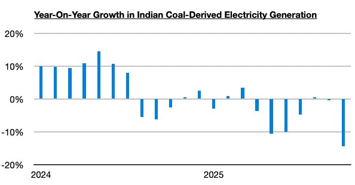
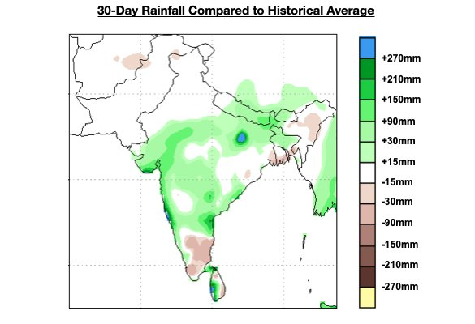
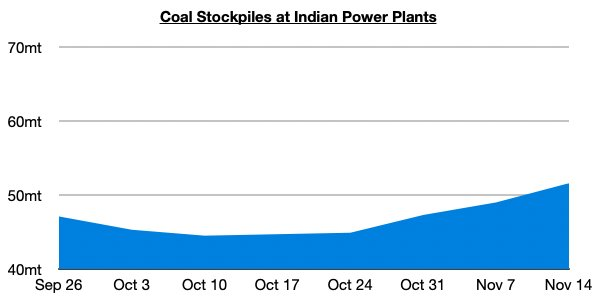
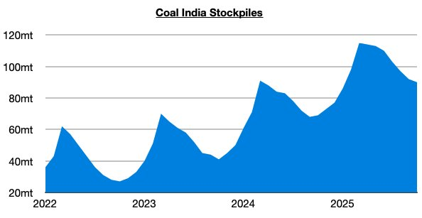

# Indian Coal Remains Longest Running Headwind in Dry Bulk Market This Year

**Date:** November 18, 2025  
**Publisher:** Breakwave Advisors | **Category:** Market Insights  
**Original URL:** [https://www.breakwaveadvisors.com/insights/2025/11/18/indian-coal-remains-longest-running-headwind-in-dry-bulk-market-this-year](https://www.breakwaveadvisors.com/insights/2025/11/18/indian-coal-remains-longest-running-headwind-in-dry-bulk-market-this-year)  

---

*By*[*Jeffrey Landsberg*](https://www.linkedin.com/in/jeffrey-landsberg-70ab957/)

As we discussed at length in Commodore Research's most recent Weekly Executive Report, weakness in India’s coal-derived electricity generation and demand for coal imports has remained the longest sustained headwind in the dry bulk market this year. New more recently, though, is that India’s coal-derived electricity generation has managed to experience its largest year-on-year contraction since 2020.

> **Figure 1: Chart 1**  
> [Local Asset](file:///C:/Users/Dell/Github/Shipping/corpus/03-breakwave/insights/2025/assets/2025-11-18_indian-coal-remains-longest-running-headwind-in-dry-bulk-market-this-year_img_chart1_b0ad367e2cd3.jpg)

Overall, the situation in India continues to worsen. Looking forward, there are no signs that India’s coal-derived electricity generation and coal imports are set to experience growth anytime soon. India's overall economy continues to struggle, and rainfall and hydropower production continue to come in above last year’s levels.

> **Figure 2: Chart 2**  
> [Local Asset](file:///C:/Users/Dell/Github/Shipping/corpus/03-breakwave/insights/2025/assets/2025-11-18_indian-coal-remains-longest-running-headwind-in-dry-bulk-market-this-year_img_chart2_c0f4fd109b9c.jpg)

Power plant and Coal India’s own coal stockpiles both remain up considerably from last year’s levels. Power plant coal stockpiles are now up year-on-year by 41%.

> **Figure 3: Chart 3**  
> [Local Asset](file:///C:/Users/Dell/Github/Shipping/corpus/03-breakwave/insights/2025/assets/2025-11-18_indian-coal-remains-longest-running-headwind-in-dry-bulk-market-this-year_img_chart3_6d221c081a44.jpg)

Coal India's stockpiles are up year-on-year by 30%.

> **Figure 4: Chart 4**  
> [Local Asset](file:///C:/Users/Dell/Github/Shipping/corpus/03-breakwave/insights/2025/assets/2025-11-18_indian-coal-remains-longest-running-headwind-in-dry-bulk-market-this-year_img_chart4_e7de4dc16cc4.jpg)

---

**Tags:** Coal, Shipping, Drybulk  
