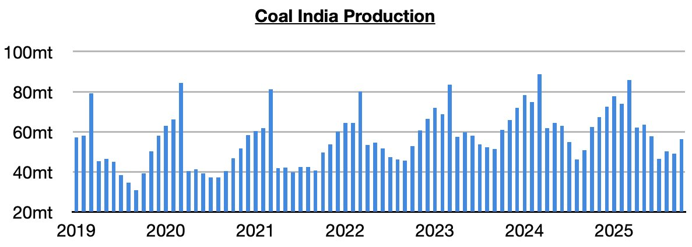
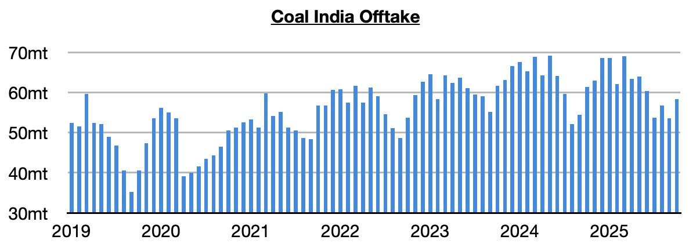
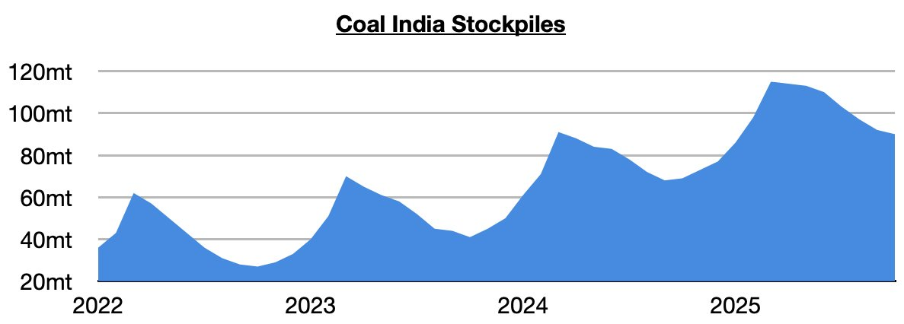

# Another Contraction in Coal India's Production

**Date:** November 21, 2025  
**Publisher:** Breakwave Advisors | **Category:** Market Insights  
**Original URL:** [https://www.breakwaveadvisors.com/insights/2025/11/21/another-contraction-in-coal-indias-production](https://www.breakwaveadvisors.com/insights/2025/11/21/another-contraction-in-coal-indias-production)  

---

*By*[*Jeffrey Landsberg*](https://www.linkedin.com/in/jeffrey-landsberg-70ab957/)

Coal India (which is responsible for over 75% of India’s coal output) produced approximately 56.4 million tons of coal last month. This is up month-on-month by 7.4 million tons (15%) but is down year-on-year by 6.1 million tons (-10%). Coal India’s output has now contracted on a year-on-year basis during eight of the last ten months. However, it has still been faring better than India's coal-derived electricity generation. During the last ten months, Coal India’s output has contracted year-on-year by 3.4% while India’s coal-derived electricity generation contracted by 4.2%.

> **Figure 1: Chart 1**  
> [Local Asset](file:///C:/Users/Dell/Github/Shipping/corpus/03-breakwave/insights/2025/assets/2025-11-21_another-contraction-in-coal-indias-production_img_chart1_30d3a33a24b2.jpg)

Offtake (the amount sent to customers) totaled 58.3 million tons, which is up month-on-month by 4.7 million tons (9%) but down year-on-year by 3.1 million tons (-5%). Offtake has now exceeded production for seven straight months. Previously, it had come in under production for six straight months.

> **Figure 2: Chart 2**  
> [Local Asset](file:///C:/Users/Dell/Github/Shipping/corpus/03-breakwave/insights/2025/assets/2025-11-21_another-contraction-in-coal-indias-production_img_chart2_9a3232b3d8a8.jpg)

Stockpiles have fallen again with offtake again exceeding production. Coal India's stockpiles now stand at approximately 90 million tons. This is 25 million tons (-22%) less than March’s record 115 million tons but is up year-on-year by 21 million tons (30%).

> **Figure 3: Chart 3**  
> [Local Asset](file:///C:/Users/Dell/Github/Shipping/corpus/03-breakwave/insights/2025/assets/2025-11-21_another-contraction-in-coal-indias-production_img_chart3_877e53447df8.jpg)

---

**Tags:** Coal, Shipping, Drybulk  
