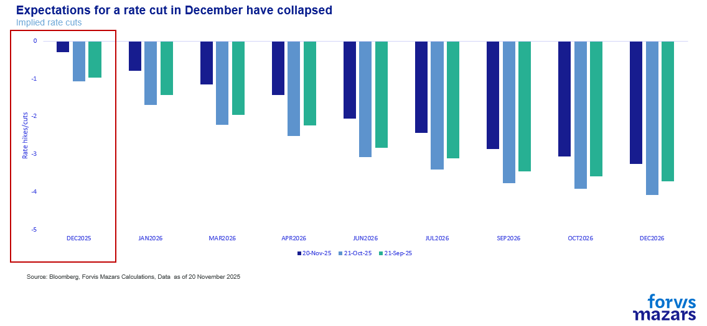
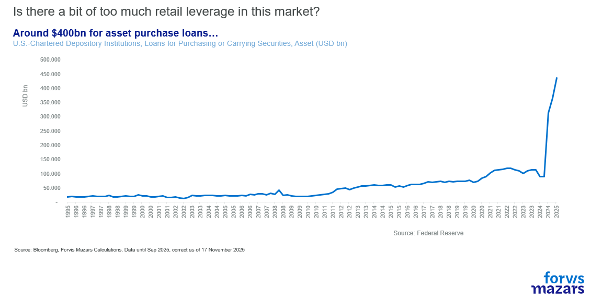
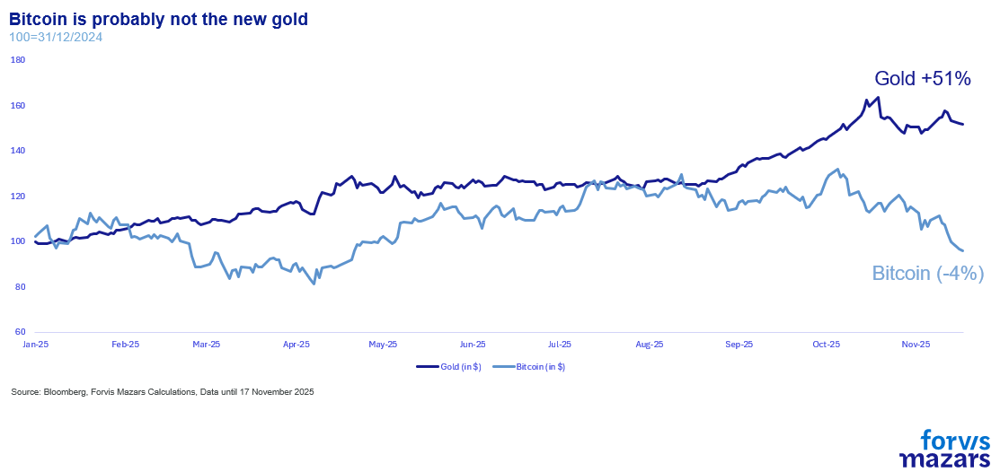
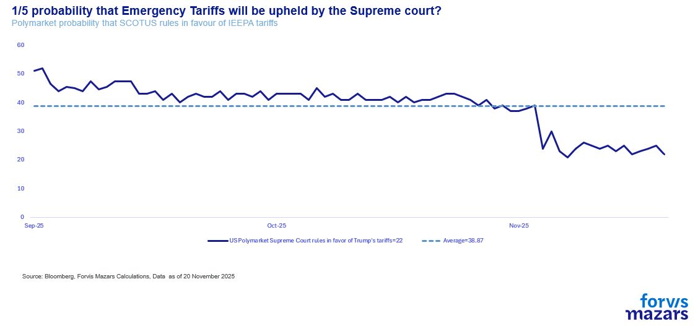
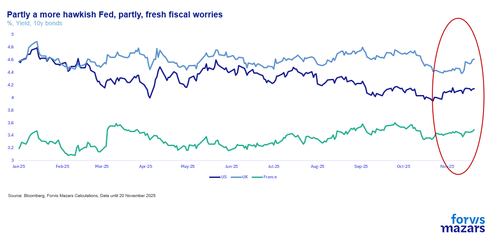
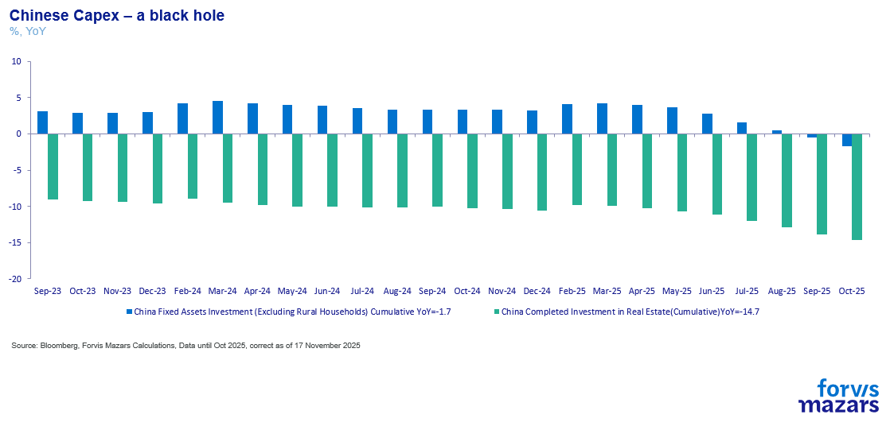
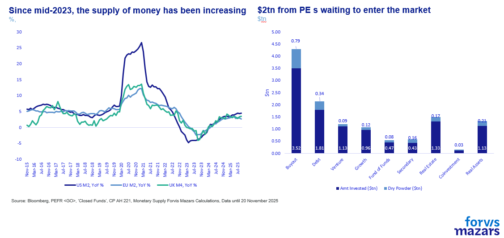
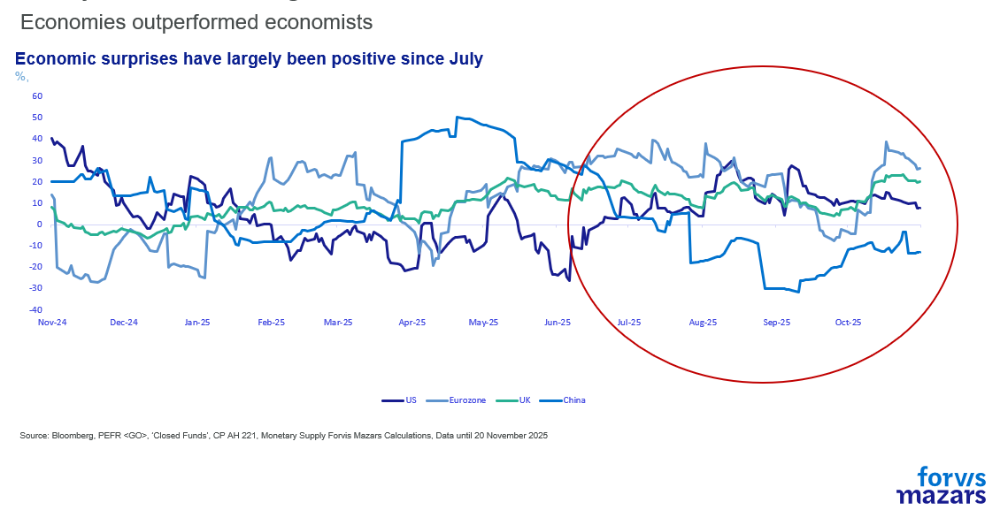
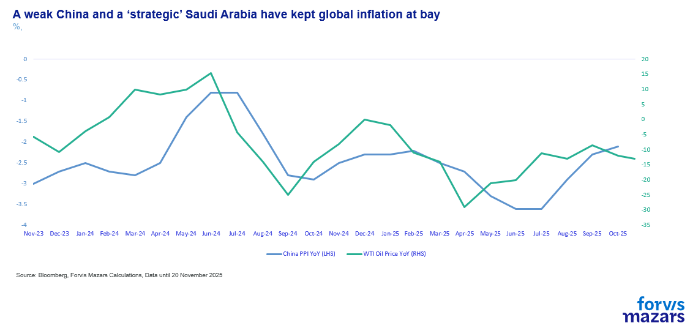

# Is it gravity? Or maybe just a breather?

**Date:** November 21, 2025  
**Publisher:** Breakwave Advisors | **Category:** Market Insights  
**Original URL:** [https://www.breakwaveadvisors.com/insights/2025/11/21/is-it-gravity-or-maybe-just-a-breather](https://www.breakwaveadvisors.com/insights/2025/11/21/is-it-gravity-or-maybe-just-a-breather)  

---

1. Recent market volatility suggests more a ‘breather’ and less a panic
2. The less dovish Fed, tech valuations, private equity, trade uncertainty, fiscal concerns and a weak China are all legitimate concerns.
3. However, market liquidity, earnings exceeding expectations and a generally resilient macro backdrop simply don’t allow us to see the environment that would prompt black swan events to ferment quickly enough to cause systemic issues.

*By*[*George Lagarias*](https://www.linkedin.com/in/george-lagarias-mba-3baa769/)

-------------------------------------------------------

Summary

Markets appear to be pausing rather than entering panic. While risks—from a less-dovish Fed to stretched tech valuations, private-equity stress, fiscal slippage, trade uncertainty and weak Chinese growth—are real, they are broadly understood and already in the narrative. What matters for businesses and investors is the*implication*: despite volatility, the macro backdrop, liquidity conditions, strong earnings and ongoing tech capex cycle do not suggest conditions for a rapid systemic break. The “so what” is that this environment points to consolidation rather than collapse, allowing firms to plan with caution but without assuming an imminent end to the cycle.

-----------------------------------------------------------------

*’You can evade reality, but not the consequences of evading reality’: Ayn Rand, 1957*

*‘The market can stay irrational longer than you can stay solvent’ : John Maynard Keynes, 1936*

September and October, two months which traditionally bring market corrections, saw investors positively radiant. As a result, hopes for the traditional Santa Rally (a late-year bounce back of equities), are fading, as a bounce back usually requires a preceding drop.

After an extended period of market exuberance, gracefully extended by the absence of key US statistical data, investors are now beginning to consider the effects of gravity on their spectacular flight towards ever higher valuations.

### Which Are the Key Areas of Concern?

-The Fed is effectively pouring cold water on hopes for another cut in September. The most interesting quote came from Jeffrey Schmidt, Kansas Fed President, who[suggested](https://www.reuters.com/business/feds-schmid-inflation-is-too-hot-policy-is-where-it-should-be-2025-11-14/)that higher unemployment is a structural issue which the Federal Reserve can’t help, so the board might as well focus on inflation. Adding to concerns, Christopher Waller pre-empted his vote for another rate cut, the second after Stephen Miran, showing that we could see more dissents going in the December meeting. Minutes from the FOMC confirmed that plenty of members were not behind October’s cut either, which makes a December cut a much more difficult proposition.

> **Figure 1: Market Chart 1**  
> **Interactive Data & Source:** [Bloomberg News](https://www.bloomberg.com/news/articles/2025-11-10/blackrock-eyes-100-loss-on-private-loan-amid-debate-over-marks) | [Local Asset](file:///C:/Users/Dell/Github/Shipping/corpus/03-breakwave/insights/2025/assets/2025-11-21_is-it-gravity-or-maybe-just-a-breather_img_image001_04e48f2bc280.png)

-Private Equity concerns. A few days ago, one of BlackRock’s subsidiary private debt funds[marked down](https://www.bloomberg.com/news/articles/2025-11-10/blackrock-eyes-100-loss-on-private-loan-amid-debate-over-marks)its investments by 100%. On Monday, it emerged that the[FBI](assets/2025-11-21_is-it-gravity-or-maybe-just-a-breather_blackrock-unit-flags-suspected-400-1_90b1c9977376.html)was looking into possible fraud in various private debt funds, including one of BlackRock’s. The private investment market, which peaked just before the Fed started hiking rates in 2022, has been gauged as a considerable area of weakness, especially given the difficulty in pricing its assets to market.

-Tech valuations retrenching and some stark warnings, from both the legendary Michael Burry who closed his Scion Hedge fund and from Rotchild’s Alexander Haissl who[bucked](http://bloomberg.com/news/articles/2025-11-18/microsoft-amazon-downgraded-as-redburn-breaks-ranks-with-peers)the trend, declaring Hyperscaler valuations exorbitant, pricing in too many good outcomes, and too few risks.

In a market where we might be seeing a lot of leveraged retail flows, it doesn’t take much of a retrenchment to lead to a correction.

> **Figure 2: Market Chart 2**  
> [Local Asset](file:///C:/Users/Dell/Github/Shipping/corpus/03-breakwave/insights/2025/assets/2025-11-21_is-it-gravity-or-maybe-just-a-breather_img_image002_87fe92ebe20a.png)

-Trades like Bitcoin, Gold, both of which have been the subject of some speculation. Bitcoin, which is at the time of writing negative for the year, has been less useful as a consistent store of value and more as a bellwether for market exuberance. While at $91K its price is still three times higher than its recent trough, it has lost considerable value since the summer. Gold is still pretty high, just north of $4000, but its recent behaviour indicates that some speculation might have been part of the price.

> **Figure 3: Market Chart 3**  
> [Local Asset](file:///C:/Users/Dell/Github/Shipping/corpus/03-breakwave/insights/2025/assets/2025-11-21_is-it-gravity-or-maybe-just-a-breather_img_image003_aa2c67e26298.png)

-Fresh trade uncertainty. Markets hate all manner of uncertainty. Frothy markets even more so. The impending US Supreme Court decision could create fresh uncertainty. If the court decides that the President should not have used the IEEPA (International Emergency Economic Powers Act) to impose tariffs on trade partners, then equity markets are safe from further threats against allies. But bond markets will be rightly worried, especially if the government is forced to pay back roughly $140bn (0.6% of GDP) to importers, as this will increase the deficit by as much. It could also throw existing arrangements into disarray. Without the Damocles’ Sword of exorbitant tariffs hanging over them, the EU, Switzerland, Japan and other Asian countries could ask to renegotiate existing agreements. The White House, meanwhile, will have to turn towards the imposition of product-targeted tariffs. Fresh trade uncertainty, coupled with a widening of the US deficit, could further upset markets.

> **Figure 4: Market Chart 4**  
> [Local Asset](file:///C:/Users/Dell/Github/Shipping/corpus/03-breakwave/insights/2025/assets/2025-11-21_is-it-gravity-or-maybe-just-a-breather_img_image004_a7803127acb9.png)

-Investors are not only focusing on America’s fiscal condition, but also on France and the UK. French governments seem to find it difficult to both bring the deficit under control and remain in power long enough to enforce it. Meanwhile, bond markets seem to be losing patience with the British government's indecision regarding potentially higher taxes (more on that after next week’s budget). Widening deficits are putting pressure on debt markets, which are equally, if not more, important for global financial stability compared to equities. Higher debt costs can affect all companies (listed or not), can increase fiscal strains, exacerbate political instability and stress the banking system.

> **Figure 5: Market Chart 5**  
> [Local Asset](file:///C:/Users/Dell/Github/Shipping/corpus/03-breakwave/insights/2025/assets/2025-11-21_is-it-gravity-or-maybe-just-a-breather_img_image005_e825a45aaf87.png)

-A final worry concerns China. The country has fallen into a liquidity trap (i.e. fiscal and monetary stimulus don’t produce the expected growth results). Various metrics, including capital expenditure, suggest that economic growth is weak. While a weak China can continue to export deflation (along with OPEC+’s strategic choice to keep oil production high), it can have a detrimental effect on demand for goods, something which has been evident in all PMI (Purchase Manager Index) reports as of late.

> **Figure 6: Market Chart 6**  
> [Local Asset](file:///C:/Users/Dell/Github/Shipping/corpus/03-breakwave/insights/2025/assets/2025-11-21_is-it-gravity-or-maybe-just-a-breather_img_image006_54002f4fd8d1.png)

The potential AI bubble, the trade war, fiscal incontinence, private equity, the Fed’s scepticism, and China are all “known unknowns”, risks we have accounted for and ones that tend to garner more attention, shifting the narrative every time the market oscillates. Investors will look at them harder when markets retrench, and may be quickly forgotten by something as simple as Nvidia’s good quarterly results.

Risks abound. But then again, they always do. And while we do take them into account, we should also not lose sight of

- Increased market liquidity, with the Fed and the BoE maintaining a rate cut bias (even if not always as pronounced as bullish investors would like them to).

> **Figure 7: Market Chart 7**  
> [Local Asset](file:///C:/Users/Dell/Github/Shipping/corpus/03-breakwave/insights/2025/assets/2025-11-21_is-it-gravity-or-maybe-just-a-breather_img_image007_e051f9805adf.png)

- Loose fiscal policy
- An astonishing, if not unprecedented, tech capital expenditure cycle

> **Figure 8: A Better-Than-Anticipated Macroeconomic Backdrop**  
> [Local Asset](file:///C:/Users/Dell/Github/Shipping/corpus/03-breakwave/insights/2025/assets/2025-11-21_is-it-gravity-or-maybe-just-a-breather_img_image008_6d0e6901e87f.png)

- Saudi Arabia’s and OPEC+'s obvious geostrategic choice to keep energy prices low

> **Figure 9: Market Chart 9**  
> [Local Asset](file:///C:/Users/Dell/Github/Shipping/corpus/03-breakwave/insights/2025/assets/2025-11-21_is-it-gravity-or-maybe-just-a-breather_img_image009_175d1149f5ee.png)

- Good corporate earnings across the board

**What it all means for businesses and investors.**

When we take everything into account, we see a clear case for the market taking a breather, even some areas of stress that may need addressing, but don’t see the environment that would prompt black swan events to ferment quickly enough for policymakers to ignore. That doesn’t mean they don’t exist; it means that we don’t see them, or the conditions that would allow them to end this financial cycle. As such, we remain sanguine about the latest bout of volatility.

---

**Tags:** Macro, Economy, Markets  
