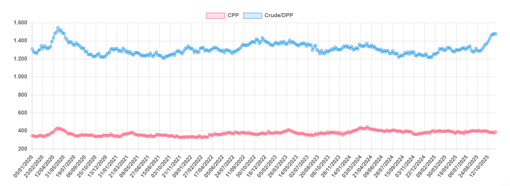

# Collision Course

**Date:** November 24, 2025  
**Publisher:** Breakwave Advisors | **Category:** Market Insights  
**Original URL:** [https://www.breakwaveadvisors.com/insights/2025/11/24/collision-course](https://www.breakwaveadvisors.com/insights/2025/11/24/collision-course)  

---

> **Figure 1: Singapore Anchorage (1)**  
> **Interactive Data & Source:** [Gibsons Co](https://www.gibsons.co.uk/market-reports) | [Local Asset](file:///C:/Users/Dell/Github/Shipping/corpus/03-breakwave/insights/2025/assets/2025-11-24_collision-course_img_singapore-anchorage28129_738512a8ef27.jpg)

For over a year now, oil analysts have been warning of a looming oil surplus with expanding oil supply far outpacing demand. The risk of a significant stock build into 2026 has been further cemented by the rapid rise in OPEC+ production quotas, alongside growth in the Americas, whilst other factors such as sanctions, the economic outlook, and the energy transition could further impact the supply/demand balance.

Perhaps the most visible near-term sign of the surplus, is oil on the water. High frequency data shows that the volumes of crude and DPP in transit (excluding floating storage) is at the highest level since May-2020 when the Covid-19 pandemic temporarily crushed oil demand. Clean products at sea on the other hand, have been trending down through Q4 as autumn refining maintenance limits CPP export volumes. Floating storage (measured as tankers laden and stationary for 30 days or more) is another barometer of an oversupplied oil market. Floating storage has been on the rise all year and last week hit a 2.5 year high, yet for context the volumes represent just 40% of what was held at sea in the peak of the pandemic. Lower frequency data from the IEA shows that global inventories at sea and on land rose by 1.15mbd from January to September with further increases likely seen in recent weeks, as indicated by higher frequency data, which also shows sanctioned cargoes increasingly struggling to find a home. For the mainstream market, the economics of storing oil at sea remain unviable given the strength in time charter rates and backwardated oil futures. As such, the expected surplus will need to find its way into refining systems and land-based storage facilities in the near term.

The location, timing and scale of the stockbuild next year will be critical for the health of the tanker market in the second half of 2026. Under an IEA scenario, supply could exceed demand by 1.4 billion barrels next year, equivalent to nearly 4 million b/d. Clearly this is not sustainable and under such a scenario prices would fall to the point where production needs to be shut in. Demand of course could be stronger, whilst supply may also grow at a slower pace than expected, allowing for somewhat of a softer landing. We may also see significant builds in both US and Chinese strategic petroleum reserves (SPRs). The US SPR is 182 million barrels below its pre-war level, whilst China is thought to be adding around 169 million barrels of storage capacity over 2025-2026. Russian oil production might also come under pressure if the sanctions continue to escalate.

Ultimately, the current supply/demand projections suggest the oil market is on a collision course. For tankers, increasing volumes of oil on the water looking for a home is a bullish factor. But longer term, the market will need to find a balance. If this comes in the form of production cuts, coinciding with an increase in newbuilding deliveries, the second half of 2026 could look very different to today’s market.

### Oil on Water (Mb)

> **Figure 2: Στιγμιότυπο Οθόνης 2025 11 24 101320**  
> **Interactive Data & Source:** [Gibsons Co](https://www.gibsons.co.uk/market-reports) | [Local Asset](file:///C:/Users/Dell/Github/Shipping/corpus/03-breakwave/insights/2025/assets/2025-11-24_collision-course_img_cea3cf84ceb9ceb3cebcceb9cf8ccf84cf85_7af7b9272346.png)

Data source:[Gibson Shipbrokers](https://www.gibsons.co.uk/market-reports)

---

**Tags:** Crude, Tankers, Markets  
