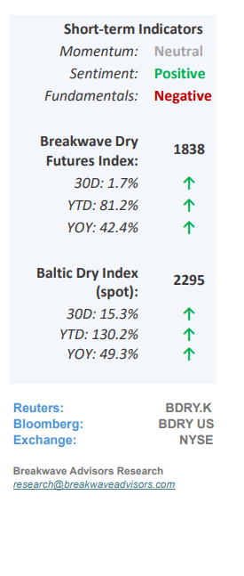
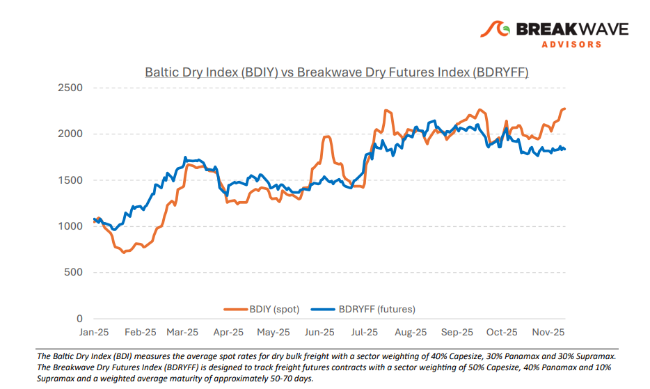
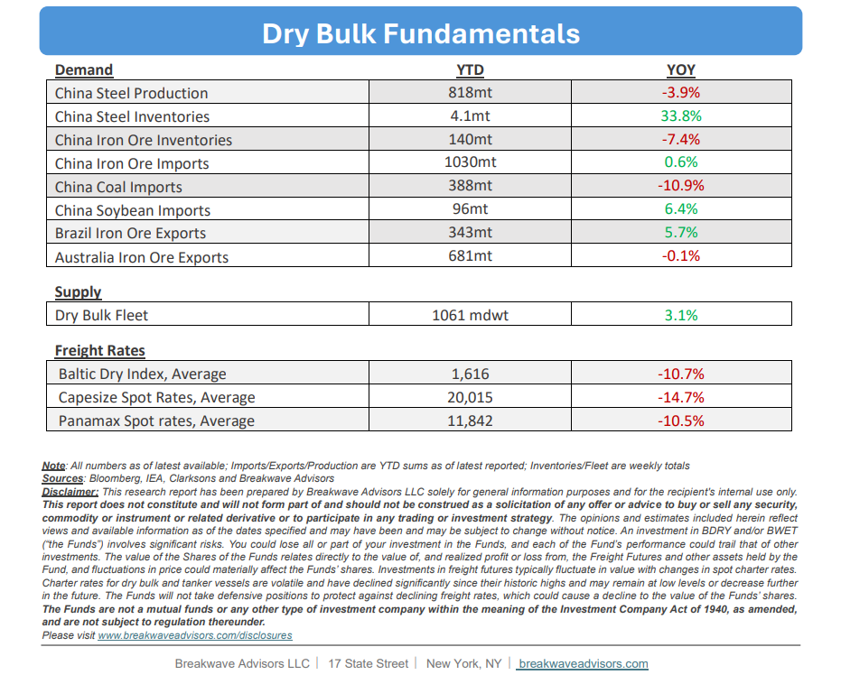

# Breakwave Bi-Weekly Dry Bulk Report - November 25, 2025

**Date:** November 25, 2025  
**Publisher:** Breakwave Advisors | **Category:** Market Insights  
**Original URL:** [https://www.breakwaveadvisors.com/insights/11252025db-kiu12kk457](https://www.breakwaveadvisors.com/insights/11252025db-kiu12kk457)  

---

•**Elevated Spot Rates Show Q4 Seasonality Alive and Well**– Consistent with historical trends, the fourth quarter is once again poised to be**the strongest period of the year**for dry bulk shipping. Current Capesize rates exceeding $30,000, coupled with lower-than-average rate volatility,**suggest market confidence**in forward pricing, with elevated rates projected even for Q1. We hold a dissenting view. While we anticipate a**stable market**overall for the coming year, we believe the expected**Q1 rate strength will not fully materialize**. The risk-reward profile, based on current futures pricing, appears unfavorable. Although West African**bauxite**trade may**mitigate**some the seasonal weakness in iron ore cargo flow, the anticipated Q1 dip in fixtures will remain significant and challenging to fully offset. Consequently, we project**some spot market weakness**in the**beginning of next year.**While some of this is reflected in the futures curve, we believe the eventual spot weakness will be more pronounced than currently priced. This divergence is not due to fundamental issues within the dry bulk market, but rather a reflection of the enduring seasonal cycle, where low recent volatility has led market expectations to exceed a reasonable risk/reward threshold.

> **Figure 1: Cea3cf84ceb9ceb3cebcceb9cf8ccf84cf85**  
> [Local Asset](file:///C:/Users/Dell/Github/Shipping/corpus/03-breakwave/insights/2025/assets/2025-11-25_11252025db-kiu12kk457_img_cea3cf84ceb9ceb3cebcceb9cf8ccf84cf85_ae7e789fdc89.png)

•**The Most “Boring” Commodity of the Year**– The year 2025 may conclude as the**least volatile year**for iron ore, a commodity historically characterized by extreme price swings. For the majority of the year, iron ore prices have maintained a remarkably tight trading range, centering around the**$100/ton mark,**a price level seemingly acceptable to both major producers and consumers. However, fundamental pressures are accumulating. The market is anticipating a near-term increase in new supply (Simandou), compounded by a potential substitution effect driven by changing steel mill dynamics. While the industry has recently increased the use of lower-quality iron ore to boost benchmark steel margins, the premium associated with higher-quality ore suggests a**shift toward substitution**will ultimately place downward pressure on pricing. This is due to the inherent difficulty steel mills will face in covering expenses otherwise. While**bearish price forecasts**have persisted for some time, the physical market has remained stubbornly resilient. Nevertheless, we project that**2026 will be the year**in which the average iron ore price settles into double-digit territory. Given the delivered price nature of the iron ore market, this could consequently have a significant impact on freight rates as well.

•**Our Long-term View**– The last few years have been characterized by increased geopolitical uncertainty. Going forward, we expect such events to continue to affect global trade and have a meaningful impact on effective vessel supply. Combined with the potential for a multi-year cyclical rebound in China’s economic activity following the recent economic turmoil, dry bulk shipping should experience higher volatility on top of a secular tightness driven by stable bulk commodity demand and a slower fleet growth owing to a relatively low orderbook.

> **Figure 2: Στιγμιότυπο Οθόνης 2025 11 25 092506**  
> [Local Asset](file:///C:/Users/Dell/Github/Shipping/corpus/03-breakwave/insights/2025/assets/2025-11-25_11252025db-kiu12kk457_img_cea3cf84ceb9ceb3cebcceb9cf8ccf84cf85_262a6f3a27c5.png)

> **Figure 3: Στιγμιότυπο Οθόνης 2025 11 25 122848**  
> [Local Asset](file:///C:/Users/Dell/Github/Shipping/corpus/03-breakwave/insights/2025/assets/2025-11-25_11252025db-kiu12kk457_img_cea3cf84ceb9ceb3cebcceb9cf8ccf84cf85_f715e062e2fd.png)

### Subscribe:
