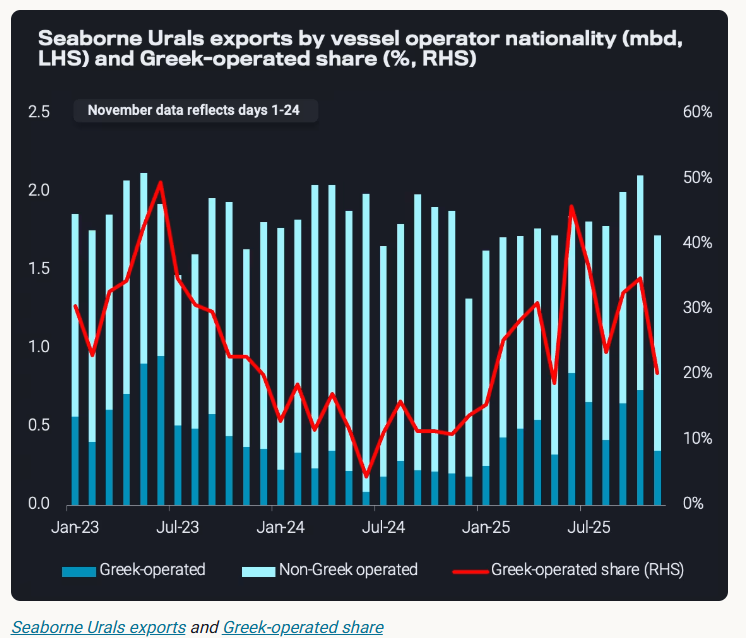
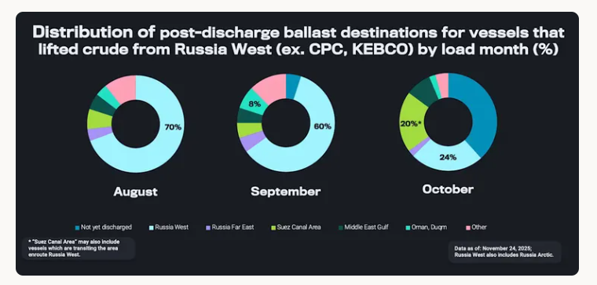
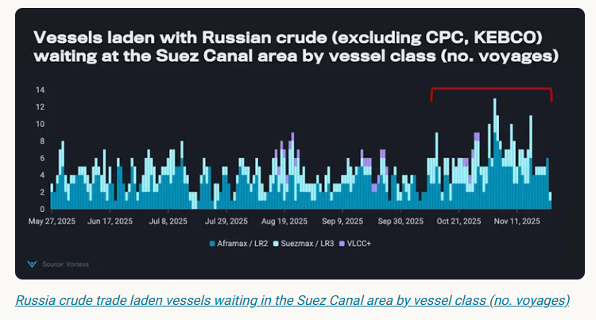

# Russia’s oil supply strains continue to build after Nov 21

**Date:** November 25, 2025  
**Publisher:** Breakwave Advisors | **Category:** Market Insights  
**Original URL:** [https://www.breakwaveadvisors.com/insights/2025/11/25/russias-oil-supply-strains-continue-to-build-after-nov-21](https://www.breakwaveadvisors.com/insights/2025/11/25/russias-oil-supply-strains-continue-to-build-after-nov-21)  

---

Russia’s November seaborne crude exports fell 20% m-o-m. With sanctions deadline behind, the volumes will likely face heightened logistical friction.

*By*[*Anna Zhminko*](https://www.linkedin.com/in/anna-zhminko/)

Russia’s seaborne crude exports surged in October, reaching the highest export level since the full-scale invasion of Ukraine[at nearly 4mbd](https://analytics.vortexa.com/Flows?dateRange=last-24-months&filtersEnabled=%5B%22p%22%2C%22o%22%2C%22d%22%2C%22d_r%22%2C%22v%22%2C%22intra_d%22%2C%22sts_o%22%2C%22c_o%22%2C%22w%22%2C%22sts%22%2C%22v_t%22%2C%22c%22%2C%22v_o%22%2C%22sh%22%2C%22co%22%5D&from=%5B%22b996521be9c996db3560ca234a56286ac38f798d34be229437555fab4f12a6a5%22%5D&geoBreakdownOriginGlobal=port&metric=bpd&page=Flows&products=%5B%2254af755a090118dcf9b0724c9a4e9f14745c26165385ffa7f1445bc768f06f11%22%5D&productsExcluded=%5B%22bb70cf56200f5b72ba69a90bda2c6b47ba29da23945c6f1994cfd4c2ef2fe0ff%22%2C%22578b0722570521d64e6a1527e1fb88ddb1a064cc15afe1d6023d2a0b6d66be6b%22%5D&sortField=unloading_start&tabId=d8180133-fa1c-4341-aeb4-622067f2084f&v=3). Lower refinery runs amid maintenance and Ukrainian drone attacks freed up more crude supplies for export.

However, with the November 21st deadline for Lukoil and Rosneft sanctions behind us, Russian crude will likely face heightened logistical friction, adding pressure to already[weak](https://analytics.vortexa.com/Flows?dateRange=last-24-months&filtersEnabled=%5B%22p%22%2C%22o%22%2C%22d%22%2C%22d_r%22%2C%22v%22%2C%22intra_d%22%2C%22sts_o%22%2C%22c_o%22%2C%22w%22%2C%22sts%22%2C%22v_t%22%2C%22c%22%2C%22v_o%22%2C%22sh%22%2C%22co%22%5D&from=%5B%22b996521be9c996db3560ca234a56286ac38f798d34be229437555fab4f12a6a5%22%5D&geoBreakdownOriginGlobal=port&metric=bpd&page=Flows&products=%5B%2254af755a090118dcf9b0724c9a4e9f14745c26165385ffa7f1445bc768f06f11%22%5D&productsBreakdown=grade&productsExcluded=%5B%22bb70cf56200f5b72ba69a90bda2c6b47ba29da23945c6f1994cfd4c2ef2fe0ff%22%2C%22578b0722570521d64e6a1527e1fb88ddb1a064cc15afe1d6023d2a0b6d66be6b%22%5D&productsXFilter=%5B%22c8803c073c2980d9849784c16bcd41d7f7b7561d2c8c1799a16166527b120242%22%5D&tabId=d8180133-fa1c-4341-aeb4-622067f2084f&timeSeriesProperty=product_grade&v=3)November seaborne export volumes.

## Greek Participation in the Urals Trade Falls to a 16-Month Low

After the October high, Russia’s total seaborne crude/condensate exports fell by 20% m-o-m (November 1-24). This is 5% lower y-o-y and 3% lower than the 2016-2024 November average.

Slower November Urals loadings weighed most heavily on the overall exports, with a 25% decrease in exports m-o-m. Notably, Greek operators’ involvement in Urals trade decreased by nearly 15 percentage points in November amid sanctions pressure.

Greek operators take a notable part in sustaining Urals crude exports, with their participation rate having reached nearly 50% of total Urals liftings in June 2025.

> **Figure 1: Στιγμιότυπο Οθόνης 2025 11 25 121736**  
> **Interactive Data & Source:** [Analytics Vortexa](https://analytics.vortexa.com/Flows?dateRange=2024-01-01T00%3A00%3A00.000Z__2025-11-24T23%3A59%3A59.999Z&destinationGlobalXFilter=%5B%2270425373a1836d6d0390dc6fef838a468717fba7776d66065a5043488f9f041b%22%5D&filtersEnabled=%5B%22p%22%2C%22o%22%2C%22d%22%2C%22d_r%22%2C%22v%22%2C%22intra_d%22%2C%22sts_o%22%2C%22c_o%22%2C%22w%22%5D&from=%5B%22b996521be9c996db3560ca234a56286ac38f798d34be229437555fab4f12a6a5%22%5D&geoBreakdownOriginGlobal=region&intraMovementDropdown=all&metric=bpd&movementEvent=unloading_start&page=Flows&products=%5B%2254af755a090118dcf9b0724c9a4e9f14745c26165385ffa7f1445bc768f06f11%22%5D&productsExcluded=%5B%22bb70cf56200f5b72ba69a90bda2c6b47ba29da23945c6f1994cfd4c2ef2fe0ff%22%2C%22578b0722570521d64e6a1527e1fb88ddb1a064cc15afe1d6023d2a0b6d66be6b%22%5D&tabId=a5bd2849-9f2d-4f6f-82b2-acb0c57c2194&timeSeriesProperty=destination_country&to=%5B%2270425373a1836d6d0390dc6fef838a468717fba7776d66065a5043488f9f041b%22%2C%22934c47f36c16a58d68ef5e007e62a23f5f036ee3f3d1f5f85a48c572b90ad8b2%22%5D&v=3) | [Local Asset](file:///C:/Users/Dell/Github/Shipping/corpus/03-breakwave/insights/2025/assets/2025-11-25_russias-oil-supply-strains-continue-to-build-after-nov-21_img_cea3cf84ceb9ceb3cebcceb9cf8ccf84cf85_21d5b3de3c25.png)

While the end of seasonal refinery maintenance may also be suppressing Urals exports, the withdrawal from Greek commercial operators remains a vital pressure point for near-term Urals liftings from Russia West.

## Ballast Vessel Reshuffling Suggests Lengthening Supply Chain

On the import side, seaborne arrivals of Russian crude (excl. CPC and KEBCO)[rose](https://analytics.vortexa.com/Flows?dateRange=2024-01-01T00%3A00%3A00.000Z__2025-11-24T23%3A59%3A59.999Z&destinationGlobalXFilter=%5B%2270425373a1836d6d0390dc6fef838a468717fba7776d66065a5043488f9f041b%22%5D&filtersEnabled=%5B%22p%22%2C%22o%22%2C%22d%22%2C%22d_r%22%2C%22v%22%2C%22intra_d%22%2C%22sts_o%22%2C%22c_o%22%2C%22w%22%5D&from=%5B%22b996521be9c996db3560ca234a56286ac38f798d34be229437555fab4f12a6a5%22%5D&geoBreakdownOriginGlobal=region&intraMovementDropdown=all&metric=bpd&movementEvent=unloading_start&page=Flows&products=%5B%2254af755a090118dcf9b0724c9a4e9f14745c26165385ffa7f1445bc768f06f11%22%5D&productsExcluded=%5B%22bb70cf56200f5b72ba69a90bda2c6b47ba29da23945c6f1994cfd4c2ef2fe0ff%22%2C%22578b0722570521d64e6a1527e1fb88ddb1a064cc15afe1d6023d2a0b6d66be6b%22%5D&tabId=a5bd2849-9f2d-4f6f-82b2-acb0c57c2194&timeSeriesProperty=destination_country&to=%5B%2270425373a1836d6d0390dc6fef838a468717fba7776d66065a5043488f9f041b%22%2C%22934c47f36c16a58d68ef5e007e62a23f5f036ee3f3d1f5f85a48c572b90ad8b2%22%5D&v=3)by 20% m-o-m to India and[decreased](https://analytics.vortexa.com/Flows?dateRange=2024-01-01T00%3A00%3A00.000Z__2025-11-24T23%3A59%3A59.999Z&destinationGlobalXFilter=%5B%22934c47f36c16a58d68ef5e007e62a23f5f036ee3f3d1f5f85a48c572b90ad8b2%22%5D&filtersEnabled=%5B%22p%22%2C%22o%22%2C%22d%22%2C%22d_r%22%2C%22v%22%2C%22intra_d%22%2C%22sts_o%22%2C%22c_o%22%2C%22w%22%5D&from=%5B%22b996521be9c996db3560ca234a56286ac38f798d34be229437555fab4f12a6a5%22%5D&geoBreakdownOriginGlobal=region&intraMovementDropdown=all&metric=bpd&movementEvent=unloading_start&page=Flows&products=%5B%2254af755a090118dcf9b0724c9a4e9f14745c26165385ffa7f1445bc768f06f11%22%5D&productsExcluded=%5B%22bb70cf56200f5b72ba69a90bda2c6b47ba29da23945c6f1994cfd4c2ef2fe0ff%22%2C%22578b0722570521d64e6a1527e1fb88ddb1a064cc15afe1d6023d2a0b6d66be6b%22%5D&tabId=a5bd2849-9f2d-4f6f-82b2-acb0c57c2194&timeSeriesProperty=destination_country&to=%5B%2270425373a1836d6d0390dc6fef838a468717fba7776d66065a5043488f9f041b%22%2C%22934c47f36c16a58d68ef5e007e62a23f5f036ee3f3d1f5f85a48c572b90ad8b2%22%5D&v=3)by 12% to China m-o-m in November (1-24). Higher arrivals to India likely stem from a push to receive the cargoes loaded in September and October ahead of the 21 November deadline.

Meanwhile, vessel movements on the ballast leg of Russia West crude voyages hint at a lengthening supply chain.

> **Figure 2: Στιγμιότυπο Οθόνης 2025 11 25 121835**  
> **Interactive Data & Source:** [Analytics Vortexa](https://analytics.vortexa.com/VoyagesFlows?dateRange=max-available-history&destinationBreakdown=sts_zone&destinationBreakdownCrossFilter=%5B%2289fe418fac308bdd%22%5D&filtersEnabled=%5B%22v_v_st%22%2C%22v%22%2C%22l_c%22%2C%22o%22%2C%22d%22%2C%22d_r%22%2C%22dwt%22%2C%22v_l_st%22%2C%22v_m_st%22%2C%22v_wt%22%2C%22l%22%2C%22intra_d%22%2C%22v_r%22%2C%22v_t%22%2C%22v_or%22%2C%22v_de%22%5D&intraMovementDropdown=exclude_intra_country&latestProducts=%5B%22c8803c073c2980d9849784c16bcd41d7f7b7561d2c8c1799a16166527b120242%22%2C%2204c4ea46fc6fccfe8388717f399b40e5e348f9a98c451d99e7366caa998191a7%22%2C%220fff12441aa3bf28aa568134ef527d09f741c543a49c0db8c03a195a0bbc481e%22%2C%2220c87d7477f8cfe103904d9af911668c9a69bd03690e74e52e4386ad34e054ee%22%2C%22a6c0a31f361b480bddfb93b1b93f38f4989013ae54b2b147ab18116fdfbebdb7%22%2C%227cab5376bbb441feabdafc7b9f6272c2f9cbd10deb604bed8fa7f9986b2a39a9%22%2C%22fef83ff1194c77d969693ee17c08e1112878e184e3449400e5904bc47b0119fe%22%2C%224ff810b966104a658d22e7155596c11bedcd1e3e81594e6187ab88ec816d95d6%22%2C%220c703e0e14d99572c62f15a26fdf2c9f0c00e111e625cd40b8b337154e81d46d%22%2C%221dfa78c965d56ab9d7b953e424d9160e9f79d0275e460c74994193a328f51537%22%2C%22054b79baa9a54171be2582c9b4f8fa82d0386d41c1914700a498dc5b95e8daba%22%2C%2274a8bc823d4742318d38072f81068fac1ac02ac66e0d491ea4366007bb95c602%22%2C%22c56c8a9d8404573236950b3644825b6928bf0c1f47abccc08e5aeff1afeabb5c%22%5D&location=%5B%2289fe418fac308bddb8aa286dbf42c0d09cfad4793cb60c99039f906494e09f8a%22%5D&originBreakdown=region&page=VoyagesFlows&tabId=93b7526a-58f5-4b1c-9844-a31b8fc8be2c&timeSeriesBreakdown=product-grade&tsAnalysisSeasonalEnabled=0&vesselRiskLevel=%5B%22sanctioned%22%5D&voyageDateRangeActivity=arrivals&voyageStatus=%5B%22laden%22%5D) | [Local Asset](file:///C:/Users/Dell/Github/Shipping/corpus/03-breakwave/insights/2025/assets/2025-11-25_russias-oil-supply-strains-continue-to-build-after-nov-21_img_cea3cf84ceb9ceb3cebcceb9cf8ccf84cf85_b842e26cda80.png)

The share of tankers which ballasted back to Russia West after discharging fell by 10 percentage points for September loaders compared to August. Notably, 8% of tankers that loaded in September (including Arctic shipping region; excluding CPC, KEBCO blends) ballasted to Duqm, Oman.

This pattern suggests early constraints for ballast tonnage availability in Russia West and a potential extension of Russia’s oil supply chain, reflected by an increasing buildup of vessels in a known ship-to-ship (STS) transfer area. The first STS transfer in the Middle East Gulf with Russian crude cargo took place in May 2024.

Furthermore, 20% of October loaders ballasted toward the Suez Canal area after discharging in China or India. While this number may also include vessels en route to Russian load locations in the Baltic and Black Sea, the parallel build-up of laden tankers with Russian crude (see below) could further suggest the usage of STS chains, especially as the[Suez Gulf STS zone](https://analytics.vortexa.com/VoyagesFlows?dateRange=max-available-history&destinationBreakdown=sts_zone&destinationBreakdownCrossFilter=%5B%2289fe418fac308bdd%22%5D&filtersEnabled=%5B%22v_v_st%22%2C%22v%22%2C%22l_c%22%2C%22o%22%2C%22d%22%2C%22d_r%22%2C%22dwt%22%2C%22v_l_st%22%2C%22v_m_st%22%2C%22v_wt%22%2C%22l%22%2C%22intra_d%22%2C%22v_r%22%2C%22v_t%22%2C%22v_or%22%2C%22v_de%22%5D&intraMovementDropdown=exclude_intra_country&latestProducts=%5B%22c8803c073c2980d9849784c16bcd41d7f7b7561d2c8c1799a16166527b120242%22%2C%2204c4ea46fc6fccfe8388717f399b40e5e348f9a98c451d99e7366caa998191a7%22%2C%220fff12441aa3bf28aa568134ef527d09f741c543a49c0db8c03a195a0bbc481e%22%2C%2220c87d7477f8cfe103904d9af911668c9a69bd03690e74e52e4386ad34e054ee%22%2C%22a6c0a31f361b480bddfb93b1b93f38f4989013ae54b2b147ab18116fdfbebdb7%22%2C%227cab5376bbb441feabdafc7b9f6272c2f9cbd10deb604bed8fa7f9986b2a39a9%22%2C%22fef83ff1194c77d969693ee17c08e1112878e184e3449400e5904bc47b0119fe%22%2C%224ff810b966104a658d22e7155596c11bedcd1e3e81594e6187ab88ec816d95d6%22%2C%220c703e0e14d99572c62f15a26fdf2c9f0c00e111e625cd40b8b337154e81d46d%22%2C%221dfa78c965d56ab9d7b953e424d9160e9f79d0275e460c74994193a328f51537%22%2C%22054b79baa9a54171be2582c9b4f8fa82d0386d41c1914700a498dc5b95e8daba%22%2C%2274a8bc823d4742318d38072f81068fac1ac02ac66e0d491ea4366007bb95c602%22%2C%22c56c8a9d8404573236950b3644825b6928bf0c1f47abccc08e5aeff1afeabb5c%22%5D&location=%5B%2289fe418fac308bddb8aa286dbf42c0d09cfad4793cb60c99039f906494e09f8a%22%5D&originBreakdown=region&page=VoyagesFlows&tabId=93b7526a-58f5-4b1c-9844-a31b8fc8be2c&timeSeriesBreakdown=product-grade&tsAnalysisSeasonalEnabled=0&vesselRiskLevel=%5B%22sanctioned%22%5D&voyageDateRangeActivity=arrivals&voyageStatus=%5B%22laden%22%5D)has only recently become a popular location for Russian crude transfers.

> **Figure 3: Στιγμιότυπο Οθόνης 2025 11 25 121937**  
> **Interactive Data & Source:** [Vortexa](https://www.vortexa.com//oil-gas-data-traders-analysts-data-scientists?gclid=Cj0KCQjw8_qRBhCXARIsAE2AtRZKOvMnbilZ_6_91d7huSFFy71pWLrnPwGwOHVzXsmsG-1a1mZnQw8aAt89EALw_wcB&hsa_acc=1782073842&hsa_ad=548425387665&hsa_cam=14746637662&hsa_grp=125038601902&hsa_kw=&hsa_mt=&hsa_net=adwords&hsa_src=g&hsa_tgt=dsa-1431852288425&hsa_ver=3&utm_campaign=%5BCD%5D%20-%20DSA%20-%20EMEA&utm_medium=cpc&utm_medium=ppc&utm_source=google&utm_source=adwords&utm_term=) | [Local Asset](file:///C:/Users/Dell/Github/Shipping/corpus/03-breakwave/insights/2025/assets/2025-11-25_russias-oil-supply-strains-continue-to-build-after-nov-21_img_cea3cf84ceb9ceb3cebcceb9cf8ccf84cf85_16feea9fcac1.png)

## What’s Next?

In the near to medium term, Russia will likely face challenges in keeping its crude exports at elevated levels, particularly from the Western region. There are early signs of tonnage constraints amid a gradually lengthening supply chain. But new vessels entering the Russian crude trade could mitigate such strains.

While it remains to be seen whether new practices emerge in Russia’s oil supply chain, early signs of vessel accumulation in the Mediterranean and Middle East Gulf zones could signal an increased reliance on STS networks to sustain the trade.

Alternatively, if new players were to take over the business from Lukoil and Rosneft in a credible manner, we may see the volumes continue flowing on direct voyages, including via Greek-operated vessels, making use of the price-cap mechanism.

Data Source:[Vortexa](https://www.vortexa.com//oil-gas-data-traders-analysts-data-scientists?gclid=Cj0KCQjw8_qRBhCXARIsAE2AtRZKOvMnbilZ_6_91d7huSFFy71pWLrnPwGwOHVzXsmsG-1a1mZnQw8aAt89EALw_wcB&hsa_acc=1782073842&hsa_ad=548425387665&hsa_cam=14746637662&hsa_grp=125038601902&hsa_kw=&hsa_mt=&hsa_net=adwords&hsa_src=g&hsa_tgt=dsa-1431852288425&hsa_ver=3&utm_campaign=%5BCD%5D%20-%20DSA%20-%20EMEA&utm_medium=cpc&utm_medium=ppc&utm_source=google&utm_source=adwords&utm_term=)

---

**Tags:** Tankers, Markets, Shipping  
