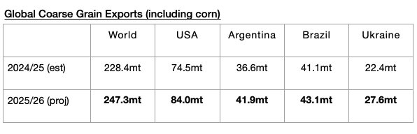

# Global Grain Export Forecast Raised Again

**Date:** November 27, 2025  
**Publisher:** Breakwave Advisors | **Category:** Market Insights  
**Original URL:** [https://www.breakwaveadvisors.com/insights/2025/11/27/global-grain-export-forecast-raised-again](https://www.breakwaveadvisors.com/insights/2025/11/27/global-grain-export-forecast-raised-again)  

---

*By*[*Jeffrey Landsberg*](https://www.linkedin.com/in/jeffrey-landsberg-70ab957/)

With the shutdown over, the United States Department of Agriculture (USDA) has recently released its latest forecast for the current 2025/26 season and is now predicting that global coarse grain, wheat, soybean, and soymeal exports will collectively total 734.1 million tons. This is 4.7 million tons (1%) more than was predicted in September and would mark a year-on-year increase of 28.7 million tons (4%). Remaining noteworthy is that during the 2024/25 season, a year-on-year contraction of 5.1 million tons (-1%) occurred.

Overall, we have been stressing in Commodore Research's Weekly Executive Reports that a return of growth in grain trade (and growth in all major dry bulk commodity trade) has been needed considering that the dry bulk fleet this year has been set to grow by a net addition of at least 350 vessels. For the dry bulk market, it has been very helpful that this season is seeing global grain trade shift back into finding growth again. The 2024/25 season's contraction was a headwind on the dry bulk market.

Regarding coarse grain, the USDA is now forecasting that global coarse grain exports in 2025/26 will total 247.3 million tons. This would mark a year-on-year increase of 18.9 million tons (8%) from the 2024/25 season. Coarse grain exports will remain the global grain market’s largest cargo by volume. A large year-on-year increase in coarse grain exports is expected from the United States. Moderate year-on-year increases are expected from Argentina and Ukraine. A relatively small year-on-year increase is expected from Brazil.

> **Figure 1: Chart**  
> [Local Asset](file:///C:/Users/Dell/Github/Shipping/corpus/03-breakwave/insights/2025/assets/2025-11-27_global-grain-export-forecast-raised-again_img_chart_3e69fff8d765.jpg)

---

**Tags:** Drybulk, Shipping, Markets  
