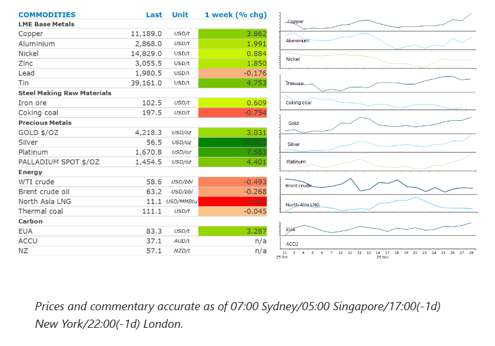
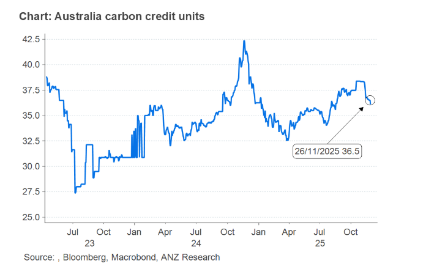

# Metals gain as rate cut looms

**Date:** December 01, 2025  
**Publisher:** Breakwave Advisors | **Category:** Market Insights  
**Original URL:** [https://www.breakwaveadvisors.com/insights/2025/12/1/metals-gain-as-rate-cut-looms](https://www.breakwaveadvisors.com/insights/2025/12/1/metals-gain-as-rate-cut-looms)  

---

The prospect of further monetary easing helped boost sentiment across the complex. Metals gained on signs of tightness. Oil fell on fears of oversupply.

*By*[*Daniel Hynes*](https://www.linkedin.com/in/dahynes/)

> **Figure 1: Στιγμιότυπο Οθόνης 2025 12 01 103011**  
> **Interactive Data & Source:** [Linkedin](https://www.linkedin.com/newsletters/commodities-wrap-6692196755876012032/?fbclid=IwAR3kiXJqZdxmp9ZcRwBNI7FsBySI-XSC0pfPur1qzjt7OZp7PTE59Tsl1QI) | [Local Asset](file:///C:/Users/Dell/Github/Shipping/corpus/03-breakwave/insights/2025/assets/2025-12-01_metals-gain-as-rate-cut-looms_img_cea3cf84ceb9ceb3cebcceb9cf8ccf84cf85_2470e01203a0.png)

### Market Commentary

**Crude oil**ended the week lower and locked in its fourth consecutive monthly decline amid easing geopolitical tensions. Expectations of a peace deal between Russia and Ukraine have risen since the US proposed a plan. US envoy, Steve Witkoff, will lead a delegation in Russia this week. President Putin said last week that the US plan could prove the basis for a deal, but that some points require discussion. Signs emerged of a de-escalation of tension between the US and Venezuela. The New York Times reported that presidents Trump and Maduro discussed a potential meeting in a call last week. The market is concerned such moves could lead to the US easing restrictions on Venezuelan crude exports to the US, its major customer. The market was also cautious heading into the weekend with OPEC+ members scheduled to meet to discuss supply. The group ended up deciding to stick with its plan to pause production increase during the first quarter of 2026 amid growing signs of a surplus in global oil markets. OPEC also approved a mechanism for its review of members’ individual production capacities, a sensitive process that will help set quotas for 2027. The decision highlights some caution by the alliance and still leaves the market facing a significant glut of oil in early 2026.

**Global gas**prices fell last week, as weather forecasts suggested heating demand would remain subdued. Recent models are pointing to warmer-than-expected temperatures in Europe, which could weigh on demand for gas. However, the situation is precarious, with storage facilities in the region only 77% full. This is well below the mandated 90% level they were required to reach by 1 December. Traders seem confident that supplies will be plentiful and enable utilities to meet demand during the peak season. Data suggest that is the case, with US LNG exports, a key supplier to the European market, set to hit a record high in November.**North Asia LNG**prices were also down sharply last week amid weak demand. China’s LNG purchases are on track to drop for a 13th straight month in November, with volumes down 5.5% y/y.

**Copper**led base metals higher, as concerns of tightness hang over the market. Industry participants are meeting in Shanghai this week at the LME Week Asia conference, aiming to set deals for copper concentrate in 2026. Kostas Bintas, head of metals at Mercuria Energy Group warned that a rush to ship metal to the US risks draining the rest of the world’s inventories. Copper has also been supported by rising expectations of a Fed rate cut. Easing monetary policy tends to be a positive backdrop for industrial metals.

**Silver**surged on Friday following an outage at the CME Group’s Chicago Mercantile Exchange. Silver jumped 6% to USD56.63/oz, surpassing a peak set during a historic squeeze in the London market in October. This is still putting pressure on other trading hubs. The chaos caused by the outage at COMEX comes amid fears that the US may be looking to apply levies to imports of the metal, after it was added to the US Geological Survey list of critical minerals this month.**Gold**ended the week up 4.3%, as Fed policymakers indicated the release of delayed economic data supports the case for lower borrowing costs, which typically benefits gold as its non-interest bearing.

### Chart of the Day

Following a strong run through Q3, ACCU prices retreated in November, as compliance buying slowed. Generic ACCUs fell to a three-month low of AUD36.50/t in late November, while Human-induced Regeneration ACCUs fell to a similar level. The market was also stirred by reports that Santos’ Moomba carbon capture and storage project has received the largest single ACCU issuance, bringing fresh supply into the market. With safeguard demand typically weaker in December, weakness may persist in the short term.

> **Figure 2: Στιγμιότυπο Οθόνης 2025 12 01 102845**  
> **Interactive Data & Source:** [Linkedin](https://www.linkedin.com/newsletters/commodities-wrap-6692196755876012032/?fbclid=IwAR3kiXJqZdxmp9ZcRwBNI7FsBySI-XSC0pfPur1qzjt7OZp7PTE59Tsl1QI) | [Local Asset](file:///C:/Users/Dell/Github/Shipping/corpus/03-breakwave/insights/2025/assets/2025-12-01_metals-gain-as-rate-cut-looms_img_cea3cf84ceb9ceb3cebcceb9cf8ccf84cf85_c2212092d407.png)

Data source:[Commodities Wrap](https://www.linkedin.com/newsletters/commodities-wrap-6692196755876012032/?fbclid=IwAR3kiXJqZdxmp9ZcRwBNI7FsBySI-XSC0pfPur1qzjt7OZp7PTE59Tsl1QI)

---

**Tags:** Shipping, Commodities, Markets  
