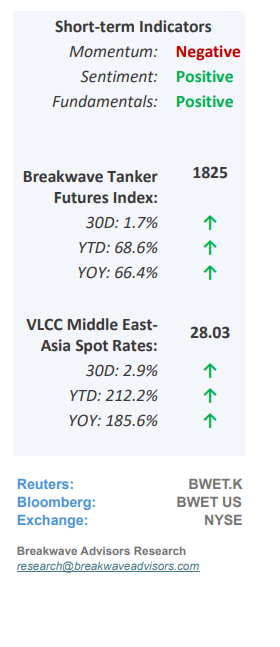
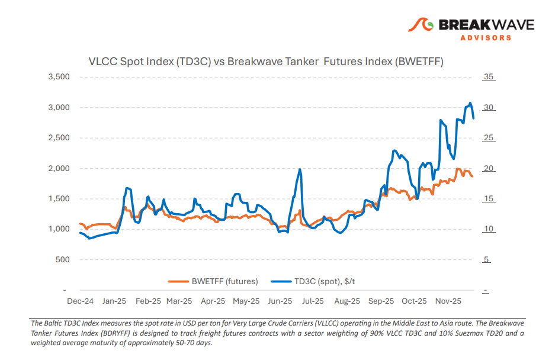
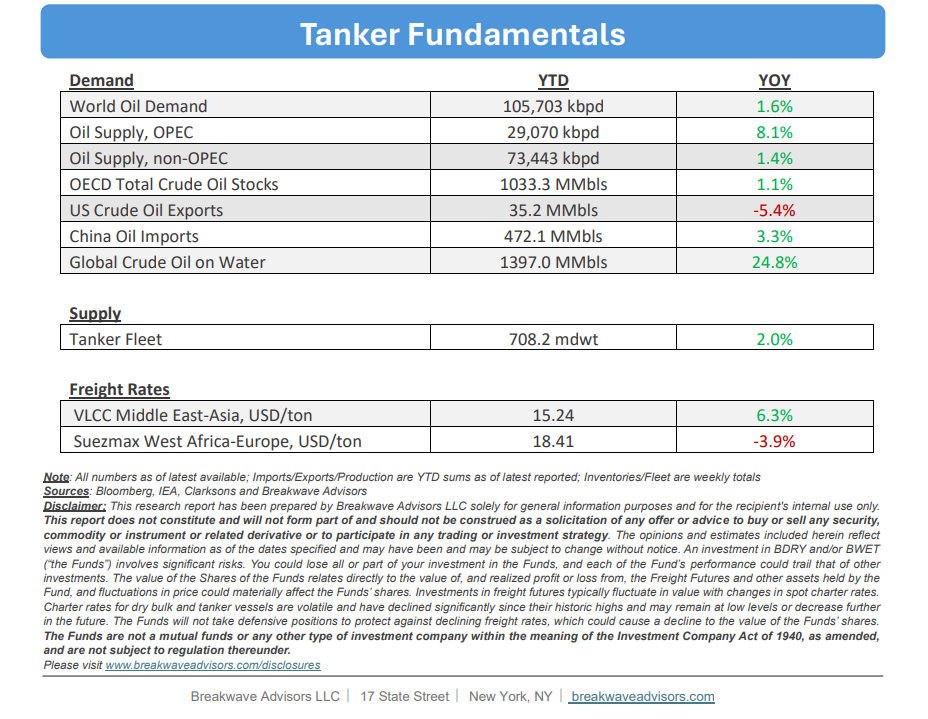

# Breakwave Bi-Weekly Tanker Report - December 2, 2025

**Date:** December 02, 2025  
**Publisher:** Breakwave Advisors | **Category:** Market Insights  
**Original URL:** [https://www.breakwaveadvisors.com/insights/2025122wetreport5k447](https://www.breakwaveadvisors.com/insights/2025122wetreport5k447)  

---

•**VLCC Market Stabilizes into Final Strech of the Year**– The Very Large Crude Carrier (VLCC) sector experienced a**market moderation**from late November into early December, losing the strong momentum of mid-November as the market transitioned. While the Arabian Gulf (AG) initially maintained firm sentiment and healthy enquiry, the**position list widened and enquiry tapered**off toward monthend, enabling charterers to secure leverage and causing a gradual softening in rates, though not a sharp correction. West Africa mirrored this cautious trend, with participants waiting for new enquiry to define future pricing following the visible easing in the AG. Despite this near-term deceleration, the**underlying market remains structurally supportive**due to elevated floating storage, robust Atlanticto-Asia flows, and sustained long-haul OPEC+ tonne-mile demand. The primary uncertainty is whether the current slowdown is a temporary pause or the start of a downward phase, while a highly improbable, yet market-altering,**Russia–Ukraine peace deal could fundamentally reverse**the long-haul engine of VLCC earnings by shifting crude back to short-haul European routes. Current tanker fundamentals are still constructive given the gains in oil flows from the gradual OPEC increases on the back of minimum fleet growth.

> **Figure 1: Στιγμιότυπο Οθόνης 2025 12 02 112939**  
> [Local Asset](file:///C:/Users/Dell/Github/Shipping/corpus/03-breakwave/insights/2025/assets/2025-12-02_2025122wetreport5k447_img_cea3cf84ceb9ceb3cebcceb9cf8ccf84cf85_a3050ac667e6.png)

•**OPEC+ Shifts into a Slower Gear amid Oversupply Fears**– During the past weekend,**OPEC+**has decided to keep its**oil production steady**through the first quarter of 2026, effectively pausing any further increases for now. A potential reason behind this stance is that the group may be seeking to**avoid exacerbating a possible oversupply**situation while demand remains uncertain. Alongside the production freeze, OPEC+ approved a mechanism to assess each member’s “maximum production capacity” between January and September 2026, a process that will be used to set baseline quotas for 2027. The move underscores a**cautious tone,**especially following recent output hikes: since April, some OPEC+ members have raised their targets by roughly 2.9 million barrels per day. Meanwhile, global supply**trends continue to heighten oversupply**concerns for 2026. A recent survey indicates that swelling production, both within OPEC+ and from strong growth outside the cartel, is expected to outpace modest demand growth next year, creating the risk of a surplus in the global oil market. Estimates vary, but many point to a**sizeable excess of supply**relative to demand, something that is clearly evident in the lower price of oil and the relatively subdued volatility experienced over the past several months.

•**Our Long-term View**– The tanker market is recovering from a long period of staggered rates as the growth in new vessel supply shrinks while oil demand remains elevated in line with the global economy. A historically low orderbook combined with favorable shifting trade patterns should continue to support increased spot rate volatility, which combined with the ongoing geopolitical turmoil, should sustain freight rates in the medium to long term.

> **Figure 2: Στιγμιότυπο Οθόνης 2025 12 02 092228**  
> [Local Asset](file:///C:/Users/Dell/Github/Shipping/corpus/03-breakwave/insights/2025/assets/2025-12-02_2025122wetreport5k447_img_cea3cf84ceb9ceb3cebcceb9cf8ccf84cf85_1c0fc3f3633c.png)

> **Figure 3: Στιγμιότυπο Οθόνης 2025 12 02 112950**  
> [Local Asset](file:///C:/Users/Dell/Github/Shipping/corpus/03-breakwave/insights/2025/assets/2025-12-02_2025122wetreport5k447_img_cea3cf84ceb9ceb3cebcceb9cf8ccf84cf85_dfae8f421396.png)

### Subscribe:
