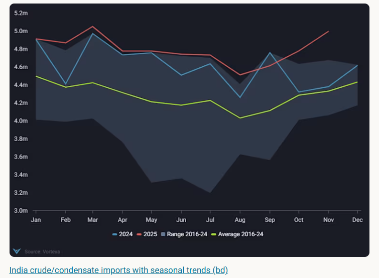
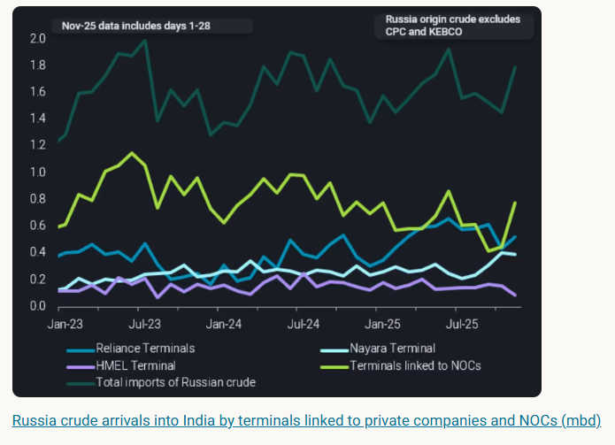
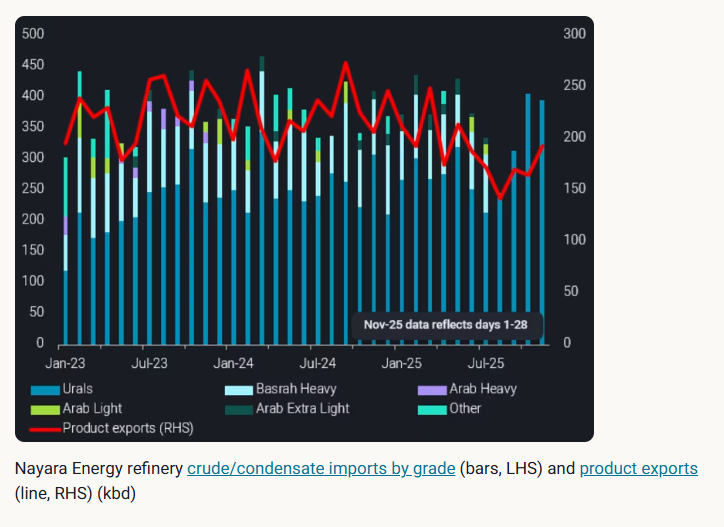
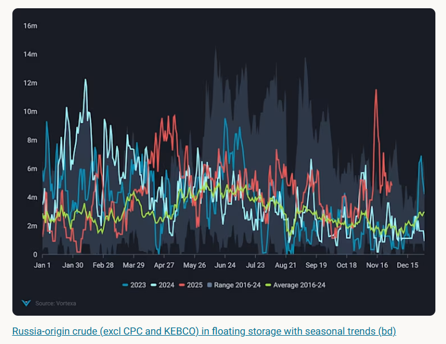
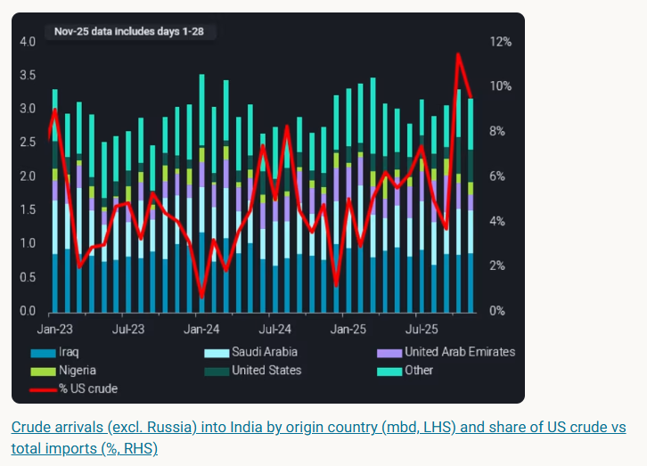
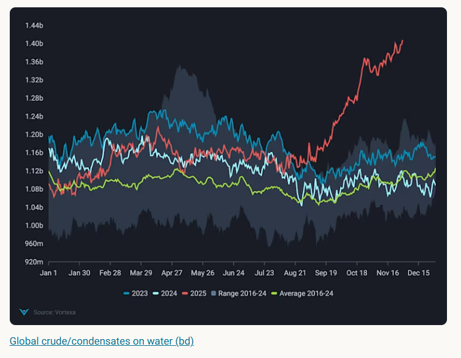

# India imports of Russian crude to decline temporarily

**Date:** December 02, 2025  
**Publisher:** Breakwave Advisors | **Category:** Market Insights  
**Original URL:** [https://www.breakwaveadvisors.com/insights/2025/12/2/india-imports-of-russian-crude-to-decline-temporarily](https://www.breakwaveadvisors.com/insights/2025/12/2/india-imports-of-russian-crude-to-decline-temporarily)  

---

India’s Russian crude imports expected to ease after November’s spike. The slowdown offers little upside for mainstream crude demand and near‑term pricing.

*By*[*Ivan Mathews*](https://www.linkedin.com/in/ivan-mathews-255689137/)

India’s crude imports rose by 220kbd m-o-m to 5.0mbd in November 2025, reaching a seasonal high and approaching the March 2025 record of 5.05mbd. The increase was driven primarily by a sharp rise in Russian crude discharges into India, which climbed 340kbd m-o-m to 1.80mbd. This report examines the drivers behind India’s surge in Russian crude arrivals and assesses the implications for mainstream crude demand and the forward curve.

> **Figure 1: Στιγμιότυπο Οθόνης 2025 12 02 135203**  
> **Interactive Data & Source:** [Analytics Vortexa](https://analytics.vortexa.com/OnShoreCrudeInventories?dateRange=2022-01-01T00%3A00%3A00.000Z__2025-11-30T23%3A59%3A59.999Z&frequency=month&onshoreInventoriesLocations=%5B%22a50f4a476665d3d507f54398b1a1aed1746c5469619c83c3398716724f8dda27%22%2C%22934c47f36c16a58d68ef5e007e62a23f5f036ee3f3d1f5f85a48c572b90ad8b2%22%2C%22e9e556620469f46a4dc171aef71073f5286a288da35c5883cac760446b0ceb46%22%2C%224e79eb8e84d26f5c3c0006283bc1aa52c170b58d667be9848e136afea91a57e9%22%2C%2250182d9d05051a6c8d24f0514d4ee828da6eaa29eacbb11cfe368f51526328ce%22%2C%2243a70ba6b21894cd24165d9d7ee59b012e698cf97e22fd275ccdd05a556e7061%22%2C%222aaad41b89dfad19e5668918018ae02695d7710bcbe5f2dc689234e8da492de3%22%2C%225e0cb0b66780a00576309aecff1b65934fc580d775bab29ac2a79397d8544e04%22%2C%22cde783a902c7837b814dfa5988ed74fb14841c2999d6984952c7cbfc543d5073%22%2C%22bcd7dddaf951959ebf6076a3a594b426a246d3bffe13339b10d04e45f222e011%22%2C%22f2ac0b4ca7b0e481ec41197ddbd37f6c60251f369ed74872691988bed8a07e0a%22%2C%22715b6aab56723cb55c3ddbdc12a2851b379919010f119cf98765d4debbdb793d%22%2C%22e6955a2c59dc90833986fe0894cf6718dddaa7816bb51bc955cdd3eb4470e554%22%2C%2270425373a1836d6d0390dc6fef838a468717fba7776d66065a5043488f9f041b%22%5D&page=OnShoreCrudeInventories&selectedRegion=%5B%2270425373a1836d6d0390dc6fef838a468717fba7776d66065a5043488f9f041b%22%5D&tabId=f10e0650-bddf-462b-996c-39c6d3cd59af&tankCrude=%5B%22confirmed%22%2C%22probable%22%5D) | [Local Asset](file:///C:/Users/Dell/Github/Shipping/corpus/03-breakwave/insights/2025/assets/2025-12-02_india-imports-of-russian-crude-to-decline-temporarily_img_cea3cf84ceb9ceb3cebcceb9cf8ccf84cf85_380eda813154.png)

Refiners in India accelerated discharges of Russian barrels ahead of the 21 November wind‑down deadline, which restricts purchases from US‑sanctioned entities Rosneft and Lukoil. Utilising Vortexa's flows data, more Russian crude was discharged into terminals linked to India's NOCs — and to a lesser extent Reliance — last month. Refiners were strategically stockpiling the additional crude for future processing once sanctions were fully in effect, as the country's[crude inventories rose by 6mb m-o-m in November](https://analytics.vortexa.com/OnShoreCrudeInventories?dateRange=2022-01-01T00%3A00%3A00.000Z__2025-11-30T23%3A59%3A59.999Z&frequency=month&onshoreInventoriesLocations=%5B%22a50f4a476665d3d507f54398b1a1aed1746c5469619c83c3398716724f8dda27%22%2C%22934c47f36c16a58d68ef5e007e62a23f5f036ee3f3d1f5f85a48c572b90ad8b2%22%2C%22e9e556620469f46a4dc171aef71073f5286a288da35c5883cac760446b0ceb46%22%2C%224e79eb8e84d26f5c3c0006283bc1aa52c170b58d667be9848e136afea91a57e9%22%2C%2250182d9d05051a6c8d24f0514d4ee828da6eaa29eacbb11cfe368f51526328ce%22%2C%2243a70ba6b21894cd24165d9d7ee59b012e698cf97e22fd275ccdd05a556e7061%22%2C%222aaad41b89dfad19e5668918018ae02695d7710bcbe5f2dc689234e8da492de3%22%2C%225e0cb0b66780a00576309aecff1b65934fc580d775bab29ac2a79397d8544e04%22%2C%22cde783a902c7837b814dfa5988ed74fb14841c2999d6984952c7cbfc543d5073%22%2C%22bcd7dddaf951959ebf6076a3a594b426a246d3bffe13339b10d04e45f222e011%22%2C%22f2ac0b4ca7b0e481ec41197ddbd37f6c60251f369ed74872691988bed8a07e0a%22%2C%22715b6aab56723cb55c3ddbdc12a2851b379919010f119cf98765d4debbdb793d%22%2C%22e6955a2c59dc90833986fe0894cf6718dddaa7816bb51bc955cdd3eb4470e554%22%2C%2270425373a1836d6d0390dc6fef838a468717fba7776d66065a5043488f9f041b%22%5D&page=OnShoreCrudeInventories&selectedRegion=%5B%2270425373a1836d6d0390dc6fef838a468717fba7776d66065a5043488f9f041b%22%5D&tabId=f10e0650-bddf-462b-996c-39c6d3cd59af&tankCrude=%5B%22confirmed%22%2C%22probable%22%5D).

> **Figure 2: Στιγμιότυπο Οθόνης 2025 12 02 135249**  
> **Interactive Data & Source:** [Analytics Vortexa](https://analytics.vortexa.com/OnShoreCrudeInventories?dateRange=2022-01-01T00%3A00%3A00.000Z__2025-11-30T23%3A59%3A59.999Z&frequency=month&onshoreInventoriesLocations=%5B%22a50f4a476665d3d507f54398b1a1aed1746c5469619c83c3398716724f8dda27%22%2C%22934c47f36c16a58d68ef5e007e62a23f5f036ee3f3d1f5f85a48c572b90ad8b2%22%2C%22e9e556620469f46a4dc171aef71073f5286a288da35c5883cac760446b0ceb46%22%2C%224e79eb8e84d26f5c3c0006283bc1aa52c170b58d667be9848e136afea91a57e9%22%2C%2250182d9d05051a6c8d24f0514d4ee828da6eaa29eacbb11cfe368f51526328ce%22%2C%2243a70ba6b21894cd24165d9d7ee59b012e698cf97e22fd275ccdd05a556e7061%22%2C%222aaad41b89dfad19e5668918018ae02695d7710bcbe5f2dc689234e8da492de3%22%2C%225e0cb0b66780a00576309aecff1b65934fc580d775bab29ac2a79397d8544e04%22%2C%22cde783a902c7837b814dfa5988ed74fb14841c2999d6984952c7cbfc543d5073%22%2C%22bcd7dddaf951959ebf6076a3a594b426a246d3bffe13339b10d04e45f222e011%22%2C%22f2ac0b4ca7b0e481ec41197ddbd37f6c60251f369ed74872691988bed8a07e0a%22%2C%22715b6aab56723cb55c3ddbdc12a2851b379919010f119cf98765d4debbdb793d%22%2C%22e6955a2c59dc90833986fe0894cf6718dddaa7816bb51bc955cdd3eb4470e554%22%2C%2270425373a1836d6d0390dc6fef838a468717fba7776d66065a5043488f9f041b%22%5D&page=OnShoreCrudeInventories&tabId=f10e0650-bddf-462b-996c-39c6d3cd59af&tankCrude=%5B%22confirmed%22%2C%22probable%22%5D) | [Local Asset](file:///C:/Users/Dell/Github/Shipping/corpus/03-breakwave/insights/2025/assets/2025-12-02_india-imports-of-russian-crude-to-decline-temporarily_img_cea3cf84ceb9ceb3cebcceb9cf8ccf84cf85_365f8d80c329.png)

In the near term, most refiners are likely to scale back Russian crude purchases following last month’s stock build. Nayara Energy stands out as the key exception. Russian crude imports into the refinery have rebounded since EU sanctions in July, and the plant is now almost entirely reliant on Russian supply. Crude imports have returned to levels before EU sanctions, while oil product exports remain subdued, indicating a pivot towards the domestic market. As a result, Nayara is positioned to be the least affected by the recent US sanctions and is expected to continue sourcing exclusively Russian barrels.

> **Figure 3: Στιγμιότυπο Οθόνης 2025 12 02 135346**  
> **Interactive Data & Source:** [Analytics Vortexa](https://analytics.vortexa.com/OnShoreCrudeInventories?dateRange=2022-01-01T00%3A00%3A00.000Z__2025-11-30T23%3A59%3A59.999Z&frequency=month&onshoreInventoriesLocations=%5B%22a50f4a476665d3d507f54398b1a1aed1746c5469619c83c3398716724f8dda27%22%2C%22934c47f36c16a58d68ef5e007e62a23f5f036ee3f3d1f5f85a48c572b90ad8b2%22%2C%22e9e556620469f46a4dc171aef71073f5286a288da35c5883cac760446b0ceb46%22%2C%224e79eb8e84d26f5c3c0006283bc1aa52c170b58d667be9848e136afea91a57e9%22%2C%2250182d9d05051a6c8d24f0514d4ee828da6eaa29eacbb11cfe368f51526328ce%22%2C%2243a70ba6b21894cd24165d9d7ee59b012e698cf97e22fd275ccdd05a556e7061%22%2C%222aaad41b89dfad19e5668918018ae02695d7710bcbe5f2dc689234e8da492de3%22%2C%225e0cb0b66780a00576309aecff1b65934fc580d775bab29ac2a79397d8544e04%22%2C%22cde783a902c7837b814dfa5988ed74fb14841c2999d6984952c7cbfc543d5073%22%2C%22bcd7dddaf951959ebf6076a3a594b426a246d3bffe13339b10d04e45f222e011%22%2C%22f2ac0b4ca7b0e481ec41197ddbd37f6c60251f369ed74872691988bed8a07e0a%22%2C%22715b6aab56723cb55c3ddbdc12a2851b379919010f119cf98765d4debbdb793d%22%2C%22e6955a2c59dc90833986fe0894cf6718dddaa7816bb51bc955cdd3eb4470e554%22%2C%2270425373a1836d6d0390dc6fef838a468717fba7776d66065a5043488f9f041b%22%5D&page=OnShoreCrudeInventories&tabId=f10e0650-bddf-462b-996c-39c6d3cd59af&tankCrude=%5B%22confirmed%22%2C%22probable%22%5D) | [Local Asset](file:///C:/Users/Dell/Github/Shipping/corpus/03-breakwave/insights/2025/assets/2025-12-02_india-imports-of-russian-crude-to-decline-temporarily_img_cea3cf84ceb9ceb3cebcceb9cf8ccf84cf85_76e30c03e244.png)

## Mainstream Crude Demand Unlikely to Strengthen

Russian crude in floating storage eased from 2025 highs in mid-November due to accelerated discharges before the wind-down deadline. That said, floating storage volumes have ticked up in the last week of November and have risen further above seasonal averages. Should volumes continue to build, it is likely that discounts of Russian crude will have to widen so as to incentivise intake. Urals FOB Primorsk FOB discount to North Sea Dated Brent have widen through November (Argus) and this should continue in December. This could lead to more Russian crude being transported on the shadow fleet to India.

> **Figure 4: Στιγμιότυπο Οθόνης 2025 12 02 135441**  
> **Interactive Data & Source:** [Analytics Vortexa](https://analytics.vortexa.com/OnShoreCrudeInventories?dateRange=2022-01-01T00%3A00%3A00.000Z__2025-11-30T23%3A59%3A59.999Z&frequency=month&onshoreInventoriesLocations=%5B%22a50f4a476665d3d507f54398b1a1aed1746c5469619c83c3398716724f8dda27%22%2C%22934c47f36c16a58d68ef5e007e62a23f5f036ee3f3d1f5f85a48c572b90ad8b2%22%2C%22e9e556620469f46a4dc171aef71073f5286a288da35c5883cac760446b0ceb46%22%2C%224e79eb8e84d26f5c3c0006283bc1aa52c170b58d667be9848e136afea91a57e9%22%2C%2250182d9d05051a6c8d24f0514d4ee828da6eaa29eacbb11cfe368f51526328ce%22%2C%2243a70ba6b21894cd24165d9d7ee59b012e698cf97e22fd275ccdd05a556e7061%22%2C%222aaad41b89dfad19e5668918018ae02695d7710bcbe5f2dc689234e8da492de3%22%2C%225e0cb0b66780a00576309aecff1b65934fc580d775bab29ac2a79397d8544e04%22%2C%22cde783a902c7837b814dfa5988ed74fb14841c2999d6984952c7cbfc543d5073%22%2C%22bcd7dddaf951959ebf6076a3a594b426a246d3bffe13339b10d04e45f222e011%22%2C%22f2ac0b4ca7b0e481ec41197ddbd37f6c60251f369ed74872691988bed8a07e0a%22%2C%22715b6aab56723cb55c3ddbdc12a2851b379919010f119cf98765d4debbdb793d%22%2C%22e6955a2c59dc90833986fe0894cf6718dddaa7816bb51bc955cdd3eb4470e554%22%2C%2270425373a1836d6d0390dc6fef838a468717fba7776d66065a5043488f9f041b%22%5D&page=OnShoreCrudeInventories&tabId=f10e0650-bddf-462b-996c-39c6d3cd59af&tankCrude=%5B%22confirmed%22%2C%22probable%22%5D) | [Local Asset](file:///C:/Users/Dell/Github/Shipping/corpus/03-breakwave/insights/2025/assets/2025-12-02_india-imports-of-russian-crude-to-decline-temporarily_img_cea3cf84ceb9ceb3cebcceb9cf8ccf84cf85_7fa3978b7232.png)

Therefore, it is highly likely that refineries in India will continue to process Russian crude despite US sanctions on Rosneft and Lukoil. This will be done by purchasing Russian crude through non-sanctioned entities and utilising the shadow fleet to import Russian barrels into the country. Crude arrivals of non-Russia origin crude dipped slightly m-o-m in November, and this could remain subdued in the coming months. We observed an uptick in US crude arrivals into India in October and November, though this largely displaced other non‑Russian suppliers rather than adding incremental import demand.

> **Figure 5: Στιγμιότυπο Οθόνης 2025 12 02 135529**  
> **Interactive Data & Source:** [Analytics Vortexa](https://analytics.vortexa.com/OnShoreCrudeInventories?dateRange=2022-01-01T00%3A00%3A00.000Z__2025-11-30T23%3A59%3A59.999Z&frequency=month&onshoreInventoriesLocations=%5B%22a50f4a476665d3d507f54398b1a1aed1746c5469619c83c3398716724f8dda27%22%2C%22934c47f36c16a58d68ef5e007e62a23f5f036ee3f3d1f5f85a48c572b90ad8b2%22%2C%22e9e556620469f46a4dc171aef71073f5286a288da35c5883cac760446b0ceb46%22%2C%224e79eb8e84d26f5c3c0006283bc1aa52c170b58d667be9848e136afea91a57e9%22%2C%2250182d9d05051a6c8d24f0514d4ee828da6eaa29eacbb11cfe368f51526328ce%22%2C%2243a70ba6b21894cd24165d9d7ee59b012e698cf97e22fd275ccdd05a556e7061%22%2C%222aaad41b89dfad19e5668918018ae02695d7710bcbe5f2dc689234e8da492de3%22%2C%225e0cb0b66780a00576309aecff1b65934fc580d775bab29ac2a79397d8544e04%22%2C%22cde783a902c7837b814dfa5988ed74fb14841c2999d6984952c7cbfc543d5073%22%2C%22bcd7dddaf951959ebf6076a3a594b426a246d3bffe13339b10d04e45f222e011%22%2C%22f2ac0b4ca7b0e481ec41197ddbd37f6c60251f369ed74872691988bed8a07e0a%22%2C%22715b6aab56723cb55c3ddbdc12a2851b379919010f119cf98765d4debbdb793d%22%2C%22e6955a2c59dc90833986fe0894cf6718dddaa7816bb51bc955cdd3eb4470e554%22%2C%2270425373a1836d6d0390dc6fef838a468717fba7776d66065a5043488f9f041b%22%5D&page=OnShoreCrudeInventories&tabId=f10e0650-bddf-462b-996c-39c6d3cd59af&tankCrude=%5B%22confirmed%22%2C%22probable%22%5D) | [Local Asset](file:///C:/Users/Dell/Github/Shipping/corpus/03-breakwave/insights/2025/assets/2025-12-02_india-imports-of-russian-crude-to-decline-temporarily_img_cea3cf84ceb9ceb3cebcceb9cf8ccf84cf85_a5909740e58e.png)

Overall, the expected slowdown in India's Russian crude imports offers little upside for mainstream crude demand. Crude on water have built since September and have reached record highs. Additionally,[global onshore crude inventories rose by close to 30mb m-o-m in November](https://analytics.vortexa.com/OnShoreCrudeInventories?dateRange=2022-01-01T00%3A00%3A00.000Z__2025-11-30T23%3A59%3A59.999Z&frequency=month&onshoreInventoriesLocations=%5B%22a50f4a476665d3d507f54398b1a1aed1746c5469619c83c3398716724f8dda27%22%2C%22934c47f36c16a58d68ef5e007e62a23f5f036ee3f3d1f5f85a48c572b90ad8b2%22%2C%22e9e556620469f46a4dc171aef71073f5286a288da35c5883cac760446b0ceb46%22%2C%224e79eb8e84d26f5c3c0006283bc1aa52c170b58d667be9848e136afea91a57e9%22%2C%2250182d9d05051a6c8d24f0514d4ee828da6eaa29eacbb11cfe368f51526328ce%22%2C%2243a70ba6b21894cd24165d9d7ee59b012e698cf97e22fd275ccdd05a556e7061%22%2C%222aaad41b89dfad19e5668918018ae02695d7710bcbe5f2dc689234e8da492de3%22%2C%225e0cb0b66780a00576309aecff1b65934fc580d775bab29ac2a79397d8544e04%22%2C%22cde783a902c7837b814dfa5988ed74fb14841c2999d6984952c7cbfc543d5073%22%2C%22bcd7dddaf951959ebf6076a3a594b426a246d3bffe13339b10d04e45f222e011%22%2C%22f2ac0b4ca7b0e481ec41197ddbd37f6c60251f369ed74872691988bed8a07e0a%22%2C%22715b6aab56723cb55c3ddbdc12a2851b379919010f119cf98765d4debbdb793d%22%2C%22e6955a2c59dc90833986fe0894cf6718dddaa7816bb51bc955cdd3eb4470e554%22%2C%2270425373a1836d6d0390dc6fef838a468717fba7776d66065a5043488f9f041b%22%5D&page=OnShoreCrudeInventories&tabId=f10e0650-bddf-462b-996c-39c6d3cd59af&tankCrude=%5B%22confirmed%22%2C%22probable%22%5D). These factors will continue to weigh on the front-end of the forward curve.

> **Figure 6: Στιγμιότυπο Οθόνης 2025 12 02 135621**  
> **Interactive Data & Source:** [Vortexa](https://www.vortexa.com//oil-gas-data-traders-analysts-data-scientists?gclid=Cj0KCQjw8_qRBhCXARIsAE2AtRZKOvMnbilZ_6_91d7huSFFy71pWLrnPwGwOHVzXsmsG-1a1mZnQw8aAt89EALw_wcB&hsa_acc=1782073842&hsa_ad=548425387665&hsa_cam=14746637662&hsa_grp=125038601902&hsa_kw=&hsa_mt=&hsa_net=adwords&hsa_src=g&hsa_tgt=dsa-1431852288425&hsa_ver=3&utm_campaign=%5BCD%5D%20-%20DSA%20-%20EMEA&utm_medium=cpc&utm_medium=ppc&utm_source=google&utm_source=adwords&utm_term=) | [Local Asset](file:///C:/Users/Dell/Github/Shipping/corpus/03-breakwave/insights/2025/assets/2025-12-02_india-imports-of-russian-crude-to-decline-temporarily_img_cea3cf84ceb9ceb3cebcceb9cf8ccf84cf85_1559debddab4.png)

Data Source:[Vortexa](https://www.vortexa.com//oil-gas-data-traders-analysts-data-scientists?gclid=Cj0KCQjw8_qRBhCXARIsAE2AtRZKOvMnbilZ_6_91d7huSFFy71pWLrnPwGwOHVzXsmsG-1a1mZnQw8aAt89EALw_wcB&hsa_acc=1782073842&hsa_ad=548425387665&hsa_cam=14746637662&hsa_grp=125038601902&hsa_kw=&hsa_mt=&hsa_net=adwords&hsa_src=g&hsa_tgt=dsa-1431852288425&hsa_ver=3&utm_campaign=%5BCD%5D%20-%20DSA%20-%20EMEA&utm_medium=cpc&utm_medium=ppc&utm_source=google&utm_source=adwords&utm_term=)

---

**Tags:** Tankers, Markets, Shipping  
