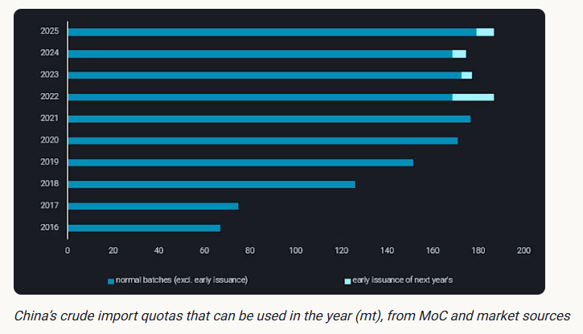
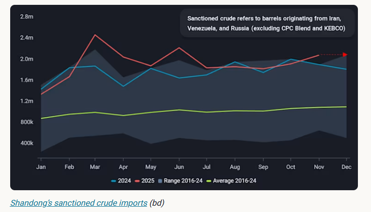
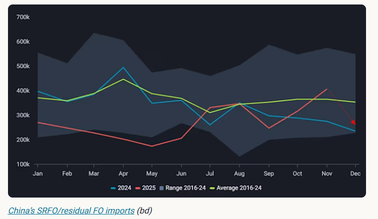

# China’s year-end crude quota release

**Date:** December 05, 2025  
**Publisher:** Breakwave Advisors | **Category:** Market Insights  
**Original URL:** [https://www.breakwaveadvisors.com/insights/2025/12/4/chinas-year-end-crude-quota-release](https://www.breakwaveadvisors.com/insights/2025/12/4/chinas-year-end-crude-quota-release)  

---

Behind China’s year-end crude quotas: What they reveal — and how they reshape sanctioned barrels

*By*[*Emma Li*](https://www.linkedin.com/in/emma-li-73003443/)

China issued its final batch of crude import quotas last week, totalling more than 7.5mt — notably higher than the 6mt released in the same batch last year. While some may view this as a sign of policy easing, the increase is better understood through the mechanics of China’s quota system and ongoing structural tightness. Under China’s planned framework, all refiners except the five major state-owned companies must hold import quotas to bring in seaborne crude. The National Development and Reform Commission (NDRC) determines the upper limit based on each plant’s registered CDU capacity, while the Ministry of Commerce (MoC) allocates annual quotas according to utilisation and tax compliance in the previous year. Although total quotas have risen over time, this largely reflects the integration of new refining capacity. In practice, allocations still fall short of effective demand due to unregistered capacity expansions and MoC cuts for underperforming refineries, resulting in routine Q4 tightness.

> **Figure 1: Στιγμιότυπο Οθόνης 2025 12 04 131022**  
> **Interactive Data & Source:** [Vortexa](https://www.vortexa.com//oil-gas-data-traders-analysts-data-scientists?gclid=Cj0KCQjw8_qRBhCXARIsAE2AtRZKOvMnbilZ_6_91d7huSFFy71pWLrnPwGwOHVzXsmsG-1a1mZnQw8aAt89EALw_wcB&hsa_acc=1782073842&hsa_ad=548425387665&hsa_cam=14746637662&hsa_grp=125038601902&hsa_kw=&hsa_mt=&hsa_net=adwords&hsa_src=g&hsa_tgt=dsa-1431852288425&hsa_ver=3&utm_campaign=%5BCD%5D%20-%20DSA%20-%20EMEA&utm_medium=cpc&utm_medium=ppc&utm_source=google&utm_source=adwords&utm_term=) | [Local Asset](file:///C:/Users/Dell/Github/Shipping/corpus/03-breakwave/insights/2025/assets/2025-12-05_chinas-year-end-crude-quota-release_img_cea3cf84ceb9ceb3cebcceb9cf8ccf84cf85_0c5be08ae995.png)

This tightness became extreme in 2022 on the back of exceptionally strong margins for teapots, prompting the MoC to allow some high-performing refiners to tap into their 2023 quotas early — a move that left them short in Q4 2023 and effectively institutionalised year-end pre-release of the following year’s quotas. This is the context behind the current early issuance. This year’s larger allocation reflects two additional pressures. First, the enforcement of the fuel oil consumption tax reduced teapots’ willingness to run non-crude feedstocks, accelerating their use of existing crude quotas and increasing their reliance on fresh allowances to maintain operations. Second, refining margins improved in Q4 as sanctions deepened discounts on sanctioned crude grades, encouraging more teapots to apply for extra quotas to capture these cheaper barrels. Together, these dynamics drove stronger demand for additional quota and ultimately resulted in a larger year-end issuance.

> **Figure 2: Στιγμιότυπο Οθόνης 2025 12 04 131031**  
> **Interactive Data & Source:** [Vortexa](https://www.vortexa.com//oil-gas-data-traders-analysts-data-scientists?gclid=Cj0KCQjw8_qRBhCXARIsAE2AtRZKOvMnbilZ_6_91d7huSFFy71pWLrnPwGwOHVzXsmsG-1a1mZnQw8aAt89EALw_wcB&hsa_acc=1782073842&hsa_ad=548425387665&hsa_cam=14746637662&hsa_grp=125038601902&hsa_kw=&hsa_mt=&hsa_net=adwords&hsa_src=g&hsa_tgt=dsa-1431852288425&hsa_ver=3&utm_campaign=%5BCD%5D%20-%20DSA%20-%20EMEA&utm_medium=cpc&utm_medium=ppc&utm_source=google&utm_source=adwords&utm_term=) | [Local Asset](file:///C:/Users/Dell/Github/Shipping/corpus/03-breakwave/insights/2025/assets/2025-12-05_chinas-year-end-crude-quota-release_img_cea3cf84ceb9ceb3cebcceb9cf8ccf84cf85_778e39cdd02b.png)

As for the effect on sanctioned flows, the new quotas will sustain — rather than lift — China’s sanctioned crude inflows. Shipments into Shandong have remained robust this year despite tightening sanctions, with part of the volumes accumulating in onshore - including bonded - storage rather than being immediately processed. This means new quotas will partly be used to draw down inventories rather than drive incremental seaborne imports.

Meanwhile, fuel oil imports, which surged recently as refiners sought alternatives amid quota shortages, are likely to decline through December as crude becomes more accessible again. With discounted Iranian and Russian fuel oil no longer needed to fill the gap, substitution should unwind, easing FO demand back toward lower levels.

> **Figure 3: Στιγμιότυπο Οθόνης 2025 12 04 131040**  
> **Interactive Data & Source:** [Vortexa](https://www.vortexa.com//oil-gas-data-traders-analysts-data-scientists?gclid=Cj0KCQjw8_qRBhCXARIsAE2AtRZKOvMnbilZ_6_91d7huSFFy71pWLrnPwGwOHVzXsmsG-1a1mZnQw8aAt89EALw_wcB&hsa_acc=1782073842&hsa_ad=548425387665&hsa_cam=14746637662&hsa_grp=125038601902&hsa_kw=&hsa_mt=&hsa_net=adwords&hsa_src=g&hsa_tgt=dsa-1431852288425&hsa_ver=3&utm_campaign=%5BCD%5D%20-%20DSA%20-%20EMEA&utm_medium=cpc&utm_medium=ppc&utm_source=google&utm_source=adwords&utm_term=) | [Local Asset](file:///C:/Users/Dell/Github/Shipping/corpus/03-breakwave/insights/2025/assets/2025-12-05_chinas-year-end-crude-quota-release_img_cea3cf84ceb9ceb3cebcceb9cf8ccf84cf85_4958137e0b3d.png)

Data Source:[Vortexa](https://www.vortexa.com//oil-gas-data-traders-analysts-data-scientists?gclid=Cj0KCQjw8_qRBhCXARIsAE2AtRZKOvMnbilZ_6_91d7huSFFy71pWLrnPwGwOHVzXsmsG-1a1mZnQw8aAt89EALw_wcB&hsa_acc=1782073842&hsa_ad=548425387665&hsa_cam=14746637662&hsa_grp=125038601902&hsa_kw=&hsa_mt=&hsa_net=adwords&hsa_src=g&hsa_tgt=dsa-1431852288425&hsa_ver=3&utm_campaign=%5BCD%5D%20-%20DSA%20-%20EMEA&utm_medium=cpc&utm_medium=ppc&utm_source=google&utm_source=adwords&utm_term=)

---

**Tags:** Crude, Shipping, Markets  
