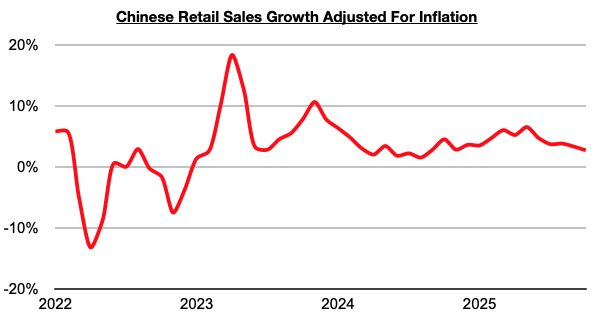

# Consumption Growth in China's Consumer Sector Continues to Decline

**Date:** December 08, 2025  
**Publisher:** Breakwave Advisors | **Category:** Market Insights  
**Original URL:** [https://www.breakwaveadvisors.com/insights/2025/12/7/consumption-growth-in-chinas-consumer-sector-continues-to-decline](https://www.breakwaveadvisors.com/insights/2025/12/7/consumption-growth-in-chinas-consumer-sector-continues-to-decline)  

---

*By*[*Jeffrey Landsberg*](https://www.linkedin.com/in/jeffrey-landsberg-70ab957/)

As we discussed in Commodore Research's most recent Weekly China Report, China’s retail sales in October grew year-on-year by 2.9%, which has marked another decline. Taking October’s 0.2% inflation into account, retail sales adjusted for inflation/deflation grew year-on-year by just 2.7%. This has marked the lowest growth seen since August 2024.

> **Figure 1: Chart**  
> [Local Asset](file:///C:/Users/Dell/Github/Shipping/corpus/03-breakwave/insights/2025/assets/2025-12-08_consumption-growth-in-chinas-consumer-sector-continues-to-decline_img_chart_17876106ea78.jpg)

Overall, consumption growth in China's consumer sector continues to decline and remains a concern. However, China's industrial sector continues to fare much better than the consumer sector. Also noteworthy is that retail sales growth has at least again come in higher than any inflation. This has now occurred for thirty-four straight months. Prior to the last thirty-four months, retail sales came in lower than inflation for four straight months.

---

**Tags:** China, Markets, Economy  
