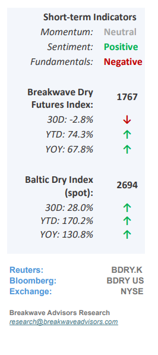
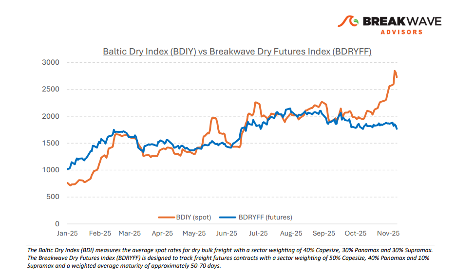
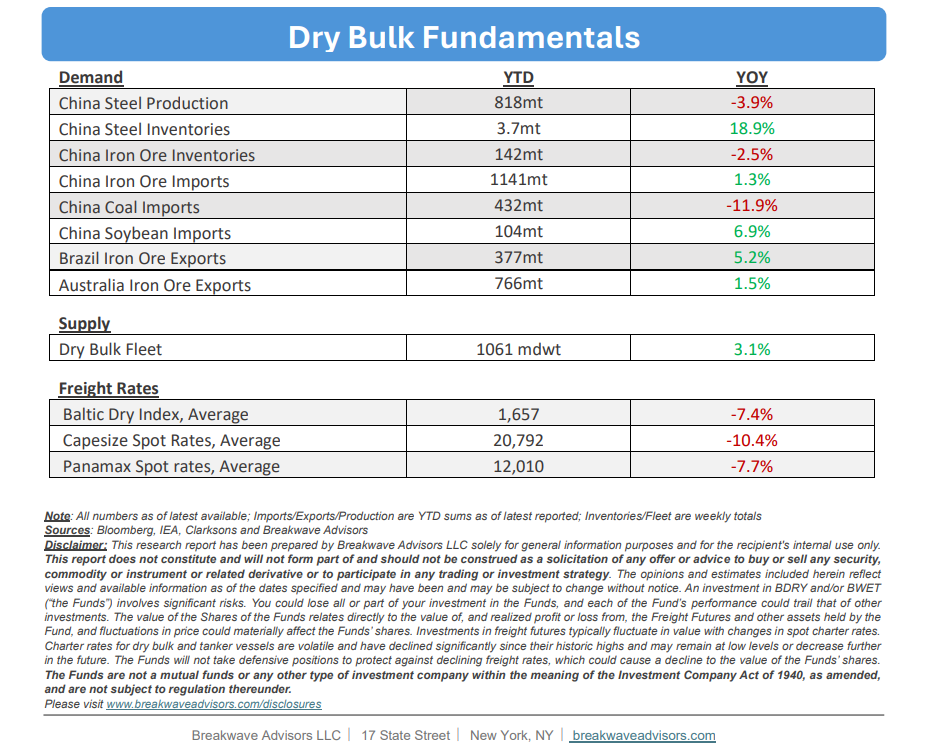

# Breakwave Bi-Weekly Dry Bulk Report - December 9, 2025

**Date:** December 09, 2025  
**Publisher:** Breakwave Advisors | **Category:** Market Insights  
**Original URL:** [https://www.breakwaveadvisors.com/insights/1292025db-report458kk](https://www.breakwaveadvisors.com/insights/1292025db-report458kk)  

---

•**The Battle of Seasonality Continues**– With current Capesize spot rates in the $40,000 range and the January futures contract trading in the low $20,000s, the dry bulk market appears to be**positioning for a significant correction in spot rates**, one consistent with historical patterns. Historically, the Capesize spot market has exited the year at levels well below where it stands today; over the past decade, year-end rates have ranged from approximately $5,000 to $20,000, with an average near $15,000. Nevertheless, each day that the Index remains at elevated levels forces the futures market to adjust,**pricing in the possibility of an outlier scenario.**Our view is that spot rates are likely to fall below $20,000 over the next few months, in line with historical trends, as seasonal demand typically eases. Although some support is expected from West Africa and the strong bauxite trade, we believe this incremental cargo flow will not be sufficient to sustain current rate levels. In any case, such a**correction is widely anticipated.**The key indicator of underlying market strength will be the subsequent spring recovery, which will reveal whether the dry bulk market can maintain a premium in spot rates despite what otherwise appears to be another year of relatively flat demand growth for bulk commodities.

> **Figure 1: Cea3cf84ceb9ceb3cebcceb9cf8ccf84cf85**  
> [Local Asset](file:///C:/Users/Dell/Github/Shipping/corpus/03-breakwave/insights/2025/assets/2025-12-09_1292025db-report458kk_img_cea3cf84ceb9ceb3cebcceb9cf8ccf84cf85_fd0b8ef12abf.png)

•**Seaborne Iron Ore Trade to Flatten Vale Says**– During its annual Vale Day event, Vale projected that the global**seaborne iron ore market will remain broadly flat**over the next five years. The company expects Chinese iron ore demand to contract, while natural resource depletion will also constrain projected export volumes. These declines are expected to be partially offset by increased shipments from West Africa and modest demand growth, primarily from the Middle East. Iron ore prices continue to hover around $100 per ton, which appears to represent the equilibrium level balancing production economics with steel mill margins. However, with supply set to increase and inventories remaining at comfortable levels, roughly flat year-overyear, we maintain a**cautious outlook on the forward price trajectory for iron ore**. At present, freight represents approximately 25% of the delivered cost to China for Brazil-origin cargoes, placing it at the higher end of the historical range. In our view, any**downward movement**in iron ore prices is likely to**put additional pressure on freight rates**as well. Lower prices would weaken miners’ leverage, incentivizing them to prioritize volume over pricing, which in turn could reduce potential shipping flows.

•**Our Long-term View**– The last few years have been characterized by increased geopolitical uncertainty. Going forward, we expect such events to continue to affect global trade and have a meaningful impact on effective vessel supply. Combined with the potential for a multi-year cyclical rebound in China’s economic activity following the recent economic turmoil, dry bulk shipping should experience higher volatility on top of a secular tightness driven by stable bulk commodity demand and a slower fleet growth owing to a relatively low orderbook.

> **Figure 2: Στιγμιότυπο Οθόνης 2025 12 09 095427**  
> [Local Asset](file:///C:/Users/Dell/Github/Shipping/corpus/03-breakwave/insights/2025/assets/2025-12-09_1292025db-report458kk_img_cea3cf84ceb9ceb3cebcceb9cf8ccf84cf85_a7d78a61ebcf.png)

> **Figure 3: Στιγμιότυπο Οθόνης 2025 12 09 114744**  
> [Local Asset](file:///C:/Users/Dell/Github/Shipping/corpus/03-breakwave/insights/2025/assets/2025-12-09_1292025db-report458kk_img_cea3cf84ceb9ceb3cebcceb9cf8ccf84cf85_99d5ef2ae6b1.png)

### Subscribe:
