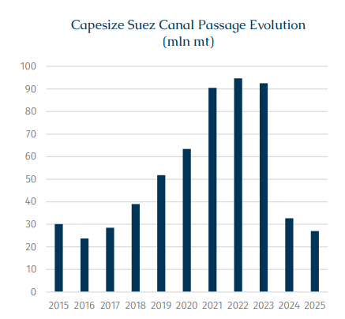
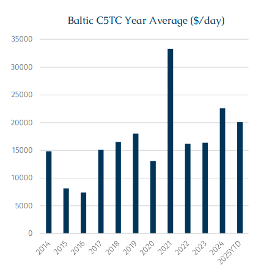
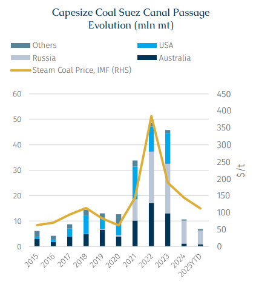
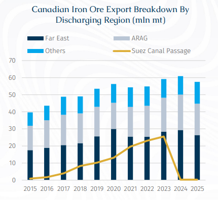
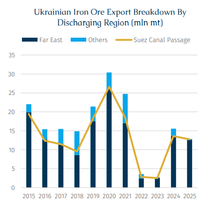

# Suez Canal Post-Ceasefire: Outlook for Capesize Transits

**Date:** December 09, 2025  
**Publisher:** Breakwave Advisors | **Category:** Market Insights  
**Original URL:** [https://www.breakwaveadvisors.com/insights/2025/12/9/suez-canal-post-ceasefire-outlook-for-capesize-transits](https://www.breakwaveadvisors.com/insights/2025/12/9/suez-canal-post-ceasefire-outlook-for-capesize-transits)  

---

> **Figure 1: Rgb Color Brs Shipbrokers Monogram Logo**  
> [Local Asset](file:///C:/Users/Dell/Github/Shipping/corpus/03-breakwave/insights/2025/assets/2025-12-09_suez-canal-post-ceasefire-outlook-for-capesize-transits_img_rgb-color-brs-shipbrokers-monogram-l_c365f35f1de5.png)

The Red Sea crisis, now stretching into its third year, has shown a sudden turning point. On 11 November, Yemen’s Houthi rebels issued a statement announcing that it had stopped attacks against Israel and commercial shipping in the Red Sea. This statement marked the first time that the Houthis had formally confirmed a suspension of attacks since the Gaza ceasefire agreement came into effect on 10 October.

Following the Houthi declaration, discussions about a potential resumption of Suez transits have begun to emerge. Notably, last week, CMA CGM and Maersk respectively reached a consensus with the SCA (Egypt’s Suez Canal Authority), reiterating their desire to restore transportation services through the Suez Canal and the Red Sea. Nevertheless, shipping companies such as these have been unwilling to provide a specific timetable, reflecting their cautious attitude and that although the security situation in the Red Sea region has improved, their safety concerns have not been completely eliminated. Therefore, the full resumption of normal navigation still depends on the security situation remaining stable for a considerable period.

As the dominant contributors to the Suez Canal’s total transit volume (in contrast, dry bulk fleet accounts for only about 20% of the overall passage), the latest statements from liner companies represent the expectations and attitudes of most shipowners. Under the continued influence of geopolitical conflicts, the recovery of the Suez Canal’s transit volume is highly likely to show a slow and gradual rise rather than a rapid rebound, a pattern fundamentally different from the rapid increase in Panama Canal transits upon the easing of drought conditions there. Indeed, the risks in the Red Sea/Suez are more uncertain. Although most players are still taking a wait-and-see stance for now, it is necessary for us to consider the impact of the eventual normalization of shipping operations in the Suez and Red Sea on the dry bulker market.

> **Figure 2: Στιγμιότυπο Οθόνης 2025 12 09 161732**  
> [Local Asset](file:///C:/Users/Dell/Github/Shipping/corpus/03-breakwave/insights/2025/assets/2025-12-09_suez-canal-post-ceasefire-outlook-for-capesize-transits_img_cea3cf84ceb9ceb3cebcceb9cf8ccf84cf85_d1cf7ce6f844.png)

Looking back at the three years before the outbreak of the Red Sea crisis (2021-23), the Suez-transiting volume of laden Capesize vessels approached a record 95 mln mt. However, we believe that this level should not be regarded as the norm, but was jointly driven by multiple overlapping idiosyncratic factors, many of which are difficult to replicate under the current and foreseeable market environment. Among them, the two most important reasons are freight levels and coal trade.

### The Suez Canal Becomes a More Attractive Option Amid High Freight Rates

The absolute high point for Capesize freight rates was attained in 2021 when the annual average of C5TC exceeded $33,000/day, a level not seen in the past decade. Under such freight stimulation, shipowners’ willingness to transit via Suez clearly increased on both laden and ballast voyage, since any route choice that saves time and improves turnaround efficiency could bring an increase in earnings. Taking the Canada China iron ore round voyage as an example, passing through the Suez Canal can save 9 days of voyage time and about 300 tonnes of fuel compared with going around the Cape of Good Hope. Based on the average level of 2021, shipowners could save around $1 mln by transiting the Suez Canal (basis a round voyage). In contrast, the cost of the Suez Canal itself is relatively stable, at roughly $400–500,000 for a Capesize vessel (and some routes may apply the Suez Canal Rebate scheme). Based on this comparison, Capesize shipowners had a clear incentive to choose the Suez route to enhance profitability.

> **Figure 3: Στιγμιότυπο Οθόνης 2025 12 09 161740**  
> [Local Asset](file:///C:/Users/Dell/Github/Shipping/corpus/03-breakwave/insights/2025/assets/2025-12-09_suez-canal-post-ceasefire-outlook-for-capesize-transits_img_cea3cf84ceb9ceb3cebcceb9cf8ccf84cf85_8a8e183a9ddb.png)

### Soaring Coal Prices Gave Rise to Numerous Long-Haul Coal Routes

In 2022 and 2023, Capesize freight rates declined significantly, but the Suez Canal’s transit volume did not fall but rather rose. This was driven primarily by exceptionally high coal prices. Historically, coal is extremely sensitive to seaborne freight due to its low cargo value, making it difficult to support long-haul shipments. In addition to the high proportion of freight in the delivered cost, long voyages also increase risks such as degradation and moisture damage, further limiting the economic feasibility of long-distance coal trade.

However, the outbreak of the Russia-Ukraine conflict completely subverted global coal trade dynamics across 2022-23, pushing coal prices sharply upward, which in turn significantly improved the economic viability of long-haul coal trade. Against this backdrop, a series of new coal trade routes centered on Russia rapidly expanded, as long-distance shipments opened from Russia’s Baltic ports to China and India via the Suez Canal. Accordingly, coal transportation via Suez rose sharply from around 10 mln mt to 48 mln mt in 2022 and 45 mln mt in 2023. Russia accounted for 20 mln mt and 19 mln mt in 2022 and 2023, respectively. However, as the short-term disruptions caused by the war subsided, coal prices subsequently tumbled reflecting the return to normal of major countries’ coal supply structures. As a result, Russia’s long-distance exports proved unsustainable and are not expected to return even if Suez risks decline.

> **Figure 4: Στιγμιότυπο Οθόνης 2025 12 09 161752**  
> [Local Asset](file:///C:/Users/Dell/Github/Shipping/corpus/03-breakwave/insights/2025/assets/2025-12-09_suez-canal-post-ceasefire-outlook-for-capesize-transits_img_cea3cf84ceb9ceb3cebcceb9cf8ccf84cf85_a2c93a18505f.png)

**When risks decline and economic viability returns, which trade flows are most likely to return to the Suez Canal?**

The first is Canadian iron ore. In the past two years, the volume of Canadian iron ore shipped to the Far East via Suez has almost fallen to zero, but the destination zones and trade directions have not fundamentally shifted. This means that the trade itself has not disappeared, but was forced to divert around the Cape of Good Hope. In this situation, once Suez transit again becomes economically feasible, the probability of Canadian iron ore returning is very high.

> **Figure 5: Στιγμιότυπο Οθόνης 2025 12 09 161814**  
> [Local Asset](file:///C:/Users/Dell/Github/Shipping/corpus/03-breakwave/insights/2025/assets/2025-12-09_suez-canal-post-ceasefire-outlook-for-capesize-transits_img_cea3cf84ceb9ceb3cebcceb9cf8ccf84cf85_67636b9de0d6.png)

Another example is Ukrainian iron ore. In contrast to Canada, Ukrainian iron ore has remained almost entirely dependent on the Suez Canal. Due to its geographical limitations, alternative routes are not practically viable, so as Red Sea risks decrease, Ukrainian ore’s competitiveness should improve amid lower insurance rates, risk surcharges, and related navigation costs, thereby promoting potential growth in its exports. It is worth noting that Ukraine remains heavily exposed to war-related uncertainties, which means that the resumption of Suez Canal transit may have only a limited short-term impact on its shipments.

> **Figure 6: Στιγμιότυπο Οθόνης 2025 12 09 161823**  
> [Local Asset](file:///C:/Users/Dell/Github/Shipping/corpus/03-breakwave/insights/2025/assets/2025-12-09_suez-canal-post-ceasefire-outlook-for-capesize-transits_img_cea3cf84ceb9ceb3cebcceb9cf8ccf84cf85_8f24e38f18e4.png)

When assessing future transit levels, we believe that a more reasonable expectation is that rather than returning to the nearly 100 mln mt scale of 2021–2023, it will remain in the 50–60 mln mt range per year, depending on freight rate levels. It is important to emphasize that this range should not be interpreted as a specific forecast of next year’s Suez Canal transit volume, but should be understood as a potential upper-bound range under a series of optimistic assumptions: including a full recovery in transit sentiment, alleviated geopolitical risks, and a market that returns to normal operation. In reality, considering shipowners’ cautious attitudes, the lag in redeploying capacity, the existence of insurance and risk premiums, and the inertia of trade structures, a more likely outcome is a gradual, step-by-step recovery, while participants wait and hope that the return of major players such as Maersk and CMA CGM will provide reassurance to the broader shipping community. This also means that the decline in tonne-mile demand, due to a shorter voyage distance, will be a gradual process rather than an instantaneous drop.

---

**Tags:** Capesize, Drybulk, Ironore  
