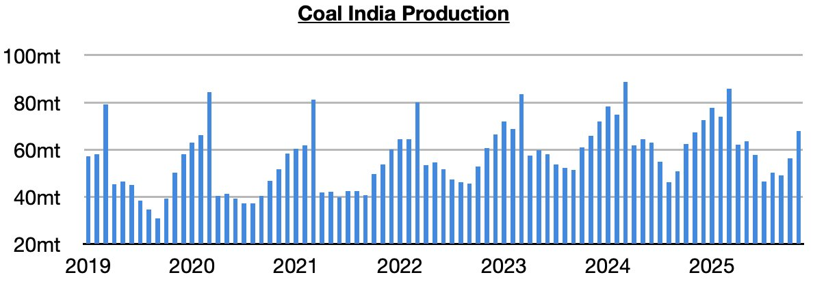
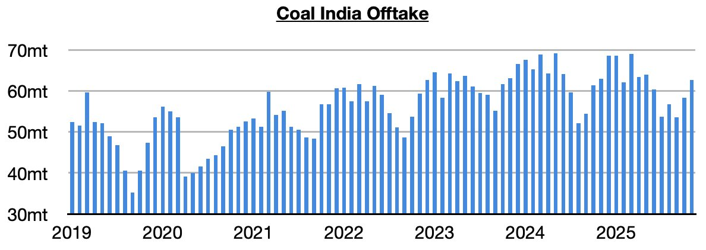
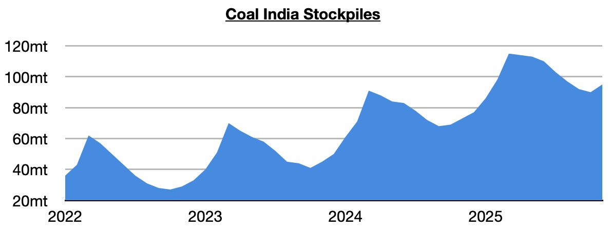

# Rebound in Coal India's Stockpiles

**Date:** December 10, 2025  
**Publisher:** Breakwave Advisors | **Category:** Market Insights  
**Original URL:** [https://www.breakwaveadvisors.com/insights/2025/12/10/rebound-in-coal-indias-stockpiles](https://www.breakwaveadvisors.com/insights/2025/12/10/rebound-in-coal-indias-stockpiles)  

---

*By*[*Jeffrey Landsberg*](https://www.linkedin.com/in/jeffrey-landsberg-70ab957/)

Coal India (which is responsible for over 75% of India’s coal output) produced 68 million tons of coal last month. This is up month-on-month by 13.6 million tons (21%) and up year-on-year by 800,000 tons (2%). Previously, Coal India’s output had contracted on a year-on-year basis during eight of the prior ten months. Significant is that 2025, in total, has seen Coal India’s output contract year-on-year by 3%. In comparison, India’s coal-derived electricity generation has contracted by 4.3%.

> **Figure 1: Chart 1**  
> [Local Asset](file:///C:/Users/Dell/Github/Shipping/corpus/03-breakwave/insights/2025/assets/2025-12-10_rebound-in-coal-indias-stockpiles_img_chart1_048369986910.jpg)

Offtake (the amount sent to customers) totaled 62.7 million tons, which is up month-on-month by 4.4 million tons (8%) but down year-on-year by 300,000 tons (-1%). Prior to last month, offtake had exceeded production for seven straight months.

> **Figure 2: Chart 2**  
> [Local Asset](file:///C:/Users/Dell/Github/Shipping/corpus/03-breakwave/insights/2025/assets/2025-12-10_rebound-in-coal-indias-stockpiles_img_chart2_b7fd096e784c.jpg)

Stockpiles have rebounded with offtake finally exceeding production. Coal India's stockpiles now stand at approximately 95 million tons. This is 20 million tons (-17%) less than March’s record 115 million tons, but it is up month-on-month by 5 million tons (6%) and year-on-year by 22 million tons (30%).

> **Figure 3: Chart 3**  
> [Local Asset](file:///C:/Users/Dell/Github/Shipping/corpus/03-breakwave/insights/2025/assets/2025-12-10_rebound-in-coal-indias-stockpiles_img_chart3_2265e520fc71.jpg)

---

**Tags:** Coal, Commodities, Drybulk  
