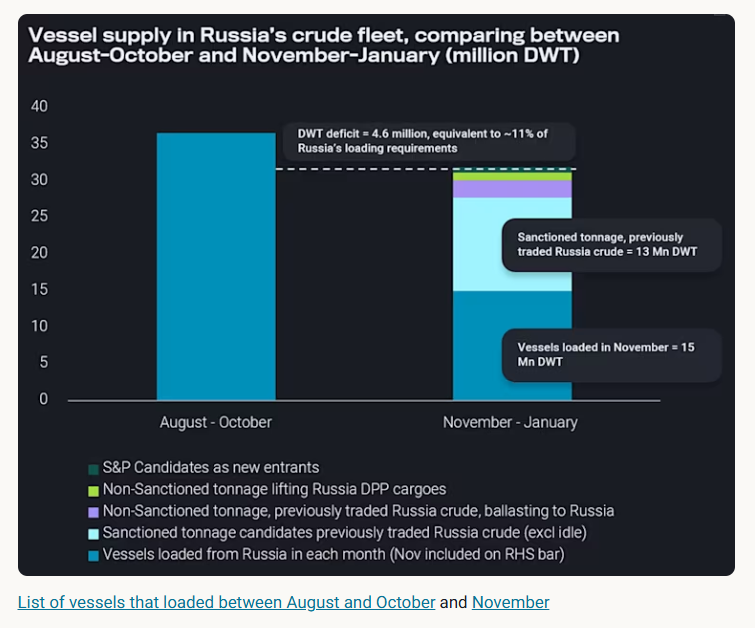
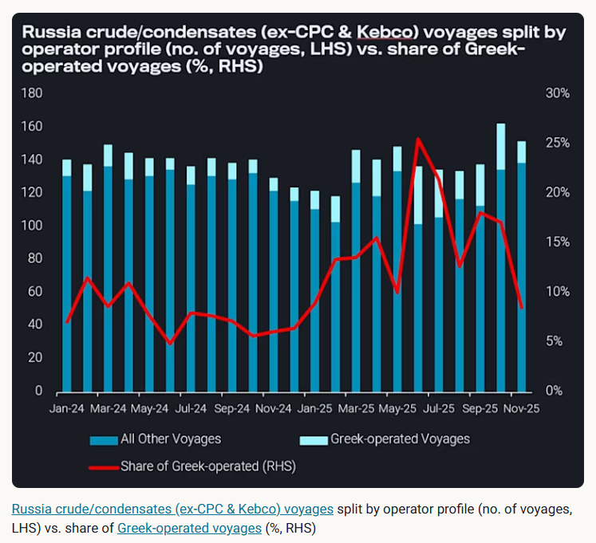
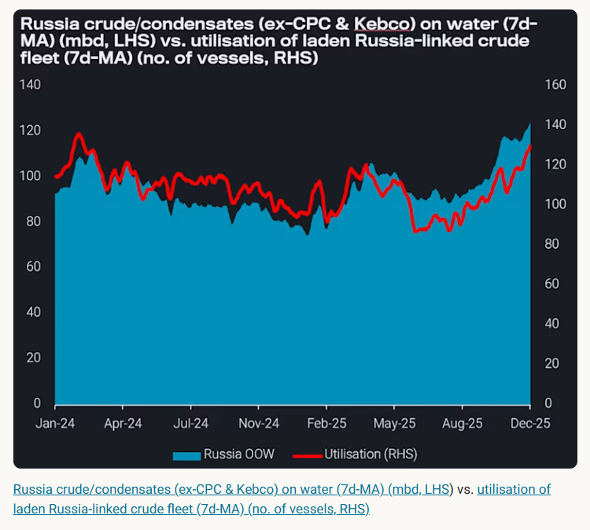
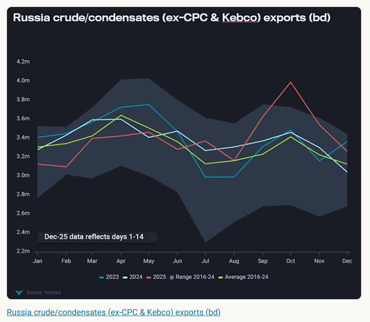

# Does Russia have a vessel supply issue?

**Date:** December 12, 2025  
**Publisher:** Breakwave Advisors | **Category:** Market Insights  
**Original URL:** [https://www.breakwaveadvisors.com/insights/2025/12/12/does-russia-have-a-vessel-supply-issue](https://www.breakwaveadvisors.com/insights/2025/12/12/does-russia-have-a-vessel-supply-issue)  

---

A tightening crude fleet and mounting sanctions are creating a structural vessel shortage for Russia’s export system.

*By*[*Delia He*](https://www.linkedin.com/in/hedelia/)

Russia’s ability to sustain its crude exports increasingly hinges on a logistical constraint that has grown too large to ignore: the tonnage willing and available to lift Russian barrels.

An analysis of the vessel supply in Russia’s crude trading fleet points to a persistent, structural deficit in available tonnage – one that continues to widen as sanctions intensify, and operational risks escalate.

This year, harsher sanctions have significantly raised the compliance and reputational risks associated with participating in Russia crude flows, especially after US’ and EU’s coordinated measure targeting Rosneft and Lukoil-linked networks.

These developments highlight the question: how much will Russia’s export engine struggle if its crude fleet diminishes by the day?

## A Grim Vessel Supply Outlook Visible

A review of Russia’s near-term tonnage supply for the coming three months reveals a shortfall that is both material and increasingly difficult to close. Taking into account:

1. Unique vessels that had directly loaded crude cargoes (ex-CPC and Kebco) from Russian ports in August-October, and that had continued to load in November;

2. Sanctioned tonnage that traded Russian crude between August-October, but have yet to lift a new cargo; 3. Vessels with a history of trading Russia crude, currently ballasting toward Russia load regions.

The resulting tonnage pool still falls short by ~6.5 million DWT, relative to Russia’s crude loading requirements observed in August-October. This deficit is roughly equivalent to 53 Suezmaxes and Aframaxes.

> **Figure 1: Στιγμιότυπο Οθόνης 2025 12 12 100834**  
> **Interactive Data & Source:** [Vortexa](https://www.vortexa.com//oil-gas-data-traders-analysts-data-scientists?gclid=Cj0KCQjw8_qRBhCXARIsAE2AtRZKOvMnbilZ_6_91d7huSFFy71pWLrnPwGwOHVzXsmsG-1a1mZnQw8aAt89EALw_wcB&hsa_acc=1782073842&hsa_ad=548425387665&hsa_cam=14746637662&hsa_grp=125038601902&hsa_kw=&hsa_mt=&hsa_net=adwords&hsa_src=g&hsa_tgt=dsa-1431852288425&hsa_ver=3&utm_campaign=%5BCD%5D%20-%20DSA%20-%20EMEA&utm_medium=cpc&utm_medium=ppc&utm_source=google&utm_source=adwords&utm_term=) | [Local Asset](file:///C:/Users/Dell/Github/Shipping/corpus/03-breakwave/insights/2025/assets/2025-12-12_does-russia-have-a-vessel-supply-issue_img_cea3cf84ceb9ceb3cebcceb9cf8ccf84cf85_760e722f28dc.png)

Russia could bridge the tonnage supply gap with the following two scenarios:

1) look to the second-hand S&P market, relying on aged vessels that could be absorbed into the shadow fleet, and redeployed on sanctioned Russia crude trades. Vortexa has identified five such plausible candidates.

2) Attempt to convert unsanctioned vessels that are currently lifting Russia DPP barrels, which stand at ~1.1 million DWT in November.

Even in the event of scenario 2, Russia could still be left with a likely 11% shortfall compared to loading requirements seen over summer.

What then emerges is a structural challenge: Russia would not have sufficient tonnage to comfortably execute its crude export programme. (In 1H2025, Russia seaborne crude exports (ex-CPC, Kebco) came to a monthly average of 3.3mbd).

## Vessels Are Already Retreating From Russia Trade

Crucially, the above analysis had assumed that flexible operators of unsanctioned tonnage – particularly Greek entities – would scale back their exposure to Russia. Evidence suggests that this retreat is already accelerating.

Year-to-date (up to November 30) 15% of monthly Russia crude voyages (ex-CPC, Kebco) were lifted on Greek-operated vessels. The share of voyages made by Greek-operated vessels had peaked at 24% in June (with 35 unique vessels), but have since declined to 10% in November (with only 16 unique vessels participating).

> **Figure 2: Στιγμιότυπο Οθόνης 2025 12 12 100846**  
> **Interactive Data & Source:** [Vortexa](https://www.vortexa.com//oil-gas-data-traders-analysts-data-scientists?gclid=Cj0KCQjw8_qRBhCXARIsAE2AtRZKOvMnbilZ_6_91d7huSFFy71pWLrnPwGwOHVzXsmsG-1a1mZnQw8aAt89EALw_wcB&hsa_acc=1782073842&hsa_ad=548425387665&hsa_cam=14746637662&hsa_grp=125038601902&hsa_kw=&hsa_mt=&hsa_net=adwords&hsa_src=g&hsa_tgt=dsa-1431852288425&hsa_ver=3&utm_campaign=%5BCD%5D%20-%20DSA%20-%20EMEA&utm_medium=cpc&utm_medium=ppc&utm_source=google&utm_source=adwords&utm_term=) | [Local Asset](file:///C:/Users/Dell/Github/Shipping/corpus/03-breakwave/insights/2025/assets/2025-12-12_does-russia-have-a-vessel-supply-issue_img_cea3cf84ceb9ceb3cebcceb9cf8ccf84cf85_86096f5454d5.png)

On December 7, the EU had further proposed a maritime ban on transporting Russian oil, signalling a ratcheting up of compliance pressure on European-linked entities. This exodus of flexible operators predates the formal EU ban, suggesting that the voluntary withdrawal of Western operators would intensify under a stricter regulatory regime.

## Freight Signals Confirm a Tightening Fleet

Russia-to-India crude freight rates have continued to trend higher, reaching a 19-month high (Argus). Plus, Russia crude fleet utilisation has hit a 21-month record high, against a backdrop of massively elevated Russian crude on water volumes. These are clear, real-time indicators of tightening supply.

> **Figure 3: Στιγμιότυπο Οθόνης 2025 12 12 100855**  
> **Interactive Data & Source:** [Vortexa](https://www.vortexa.com//oil-gas-data-traders-analysts-data-scientists?gclid=Cj0KCQjw8_qRBhCXARIsAE2AtRZKOvMnbilZ_6_91d7huSFFy71pWLrnPwGwOHVzXsmsG-1a1mZnQw8aAt89EALw_wcB&hsa_acc=1782073842&hsa_ad=548425387665&hsa_cam=14746637662&hsa_grp=125038601902&hsa_kw=&hsa_mt=&hsa_net=adwords&hsa_src=g&hsa_tgt=dsa-1431852288425&hsa_ver=3&utm_campaign=%5BCD%5D%20-%20DSA%20-%20EMEA&utm_medium=cpc&utm_medium=ppc&utm_source=google&utm_source=adwords&utm_term=) | [Local Asset](file:///C:/Users/Dell/Github/Shipping/corpus/03-breakwave/insights/2025/assets/2025-12-12_does-russia-have-a-vessel-supply-issue_img_cea3cf84ceb9ceb3cebcceb9cf8ccf84cf85_05dc69a32f15.png)

Looking ahead, in addition to greater absorption of ageing vessels via the S&P market, Russia’s crude logistics would likely rely on a heavier use of dark, evasive tactics. This includes increased dark STS operations in new jurisdictions, mirroring tactics employed by Iran’s dark fleet.

These measures would inevitably lengthen Russia’s oil supply chain. Protracted voyage durations, and greater reliance on evasive practices would keep vessels tied up at sea for extended periods – further tightening effective fleet supply.

Two scenarios stand out. If India and Turkey were to sharply scale back purchases of Russia crude, most barrels would therefore default to China. This would lock the fleet into longer-haul voyages. Under such circumstance, Russia would likely scale up STS operations in the Mediterranean or Mideast Gulf to accelerate vessel turnaround, potentially drawing more VLCCs into Russia’s shadow fleet.

If, instead, India’s and Turkey’s demand for Russian crude recovers, there is a strong financial incentive for Russia to keep export flows steady. Russia would likely continue to aggressively recruit new entrants into the shadow fleet – either from the S&P market, or attracting flexible operators – to backfill the tonnage deficit.

## The Russia Oil Machine Is at Risk

Russia’s crude export performance in 2025 has been robust – with 2H2025 exports seeing a 7% y-o-y uplift, and 10% uplift from 2023 levels – despite sanctions headwinds.

But enforcement intensity has risen in parallel, and the underlying pool of vessels available have appeared to have fallen out of pace with export ambitions. A key determinant of Russia’s ability to sustain its crude supply chain would be the physical availability of the fleet that moves the barrels.

> **Figure 4: Στιγμιότυπο Οθόνης 2025 12 12 100905**  
> **Interactive Data & Source:** [Vortexa](https://www.vortexa.com//oil-gas-data-traders-analysts-data-scientists?gclid=Cj0KCQjw8_qRBhCXARIsAE2AtRZKOvMnbilZ_6_91d7huSFFy71pWLrnPwGwOHVzXsmsG-1a1mZnQw8aAt89EALw_wcB&hsa_acc=1782073842&hsa_ad=548425387665&hsa_cam=14746637662&hsa_grp=125038601902&hsa_kw=&hsa_mt=&hsa_net=adwords&hsa_src=g&hsa_tgt=dsa-1431852288425&hsa_ver=3&utm_campaign=%5BCD%5D%20-%20DSA%20-%20EMEA&utm_medium=cpc&utm_medium=ppc&utm_source=google&utm_source=adwords&utm_term=) | [Local Asset](file:///C:/Users/Dell/Github/Shipping/corpus/03-breakwave/insights/2025/assets/2025-12-12_does-russia-have-a-vessel-supply-issue_img_cea3cf84ceb9ceb3cebcceb9cf8ccf84cf85_16a7c183f0e0.png)

Data Source:[Vortexa](https://www.vortexa.com//oil-gas-data-traders-analysts-data-scientists?gclid=Cj0KCQjw8_qRBhCXARIsAE2AtRZKOvMnbilZ_6_91d7huSFFy71pWLrnPwGwOHVzXsmsG-1a1mZnQw8aAt89EALw_wcB&hsa_acc=1782073842&hsa_ad=548425387665&hsa_cam=14746637662&hsa_grp=125038601902&hsa_kw=&hsa_mt=&hsa_net=adwords&hsa_src=g&hsa_tgt=dsa-1431852288425&hsa_ver=3&utm_campaign=%5BCD%5D%20-%20DSA%20-%20EMEA&utm_medium=cpc&utm_medium=ppc&utm_source=google&utm_source=adwords&utm_term=)

---

**Tags:** Crude, Shipping, Markets  
