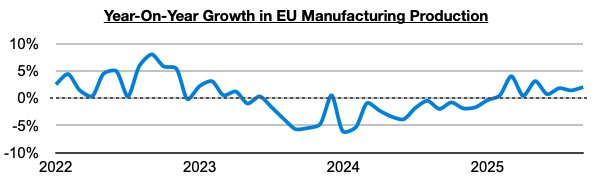
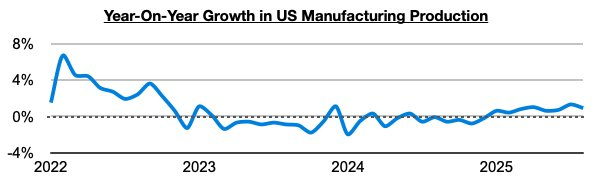
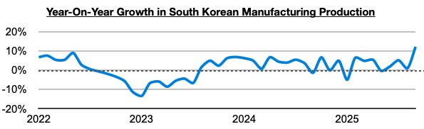
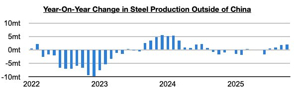

# Ongoing Global Manufacturing Production Growth

**Date:** December 12, 2025  
**Publisher:** Breakwave Advisors | **Category:** Market Insights  
**Original URL:** [https://www.breakwaveadvisors.com/insights/2025/12/12/ongoing-global-manufacturing-production-growth](https://www.breakwaveadvisors.com/insights/2025/12/12/ongoing-global-manufacturing-production-growth)  

---

*By*[*Jeffrey Landsberg*](https://www.linkedin.com/in/jeffrey-landsberg-70ab957/)

While during much of last year there was sustained industrial weakness in the global economy outside of China — this year in Commodore's Weekly Executive Reports we have continued to stress that there has been sustained improvement, with the majority of major economies worldwide now enjoying year-on-year growth in manufacturing production (**manufacturing specifically refers to using raw materials to create finished products and is the largest component of overall industrial production**). In addition to manufacturing production continuing to enjoy long periods of year-on-year growth in China, India, and Russia (all have seen at least thirty-two months of sustained year-on-year growth) — Europe, the United States, and South Korea have all more recently been enjoying sustained growth as well. In the European Union, the most recently released data shows manufacturing production has grown on a year-on-year basis for eight straight months. Previously, it had contracted on a year-on-year basis for thirteen straight months.

> **Figure 1: Chart 1**  
> [Local Asset](file:///C:/Users/Dell/Github/Shipping/corpus/03-breakwave/insights/2025/assets/2025-12-12_ongoing-global-manufacturing-production-growth_img_chart1_21a75c45d83e.jpg)

In the United States, manufacturing production has grown on a year-on-year basis for eight straight months. Previously, it had contracted on a year-on-year basis during nineteen of the prior twenty-two months.

> **Figure 2: Chart 2**  
> [Local Asset](file:///C:/Users/Dell/Github/Shipping/corpus/03-breakwave/insights/2025/assets/2025-12-12_ongoing-global-manufacturing-production-growth_img_chart2_4717c11b53c8.jpg)

In South Korea, manufacturing production has grown on a year-on-year basis in seven of the last eight months. Previously, it had contracted on a year-on-year basis during three of the prior five months.

> **Figure 3: Chart 3**  
> [Local Asset](file:///C:/Users/Dell/Github/Shipping/corpus/03-breakwave/insights/2025/assets/2025-12-12_ongoing-global-manufacturing-production-growth_img_chart3_8c90cfe795e6.jpg)

Overall, it remains helpful for the dry bulk shipping market that the industrial improvement occurring in the global economy remains in place. And of course helpful for iron ore trade is that steel production ex-China in recent months has finally been enjoying growth. This remains a relatively new development. Steel production ex-China has now grown on a year-on-year basis for four straight months. Previously, it had contracted during eight of the prior ten months.

> **Figure 4: Chart 4**  
> [Local Asset](file:///C:/Users/Dell/Github/Shipping/corpus/03-breakwave/insights/2025/assets/2025-12-12_ongoing-global-manufacturing-production-growth_img_chart4_3ca44d094fb4.jpg)

---

**Tags:** Drybulk, Shipping, Markets  
