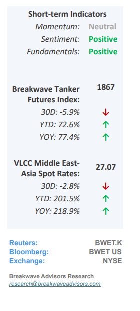
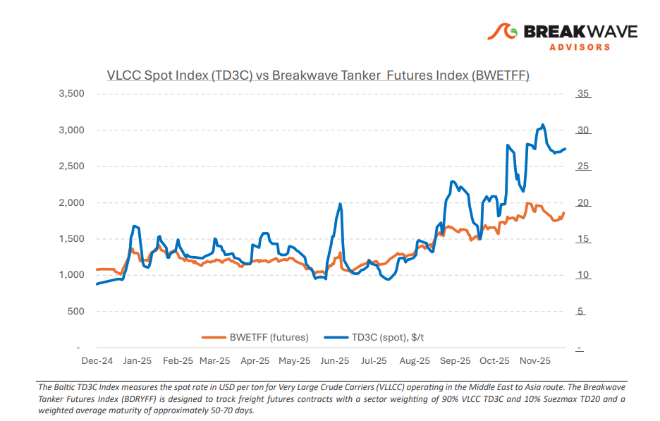
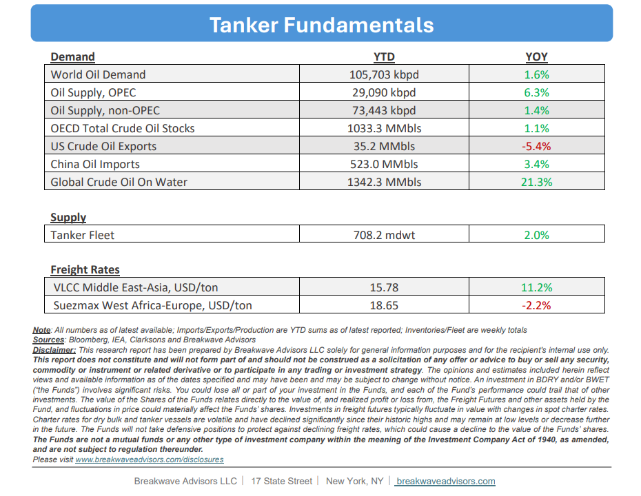

# Breakwave Bi-Weekly Tanker Report - December 16, 2025

**Date:** December 16, 2025  
**Publisher:** Breakwave Advisors | **Category:** Market Insights  
**Original URL:** [https://www.breakwaveadvisors.com/insights/12162025wetreport5k447544](https://www.breakwaveadvisors.com/insights/12162025wetreport5k447544)  

---

•**VLCC Market Holds Ground but Lacks Fuel into Yearend**– In the lead-up to midDecember, the Arabian Gulf VLCC**market exhibited restrained sentiment,**as activity remained muted due to limited new inquiries and ample available tonnage. Although a small cluster of prompt stems attracted temporary interest and led to a brief tightening in local supply, this effect proved transitory, with insufficient charterer engagement preventing any sustained momentum. By the close of the week, a substantial portion of third-decade December cargoes had been fixed, whereas forward January stems continued to encounter ample supply, restricting owners’ leverage to increase rates. The**West Africa VLCC market**reflected the quieter year-end atmosphere seen across the Atlantic basin, with**few inquiries**and limited visibility in the spot market. Most deals were handled discreetly, making it hard to interpret the available tonnage list or predict market direction. Although there was some tightening late in the week as several VLCCs headed to the Middle East, this had little effect on overall sentiment. Ship owners struggled to turn the modest reduction in vessel availability into higher rates due to a lack of new demand. As the year ends, the VLCC market**appears optimistic and poised for a robust year:**Asian demand remains steady, OPEC's outlook is positive, and global geopolitical tensions are still boosting tonne-miles.

> **Figure 1: Στιγμιότυπο Οθόνης 2025 12 16 104813**  
> [Local Asset](file:///C:/Users/Dell/Github/Shipping/corpus/03-breakwave/insights/2025/assets/2025-12-16_12162025wetreport5k447544_img_cea3cf84ceb9ceb3cebcceb9cf8ccf84cf85_03eb565b9ff0.png)

•**OPEC+ Reiterates its Bullish Outlook for 2026**– OPEC has recently reiterated a bullish demand forecast into 2026, expecting global oil demand to rise by about 1.4 million barrels per day (bpd) next year,**supporting a relatively balanced oil market**based on the group’s latest projections. OPEC anticipates demand for**OPEC+**crude at around 43.0 million bpd in 2026, slightly up from the full year 2025 estimates, and suggests that**supply and demand could remain closely aligned**, even as monthly production increases are paused in early 2026. This contrasts with broader market chatter about a potential oversupply that has kept prices subdued for most of the past year: While OPEC’s outlook suggests balance or modest tightening, other forecasters (e.g., IEA and commodities firms)**warn of a potential oil supply glut in 2026,**driven by rising non-OPEC output and slower demand growth. This could potentially exert downward pressure on crude prices and indirectly temper VLCC liftings if oil balances soften and refiners defer runs. However, with oil in the water still at decade highs, the near-term outlook remains favorable for VLCCs.

•**Our Long-term View**– The tanker market is recovering from a long period of staggered rates as the growth in new vessel supply shrinks while oil demand remains elevated in line with the global economy. A historically low orderbook combined with favorable shifting trade patterns should continue to support increased spot rate volatility, which combined with the ongoing geopolitical turmoil, should sustain freight rates in the medium to long term.

> **Figure 2: Στιγμιότυπο Οθόνης 2025 12 16 093701**  
> [Local Asset](file:///C:/Users/Dell/Github/Shipping/corpus/03-breakwave/insights/2025/assets/2025-12-16_12162025wetreport5k447544_img_cea3cf84ceb9ceb3cebcceb9cf8ccf84cf85_a256d2dadc1b.png)

> **Figure 3: Στιγμιότυπο Οθόνης 2025 12 16 104827**  
> [Local Asset](file:///C:/Users/Dell/Github/Shipping/corpus/03-breakwave/insights/2025/assets/2025-12-16_12162025wetreport5k447544_img_cea3cf84ceb9ceb3cebcceb9cf8ccf84cf85_c20cbaf0ee08.png)

### Subscribe:
