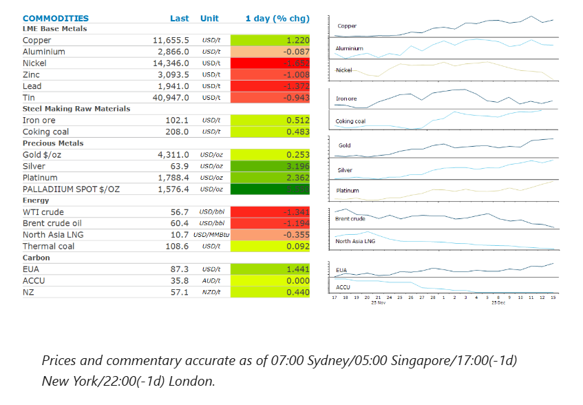
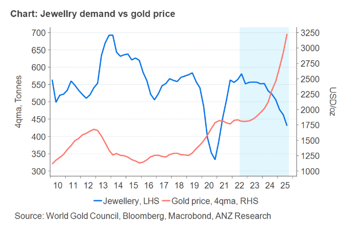

# Oil falls as Ukrainian peace talks progress

**Date:** December 16, 2025  
**Publisher:** Breakwave Advisors | **Category:** Market Insights  
**Original URL:** [https://www.breakwaveadvisors.com/insights/2025/12/16/oil-falls-as-ukrainian-peace-talks-progress](https://www.breakwaveadvisors.com/insights/2025/12/16/oil-falls-as-ukrainian-peace-talks-progress)  

---

Energy fell as geopolitical risks lessened. Industrial metals found support amid concerns of tightening supplies. Gold was steady ahead of key economic data.

*By*[*Daniel Hynes*](https://www.linkedin.com/in/dahynes/)

> **Figure 1: Στιγμιότυπο Οθόνης 2025 12 16 113707**  
> **Interactive Data & Source:** [Linkedin](https://www.linkedin.com/newsletters/commodities-wrap-6692196755876012032/?fbclid=IwAR3kiXJqZdxmp9ZcRwBNI7FsBySI-XSC0pfPur1qzjt7OZp7PTE59Tsl1QI) | [Local Asset](file:///C:/Users/Dell/Github/Shipping/corpus/03-breakwave/insights/2025/assets/2025-12-16_oil-falls-as-ukrainian-peace-talks-progress_img_cea3cf84ceb9ceb3cebcceb9cf8ccf84cf85_256dd91c4909.png)

### Market Commentary

**Crude oil**fell as the market weighed up signs of optimism on a peace deal being reached between Russia and Ukraine. Monday’s talks between the US and Ukraine were “very constructive”, according to President Volodymyr Zelensky. He added that with real progress being made, an agreement may be reached soon. This raised concerns that recent US sanctions on Russian oil companies would be ultimately lifted, adding to an already well supplied market. This offset other geopolitical risks at play. US military action in Venezuela is looking increasingly likely after the Trump administration seized an oil tanker last week and has positioned warships, aircraft and troops near its coast. The country’s state oil company was also hit by a cyberattack which curtailed the network managing export systems at the country’s main crude terminal at Jose. The geopolitical backdrop also overshadowed signs of improving demand in China. The country’s apparent oil demand rose 4.5% to 14.65mb/d in November, according to Bloomberg data. China’s statistics bureau also released industrial output data which showed that crude processing rose 3.9% y/y to 60.83mt in the same month.

**European natural gas**edged lower amid confidence that ample deliveries of LNG will meet any increased needs over the heating season. A relatively mild first half of December has seen gas demand remain subdued. However, that is expected to rise in the coming week as forecasts of lower temperatures increase. The European Centre for Medium-Range Forecasts expects temperatures to fall up to 3 degrees Celsius below normal levels in several major cities. North Asian LNG prices also nudged lower as winter demand falters. The region’s key buyers have remained on the sidelines despite prices falling below USD10/MMBtu in recent days. Chinese importers have remained quiet due to high inventories. Japanese interest is also said to be weak.

**Copper**gained as the market focuses on tight supply next year. Renewed supply disruptions this year and robust demand have boosted sentiment, despite concerns over the global economy. The market shrugged off another set of weak economic data. Retail sales rose just 1.3% y/y in November, the weakest since late 2022. Industrial output climbed 4.8% y/y, slightly below October’s 4.9% pace. Fixed asset investment fell 2.6% in the January-November period, widening from a 1.7% fall in the first 10 months. Despite the weak economic data, copper demand has remained relatively strong. China’s imports of copper have remained elevated, as growth from sectors such as electric vehicles (EV) and energy infrastructure has mitigated the weak manufacturing and property sectors. US demand has also been strong, as the AI-related investment boom and trade tensions ease. The rest of the base metals complex failed to follow copper higher, with nickel, zinc and lead all around 1%.

**Iron ore**futures were steady amid mixed signals on demand. China’s steel mill stockpiles dropped to their lowest level since January 2025. Inventory levels at major Chinese steel mills now sit at 14.3mt, down 8.52% from earlier this month. However, steel output in November fell 10.9% to 69.87mt. That brings this year’s cumulative total to 891.67mt, down 4% y/y. The housing market also remains weak, with residential property sales down 8.1% y/y in November. Weak demand pushed property investment down 15.9%, while new housing starts fell nearly 20%.

**Gold**was relatively unchanged as the outlook for interest rates remained in focus. This comes ahead of key US data on jobs and retail sales.

### Chart of the Day

Jewellery demand is sensitive to price, making it the weakest link for gold. With prices expected to continue rising in 2026, we expect jewellery demand will remain under pressure. However, a moderate increase in prices may provide some relief, with the decline easing to 5% year-on-year, reaching 1,500t in 2026.

> **Figure 2: Στιγμιότυπο Οθόνης 2025 12 16 113805**  
> **Interactive Data & Source:** [Linkedin](https://www.linkedin.com/newsletters/commodities-wrap-6692196755876012032/?fbclid=IwAR3kiXJqZdxmp9ZcRwBNI7FsBySI-XSC0pfPur1qzjt7OZp7PTE59Tsl1QI) | [Local Asset](file:///C:/Users/Dell/Github/Shipping/corpus/03-breakwave/insights/2025/assets/2025-12-16_oil-falls-as-ukrainian-peace-talks-progress_img_cea3cf84ceb9ceb3cebcceb9cf8ccf84cf85_9843e17b0d5a.png)

Data source:[Commodities Wrap](https://www.linkedin.com/newsletters/commodities-wrap-6692196755876012032/?fbclid=IwAR3kiXJqZdxmp9ZcRwBNI7FsBySI-XSC0pfPur1qzjt7OZp7PTE59Tsl1QI)

---

**Tags:** Markets, Commodities, Economy  
