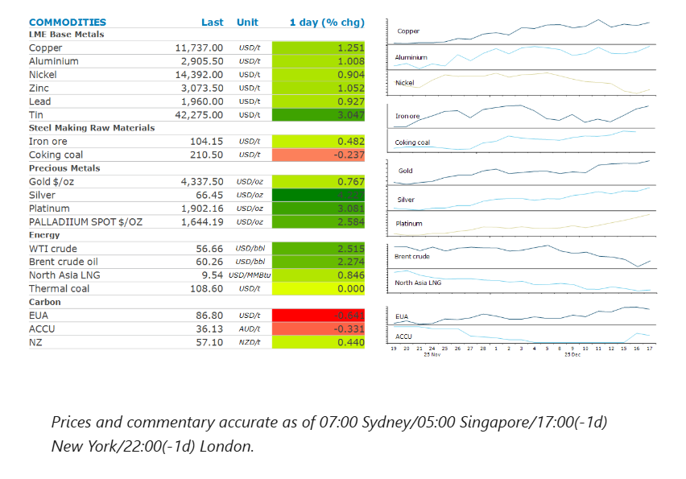
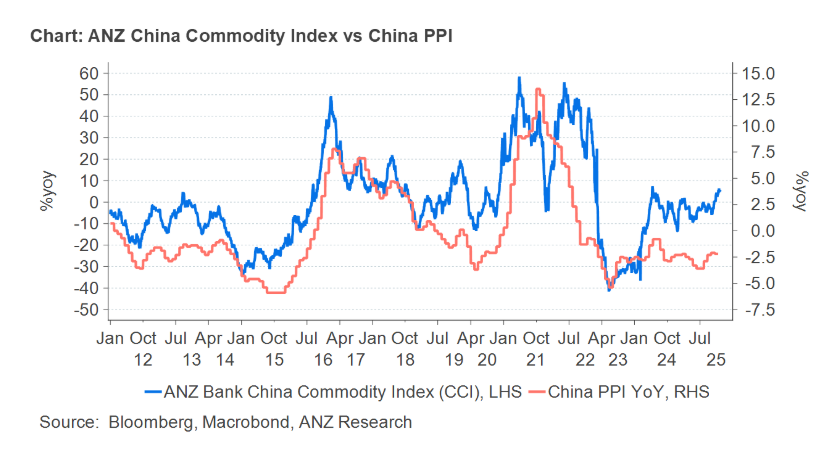

# Crude oil gains amid rising geopolitical risks

**Date:** December 18, 2025  
**Publisher:** Breakwave Advisors | **Category:** Market Insights  
**Original URL:** [https://www.breakwaveadvisors.com/insights/2025/12/18/crude-oil-gains-amid-rising-geopolitical-risks](https://www.breakwaveadvisors.com/insights/2025/12/18/crude-oil-gains-amid-rising-geopolitical-risks)  

---

Rising geopolitical tensions pushed the energy sector higher. The prospect of further rate cuts boosted the precious- and industrial-metals markets.

*By*[*Daniel Hynes*](https://www.linkedin.com/in/dahynes/)

> **Figure 1: Στιγμιότυπο Οθόνης 2025 12 18 153221**  
> **Interactive Data & Source:** [Linkedin](https://www.linkedin.com/newsletters/commodities-wrap-6692196755876012032/?fbclid=IwAR3kiXJqZdxmp9ZcRwBNI7FsBySI-XSC0pfPur1qzjt7OZp7PTE59Tsl1QI) | [Local Asset](file:///C:/Users/Dell/Github/Shipping/corpus/03-breakwave/insights/2025/assets/2025-12-18_crude-oil-gains-amid-rising-geopolitical-risks_img_cea3cf84ceb9ceb3cebcceb9cf8ccf84cf85_e96dd3ffab3e.png)

### Market Commentary

**Crude oil**rallied in response to a sudden ratcheting up of geopolitical tensions. President Trump increased pressure on the Venezuelan government by ordering a blockade of sanctioned oil tankers going into and leaving the country. Last week, the US seized an oil tanker and positioned warships, aircraft and troops near Venezuela’s coast. The moves threaten to disrupt a significant amount of crude oil. Venezuela exported around 950kb/d of crude and fuel in November. Crude oil alone was 780kb/d. The market rallied on the news, with Brent crude jumping more than 1%. However, the gains were limited amid conjecture on the amount of oil that would be impacted. The Centre for Strategic & International Studies estimates less than 20% of this oil is transported on shadow/sanctioned tankers. This brings the total amount of crude oil at risk to around 200–300kb/d. Despite signs that Ukraine is close to agreeing a proposed peace plan, there are mounting concerns that Russia will reject its terms. So much so that the US is preparing a fresh round of sanctions on Russia’s energy sector if that occurs. Such measures may include targeting vessels that Russia uses to transport its oil, as well as traders who facilitate the transactions. Rising geopolitical risks overshadowed the EIA’s weekly inventory report which showed a rise in domestic fuel inventories. Gasoline stockpiles rose 4,808kbbl last week, while distillate fuel was up 1,712kbbl. There was also a relatively small draw in crude stocks (-1,274kbbl).

**European gas**rose as signs of tightness emerged. The region is now expected to see colder temperatures over Christmas-New Year. In addition, forecasts are showing less wind power generation. This would boost the need for gas-fired power generation at a time when storage facilities are only 69% full compared with a five-year seasonal average of 78%. To date, traders have been comfortable with the risks due to plentiful supply, particularly of LNG, but rising geopolitical tension raises the risk of supply disruptions. Lower prices could entice more Asian buyers into the market.**North Asian LNG**prices have been trading in the low-to-mid-USD9/mmBtu range, which has enticed some smaller exporters into the spot market.

**Copper**led the base metals higher ahead of economic data that could impact the US Federal Reserve’s stance on monetary policy. Further interest rate cuts would be a tailwind for the sector. The market also shrugged off yesterday’s selloff as it looks ahead to tightening markets. Copper demand has been relatively strong, with China’s imports elevated. Demand in the US is also expected to pick up amid an AI-related investment boom.

**Gold**rose, approaching record levels, as investors sought haven assets amid rising geopolitical tensions around Venezuela. Expectations of further rate cuts also boosted sentiment.**Platinum**hit a 17-year high amid tight supply and elevated trading activity in a new Chinese future contract. The London market continues to show signs of tightening as banks store metal in the US to insure against the risk of tariffs. The annualised cost of borrowing platinum for one month is at around 14%, a historically high level. This has been exacerbated by the new contract on the Guangzhou Futures Exchange. Trading volumes on the new offering were significant, raising the prospect of rising imports into the Chinese market.

### Chart of the Day

China has been stuck in an inflationary spiral amid increase competition in key industrial sectors. There was hope that rising commodity prices could help alleviate some of that pressure. ANZ China Commodity Index has a good correlation with China PPI. However, recent gains in the CCI (driven by gains in industrial metals) have failed drag PPI higher.

> **Figure 2: Στιγμιότυπο Οθόνης 2025 12 18 153320**  
> **Interactive Data & Source:** [Linkedin](https://www.linkedin.com/newsletters/commodities-wrap-6692196755876012032/?fbclid=IwAR3kiXJqZdxmp9ZcRwBNI7FsBySI-XSC0pfPur1qzjt7OZp7PTE59Tsl1QI) | [Local Asset](file:///C:/Users/Dell/Github/Shipping/corpus/03-breakwave/insights/2025/assets/2025-12-18_crude-oil-gains-amid-rising-geopolitical-risks_img_cea3cf84ceb9ceb3cebcceb9cf8ccf84cf85_145fe095cf46.png)

Data source:[Commodities Wrap](https://www.linkedin.com/newsletters/commodities-wrap-6692196755876012032/?fbclid=IwAR3kiXJqZdxmp9ZcRwBNI7FsBySI-XSC0pfPur1qzjt7OZp7PTE59Tsl1QI)

---

**Tags:** Markets, Commodities, Economy  
