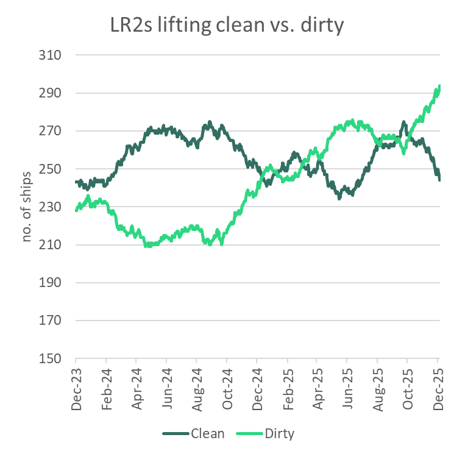
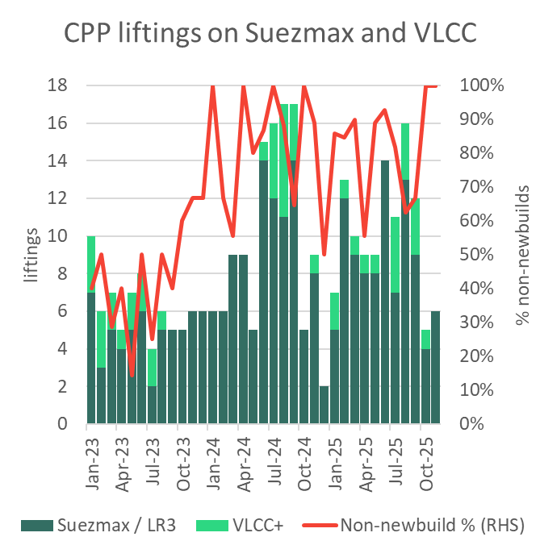
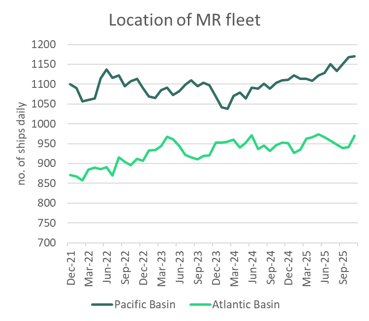
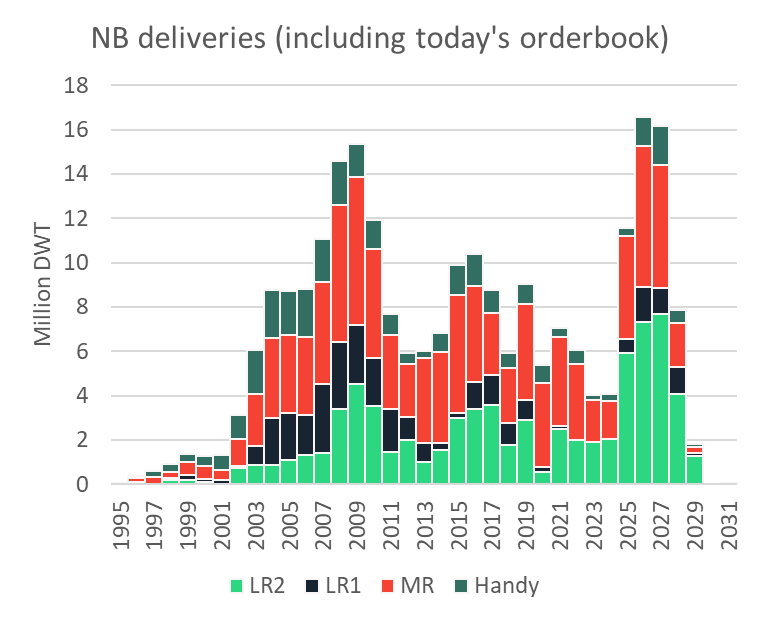

# The Big Picture: Coated tanker earnings 2025 – A retrospective

**Date:** December 19, 2025  
**Publisher:** Breakwave Advisors | **Category:** Market Insights  
**Original URL:** [https://www.breakwaveadvisors.com/insights/2025/12/19/the-big-picture-coated-tanker-earnings-2025-a-retrospective](https://www.breakwaveadvisors.com/insights/2025/12/19/the-big-picture-coated-tanker-earnings-2025-a-retrospective)  

---

*By*[*Mary Melton*](https://www.linkedin.com/in/maryemelton/)

With the initial shock of the Red Sea attacks behind them, the strong coated tanker earnings in H1 2024 had returned to earth by the end of last year. Rates bottomed out in the last quarter of 2024, averaging a still healthy $18k/day for MRs, $26k/day for LR1s and $31k/day for LR2s. The first quarter of this year saw rates improve for the larger coated tankers. At first, MRs saw little change as the first large wave of newbuildings hit the sea. But earnings went on to improve throughout the year for MRs. Strengthening LR earnings took a pause in the 3rd quarter, but all markets look likely to finish strong, despite some weakness creeping in to the MR Atlantic market in recent weeks. The fourth quarter looks set to come in at around $44k/day for LR2s, $37k/day for LR1s and $26k/day for MRs. So while down on 2024, this year is one the coated tanker owners will remember fondly. Here we look at some of the key themes and events that defined product carrier earnings in 2025.

### Strong Crude Tanker Market Lifts Coated Tanker Market

A strong crude tanker market, particularly in H2 2025, encouraged coated tankers to migrate over to dirty trades, and limited the poaching of clean cargoes by larger uncoated tankers. This is thanks to:

- **Oil supply growth.**The result of OPEC’s unwinding of voluntary cuts from April, increased production from the Americas (much of it going East), and Ukrainian attacks on Russia refineries in late summer, which pushed more crude on the water.
- **Sanctions-related delays**. US sanctions on Lukoil/Rosneft caused discharge delays to develop through November as Indian and Chinese-state owned companies shunned Russian crude. Sanctions on the Rizhao Shihua terminal in China in October also created congestion and discharge delays.
- **Vessel sanctions.**Over 580 new tankers were added to the sanctions registry this year for the first time, thanks to large sanctions designations in January, May and July. Smaller, coated tankers were less impacted. As of today, 6% of MR2s, 8% of Handysize, 19% of LR1s, 15% of LR2s, 33% of Aframax, 17% of Suezmaxes and 17% of VLCCs are sanctioned. This has drawn compliant tankers into shadow trades, tightening the market for compliant ships while also increasing the inefficiency of shadow trades. With 52 additions to the LR2 fleet but 73 vessels sanctioned, the compliant fleet has tightened by 21 units.

LR2 tankers began shifting into dirty trades early in the year after US sanctions in January - mainly on Aframax and LR2s - tightened crude tanker supply and boosted earnings. This encouraged nearly 25 LR2s to dirty up, reducing availability for clean product exports. Strong crude markets in Q4 accelerated the trend, adding nearly 30 more LR2s to the dirty fleet. 52 LR2 new builds have entered the fleet this year and none exited, and nearly 40 more LR2s are trading dirty today than at the start of the year. Only 12 additional vessels are currently available for CPP trades.

> **Figure 1: A435 Image 0 1766079308482**  
> [Local Asset](file:///C:/Users/Dell/Github/Shipping/corpus/03-breakwave/insights/2025/assets/2025-12-19_the-big-picture-coated-tanker-earnings-2025-a-retrospective_img_a435-image-0-1766079308482_44e139eae5fe.png)

*Source: Vortexa*

The incentive to move to the dirty market has been helped by VLCC/Suezmax poaching LR2 long-haul middle distillate cargoes to the tune of around 200k b/d, which caps LR2 earnings for CPP trades. This trend is most pronounced in the summer months, as a seasonal slow-down in crude demand incentivises the switch. VLCC/Suezmax CPP liftings in June-September were 18% lower than the same period last year, but were still very much present, especially given the higher deliveries of uncoated Suezmaxes compared to last year.

> **Figure 2: B722 Image 1 1766079308486**  
> [Local Asset](file:///C:/Users/Dell/Github/Shipping/corpus/03-breakwave/insights/2025/assets/2025-12-19_the-big-picture-coated-tanker-earnings-2025-a-retrospective_img_b722-image-1-1766079308486_24aa1ab9ccbf.png)

*Source: Vortexa*

### Red Sea Diversions Kept Lrs Buoyant

The diversion away from the Red Sea around the Cape of Good Hope was still vital for increasing tonne-mile demand for the LR sector. The belief that the Suez Canal would open to traffic following the Houthi’s announcement of a Red Sea reopening in January proved premature, thanks to the fragility of the Israel/Gaza peace process. A US bombing campaign from March through May had limited success, and most operators (not carrying a Russian cargo) continued to avoid the canal.

The Israel-Gaza ceasefire in October has yet to result in a substantial increase in transits, even though the Houthis announced an end to attacks. Although oil tanker transits past the Bab-el-Mandeb look set to finish the year about 5% higher yoy, thanks to high Russian crude exports and the return of close to 50 LR CPP voyages (mostly originating from Sikka). Nevertheless, transits in 2025 are on track to finish 58% lower than in 2023.

### Us Policy: Tariffs and Us and China Port Fees – Worst Case Avoided

- **Tariffs.**Trump’s tariffs in early April robbed Q2 2025 of demand growth in non-OECD countries. A tariff threatened by Trump on oil from Canada and Mexico was avoided in early March. Chinese goods were hit with US tariffs, and China retaliated by an import tariff on US LPG, which boosted naphtha flows. Naphtha imports into China have averaged 100k b/d higher this year yoy, with tonne-miles for naphtha imports into China growing over 20% this year.
- **Port Fees.**To combat China’s dominance in the maritime sector, in April, the Office of the US Trade Representative announced port fees from 14 October on Chinese-built or operated vessels calling in US ports but then dropped the requirement on 10 November. If fees had remained in place, coated tankers trading in the US would have been largely shielded from the impact anyways thanks to key exemptions on Chinese-built vessels less than 80k DWT. China’s retaliatory port fees on US-linked vessels also mainly affected large crude carriers for the few weeks it was in place from mid-October. Due to the quick climbdown, something that could have been disruptive to the tanker market largely wasn’t.
- **Venezuela.**To close out the year we will be watching closely what happens with Venezuela and the US ‘blockade’. This represents a dramatic new approach to international law.

### Tight Product Market Extends Voyage Length in H2 2025

Unlike the crude market, that saw crude oil supply increase by on average 1.5m b/d in 2H 2025, refined product markets were tight. This has been caused by refinery capacity constraints resulting from:

Average tonne-miles for the coated tanker fleet in the second half of the year increased by around 3.5% compared to the first half, as outages prompted increased inter-regional liftings and replacement flows from longer-haul destinations. Below average levels of product stocks in OECD countries heightened the sensitivity of key importers to fluctuations in global product supply.

### Russian Products Continued to Move Long-Haul, Until They Didn’t

Russian diesel exports were already shifting in early 2025 as demand for Russian product strengthened in the Mediterranean, diverting volumes away from long-haul destinations such as Brazil toward short-haul markets like Turkey and North Africa.

From August, intensified Ukrainian drone attacks took up to a third of Russia’s refining capacity offline, helping to cut Russia’s diesel exports by about 300 kb/d versus Q2 and further cutting supply to Turkey and Brazil. As a result, Brazil increasingly turned to US diesel from July, reversing the US market-share loss that had been in place since the price cap shut Russian diesel out of European market in February 2023 and Brazil absorbed displaced Russian barrels.

As a result of the drone attacks:

- Heightened competition among Europe, Brazil and Latin American buyers for US diesel pushed TC14 and TC18 freight rates higher from July. Availability shortages in the US Gulf were exacerbated by limited backhaul options from Europe due to weaker European import demand on the US East Coast and in West Africa.
- A drop in Turkey’s Russian diesel imports decreased Turkey’s exports to Europe/North Africa from July, halving in the second half of the year compared to the first. Europe relied increasingly on volumes from the Middle East, India and the US, pushing up long-haul freight demand.

### MR Fleet Distribution Heightens Supply Shortages in the Us Gulf

Whereas very little change was evident in the regional distribution of the LR fleet, the MR fleet focused more on the markets East of Suez during 2025. Part of this is naturally due to the 98 MR deliveries which hit the water in the East. But these were supported by growing export capacity out of the Middle East, where MR tonne-miles increased 11% yoy in 2025.

A widening gulf between supply in the East versus the Atlantic through Q3 accentuated the lack of availability in the US Gulf when Europe’s demand for US diesel picked up in the summer, and we saw spikes in US Gulf MR spot rates. The transatlantic diesel flow is the fronthaul in the Atlantic, which is a trend we’ve seen since the ban on Russian diesel in Europe. The rise in transatlantic diesel flows, and a longer-term decline in demand for Europe’s gasoline make it difficult to triangulate European exports to the US Atlantic coast with US Gulf diesel exports. Exporters in the US Gulf must pay more to attract vessels to the region.

> **Figure 3: A6a7 Image 2 1766079308488**  
> [Local Asset](file:///C:/Users/Dell/Github/Shipping/corpus/03-breakwave/insights/2025/assets/2025-12-19_the-big-picture-coated-tanker-earnings-2025-a-retrospective_img_a6a7-image-2-1766079308488_acf7dabfbfdf.png)

*Source: Vortexa*

### Strong Fleet Growth Caps Rate Gains

2023 and 2024 saw historically few deliveries of coated tankers. This year has been the fourth busiest on record, with almost as much DWT delivering in one year as we saw enter the market in the previous three years. The third quarter of 2025 was the busiest for MR deliveries, with 31 MRs hitting the water.

> **Figure 4: 64a6 Image 3 1766079308490**  
> [Local Asset](file:///C:/Users/Dell/Github/Shipping/corpus/03-breakwave/insights/2025/assets/2025-12-19_the-big-picture-coated-tanker-earnings-2025-a-retrospective_img_64a6-image-3-1766079308490_047dfb77141e.png)

**Time charter**rates for LR2s have improved since an April low of $29k/day for one year. The one-year rate is now up to $36.5k/day. By the end of 2025, MR one year TC rates were back to where they started at just over $23k/day.

**Asset values**for uncoated tankers were on a downward trajectory for most of the year but recovered in November as spot rates improved. 5-year-old MRs started the year at $44m, dropped to 40m by September, and recovered to $45m since November. 5-year-old LR2s reached $71.5m in February before weakening to $63m during the Northern Hemisphere summer, rising to $70m by November. Newbuilding prices ended the year lower than they started, despite a small rally at the very end of the year.

**NB ordering**activity has been historically strong this year in the coated tanker sector, with another 47.3m DWT ordered, down the near-record ordering activity of 60.7m DWT last year.

2025 was a busy year for**second hand sales**of coated tankers. Sales in DWT terms were up 11% on 2024, but still just 64% of the average annual activity in the 3 years from 2021 to 2023.

---

**Tags:** Tankers, Crude, Shipping  
