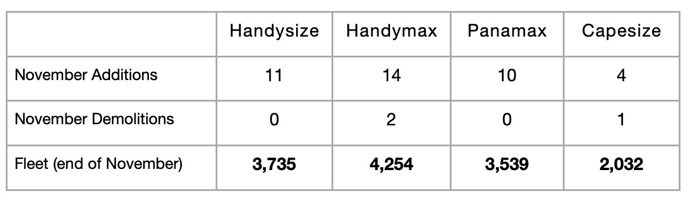

# Dry Bulk Market On Solid Footing

**Date:** December 23, 2025  
**Publisher:** Breakwave Advisors | **Category:** Market Insights  
**Original URL:** [https://www.breakwaveadvisors.com/insights/2025/12/23/dry-bulk-market-on-solid-footing](https://www.breakwaveadvisors.com/insights/2025/12/23/dry-bulk-market-on-solid-footing)  

---

*By*[*Jeffrey Landsberg*](https://www.linkedin.com/in/jeffrey-landsberg-70ab957/)

With the new year fast approaching, it is encouraging — and not surprising — that the dry bulk market finds itself on solid footing. Capesize rates ended last week up year-on-year by 236%, panamax rates up by 37%, supramax rates up by 29%, and handysize rates up by 27%. Fleet growth remains moderate and manageable. Most recently, approximately 39 newbuildings were delivered in November, which was 4 less than were delivered in October. Approximately 3 vessels were scrapped, which was 2 less than were scrapped in October. When all is said and done this year, the fleet will have grown by a net addition of around 375 vessels. For 2026, we expect the fleet will grow by a net addition of at least another 375 vessels. Going forward, we remain bullish — and in particular, most bullish for the capesize market.

> **Figure 1: Chart**  
> [Local Asset](file:///C:/Users/Dell/Github/Shipping/corpus/03-breakwave/insights/2025/assets/2025-12-23_dry-bulk-market-on-solid-footing_img_chart_722af5e93ff0.jpg)

---

**Tags:** Drybulk, Shipping, Capesize  
