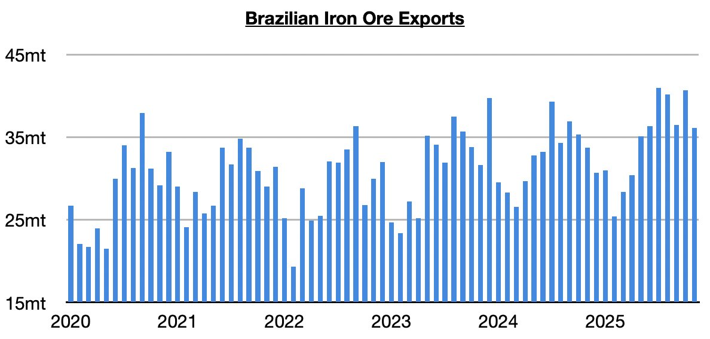

# Ongoing Growth in Brazil's Iron Ore Exports

**Date:** December 30, 2025  
**Publisher:** Breakwave Advisors | **Category:** Market Insights  
**Original URL:** [https://www.breakwaveadvisors.com/insights/2025/12/30/ongoing-growth-in-brazils-iron-ore-exports](https://www.breakwaveadvisors.com/insights/2025/12/30/ongoing-growth-in-brazils-iron-ore-exports)  

---

*By*[*Jeffrey Landsberg*](https://www.linkedin.com/in/jeffrey-landsberg-70ab957/)

The most recently released data shows that Brazil exported 36.1 million tons of iron ore in November. While this is down month-on-month by 4.6 million tons (-11%), it is up year-on-year by 2.4 million tons (7%). Brazil’s iron ore exports have now increased on a year-on-year basis during eight of the last nine months. Significant is that during these last eight months, imports have grown year-on-year by 22.9 million tons (8%). As we have stressed often, prior to March exports were down year-on-year this year by 1.4 million tons (-2%). As we have also discussed in our Weekly Executive Reports, as recently as in 2022 Brazil’s iron ore exports contracted. They fell that year by 12.9 million tons (-4%). Overall, it has remained very helpful for the capesize market that Brazil’s iron ore exports have been finding solid growth.

> **Figure 1: Chart**  
> [Local Asset](file:///C:/Users/Dell/Github/Shipping/corpus/03-breakwave/insights/2025/assets/2025-12-30_ongoing-growth-in-brazils-iron-ore-exports_img_chart_d06cf964ece7.jpg)

---

**Tags:** Ironore, Shipping, Drybulk  
