# Tanker Market Monitor | Freight Fundamentals & Market Momentum

**Date:** January 02, 2026  
**Publisher:** Breakwave Advisors | **Category:** Market Insights  
**Original URL:** [https://www.breakwaveadvisors.com/insights/2026/1/2/freight-fundamentals-amp-market-momentum](https://www.breakwaveadvisors.com/insights/2026/1/2/freight-fundamentals-amp-market-momentum)  

---

**Spotlight |**Dirty vs. Clean tanker freight sentiment

- Tanker freight markets continue to diverge, with dirty segments losing momentum, while clean markets retain a firmer undertone.

**Dirty**[**Freight**](https://go.signalocean.com/e/983831/-dynamic-market-prices-tankers/2rqpwr/565317097/h/DCTjcbWoxrICqu1YO6NnGVN8HCrMSbfMgg0a-1BfKfk)**Market Sentiment**

**VLCC**MEG- China

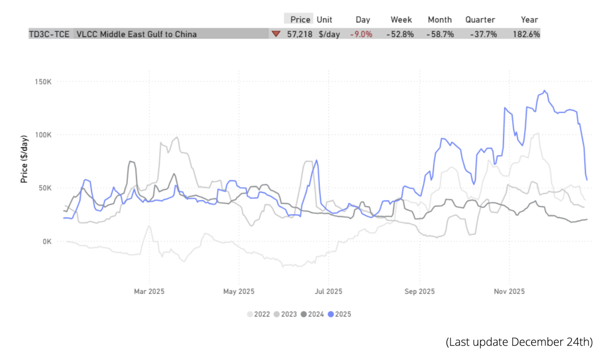

> **Figure 1: Weaker**  
> **Interactive Data & Source:** [Signal Ocean Dynamic Market Prices](https://go.signalocean.com/e/983831/-dynamic-market-prices-tankers/2rqpwr/565317097/h/DCTjcbWoxrICqu1YO6NnGVN8HCrMSbfMgg0a-1BfKfk) | [Local Asset](file:///C:/Users/Dell/Github/Shipping/corpus/03-breakwave/insights/2026/assets/2026-01-02_freight-fundamentals-amp-market-momentum_img_unnamed28529_e10f130db450.png)

**Suezmax**Black Sea - Med

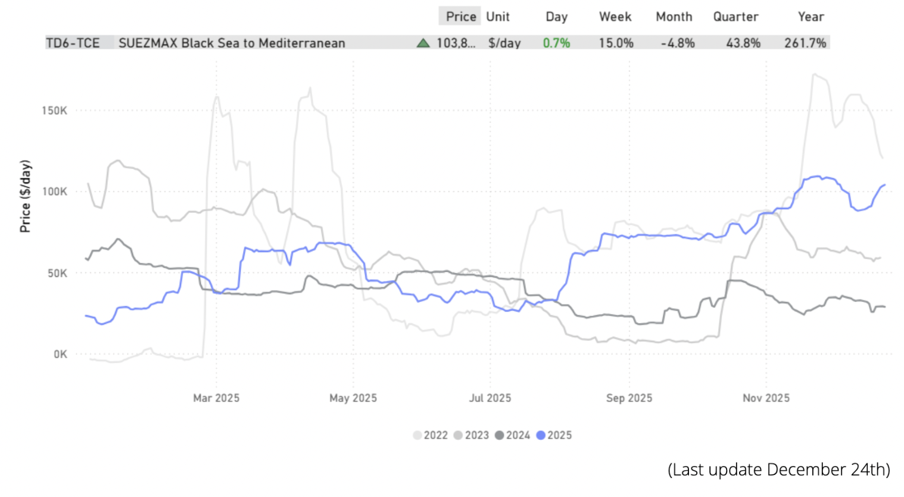

> **Figure 2: Firmer**  
> **Interactive Data & Source:** [Signal Ocean Dynamic Market Prices](https://go.signalocean.com/e/983831/-dynamic-market-prices-tankers/2rqpwr/565317097/h/DCTjcbWoxrICqu1YO6NnGVN8HCrMSbfMgg0a-1BfKfk) | [Local Asset](file:///C:/Users/Dell/Github/Shipping/corpus/03-breakwave/insights/2026/assets/2026-01-02_freight-fundamentals-amp-market-momentum_img_unnamed28629_9877b708f758.png)

**Aframax**Cross Med

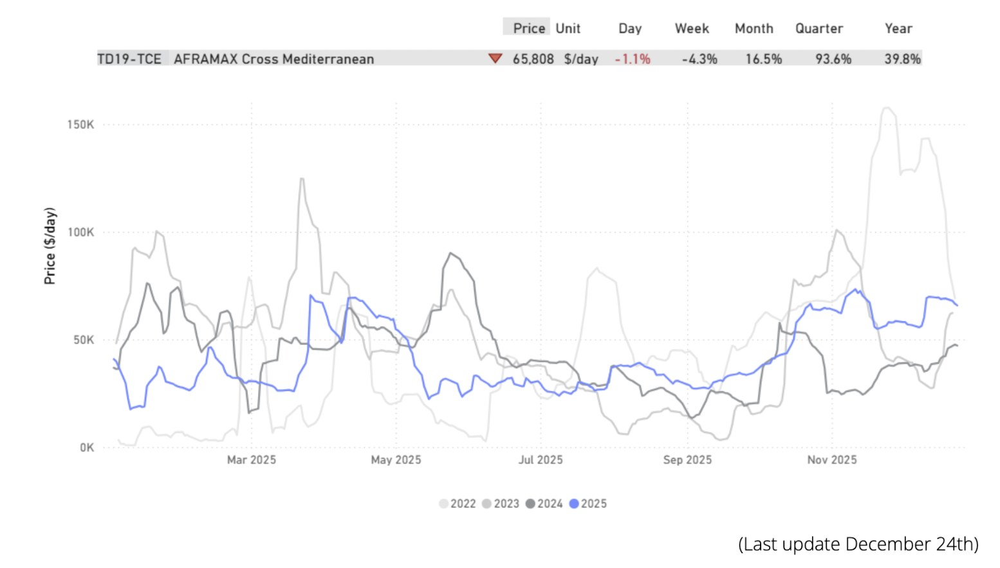

> **Figure 3: Market Chart 3**  
> **Interactive Data & Source:** [Signal Ocean Dynamic Market Prices](https://go.signalocean.com/e/983831/-dynamic-market-prices-tankers/2rqpwr/565317097/h/DCTjcbWoxrICqu1YO6NnGVN8HCrMSbfMgg0a-1BfKfk) | [Local Asset](file:///C:/Users/Dell/Github/Shipping/corpus/03-breakwave/insights/2026/assets/2026-01-02_freight-fundamentals-amp-market-momentum_img_unnamed28729_5e05c8cebed1.png)

**Clean**[**Freight**](https://go.signalocean.com/e/983831/-dynamic-market-prices-tankers/2rqpwr/565317097/h/DCTjcbWoxrICqu1YO6NnGVN8HCrMSbfMgg0a-1BfKfk)**Market Sentiment**

**MR**Sikka - Japan

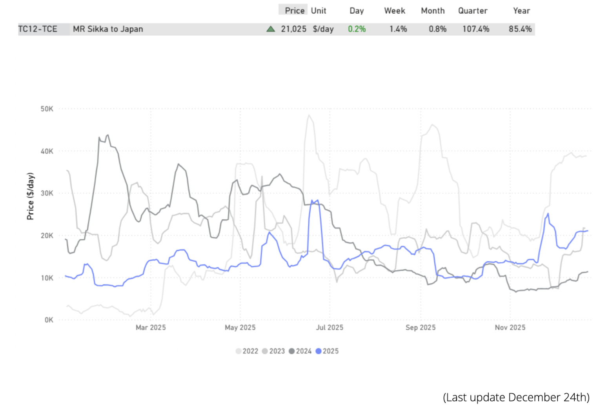

> **Figure 4: Market Chart 4**  
> **Interactive Data & Source:** [Signal Ocean Dynamic Market Prices](https://go.signalocean.com/e/983831/-dynamic-market-prices-tankers/2rqpwr/565317097/h/DCTjcbWoxrICqu1YO6NnGVN8HCrMSbfMgg0a-1BfKfk) | [Local Asset](file:///C:/Users/Dell/Github/Shipping/corpus/03-breakwave/insights/2026/assets/2026-01-02_freight-fundamentals-amp-market-momentum_img_unnamed28829_0be0adb5e936.png)

### Lr2meg - Japansteady

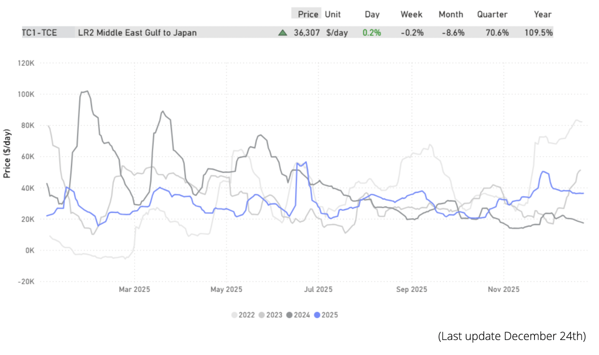

> **Figure 5: Demand Volumes)**  
> *Dirty Market Signals(WS | Ballast Positioning | Demand Volumes)*  
> **Interactive Data & Source:** [Signal Ocean Dynamic Market Prices](https://go.signalocean.com/e/983831/-dynamic-market-prices-tankers/2rqpwr/565317097/h/DCTjcbWoxrICqu1YO6NnGVN8HCrMSbfMgg0a-1BfKfk) | [Local Asset](file:///C:/Users/Dell/Github/Shipping/corpus/03-breakwave/insights/2026/assets/2026-01-02_freight-fundamentals-amp-market-momentum_img_unnamed28929_8435292abb5f.png)

- What current fundamentals imply for the days ahead

### VLCC Weaker

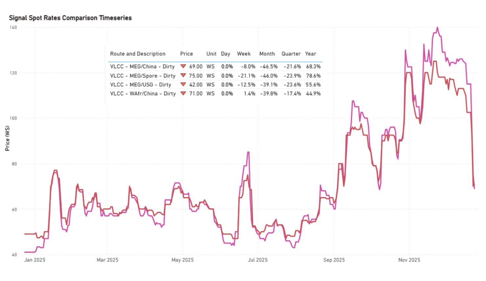

> **Figure 6: Signalassessmentoverview**  
> **Interactive Data & Source:** [Signal Ocean VLCC Insights](https://go.signalocean.com/e/983831/mic-vlcc-insights-downloadable/2rqpwv/565317097/h/DCTjcbWoxrICqu1YO6NnGVN8HCrMSbfMgg0a-1BfKfk) | [Local Asset](file:///C:/Users/Dell/Github/Shipping/corpus/03-breakwave/insights/2026/assets/2026-01-02_freight-fundamentals-amp-market-momentum_img_unnamed281029_653de886bced.png)

**Ballasters| AG & WAFR**[**Supply**](https://go.signalocean.com/e/983831/mic-vlcc-insights-downloadable/2rqpwv/565317097/h/DCTjcbWoxrICqu1YO6NnGVN8HCrMSbfMgg0a-1BfKfk)**Building**

Bearish for near-term freight

- An increase in VLCC ballast availability in AG and West Africa is weighing on freight momentum into year-end, keeping rates under pressure in the near term.

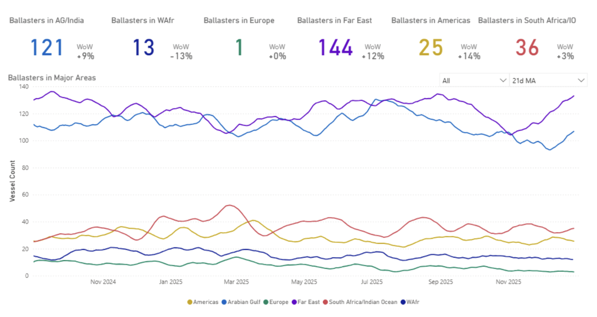

> **Figure 7: Market Chart 7**  
> **Interactive Data & Source:** [Signal Ocean Dynamic Timeseries](https://go.signalocean.com/e/983831/nker-dynamic-timeseries-tanker/2rqpwy/565317097/h/DCTjcbWoxrICqu1YO6NnGVN8HCrMSbfMgg0a-1BfKfk) | [Local Asset](file:///C:/Users/Dell/Github/Shipping/corpus/03-breakwave/insights/2026/assets/2026-01-02_freight-fundamentals-amp-market-momentum_img_unnamed281129_fcbf58877bfb.png)

### Gross Supply vs Cargo Demand |Td3 & Td15

- The primary concern for the VLCC market approaching year-end is the noticeable disparity between the gross vessel supply and the anticipated cargo demand. Forward curves indicate that the rate of supply growth is expected to outpace demand in the coming weeks, particularly on the TD3C and TD15 routes.

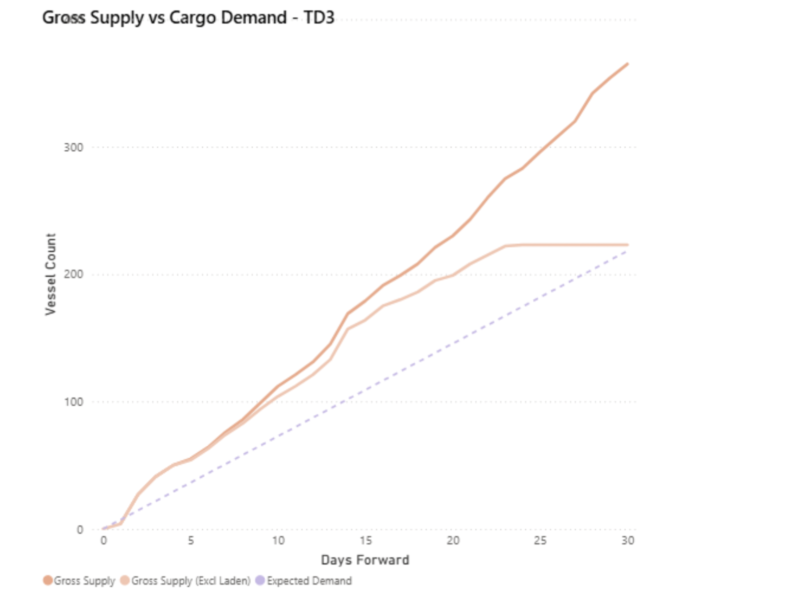

> **Figure 8: Supply vs Demand**  
> **Interactive Data & Source:** [Signal Ocean Dynamic Timeseries](https://go.signalocean.com/e/983831/nker-dynamic-timeseries-tanker/2rqpwy/565317097/h/DCTjcbWoxrICqu1YO6NnGVN8HCrMSbfMgg0a-1BfKfk) | [Local Asset](file:///C:/Users/Dell/Github/Shipping/corpus/03-breakwave/insights/2026/assets/2026-01-02_freight-fundamentals-amp-market-momentum_img_unnamed281229_f538c6e26e67.png)

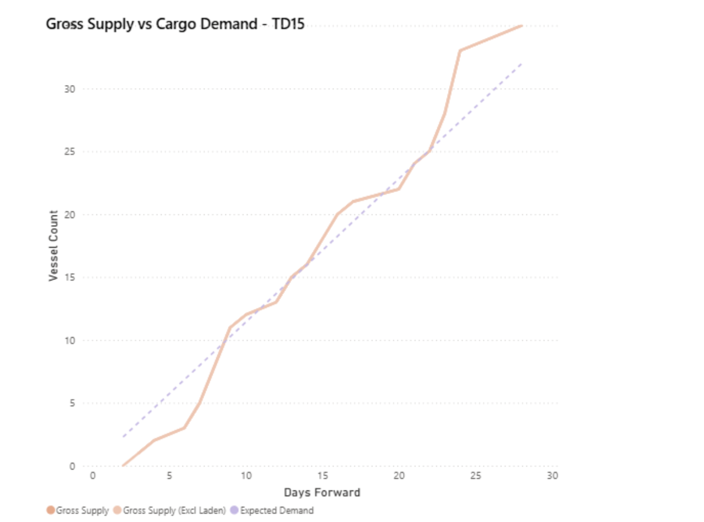

> **Figure 9: Market Chart 9**  
> **Interactive Data & Source:** [Signal Ocean Dynamic Timeseries](https://go.signalocean.com/e/983831/nker-dynamic-timeseries-tanker/2rqpwy/565317097/h/DCTjcbWoxrICqu1YO6NnGVN8HCrMSbfMgg0a-1BfKfk) | [Local Asset](file:///C:/Users/Dell/Github/Shipping/corpus/03-breakwave/insights/2026/assets/2026-01-02_freight-fundamentals-amp-market-momentum_img_unnamed281329_90fc844bebec.png)

### Demand (Volume Loaded) | Td3c

Lack of incremental volume growth caps freight support

- TD3C loaded volumes are tracking close to the long-term benchmark (~14.0 mbbl). With 2025 activity yet to show meaningful incremental volume growth, and tonne-day generation gradually easing as voyage durations normalise, the scope for sustained upward pressure on freight rates appears limited.

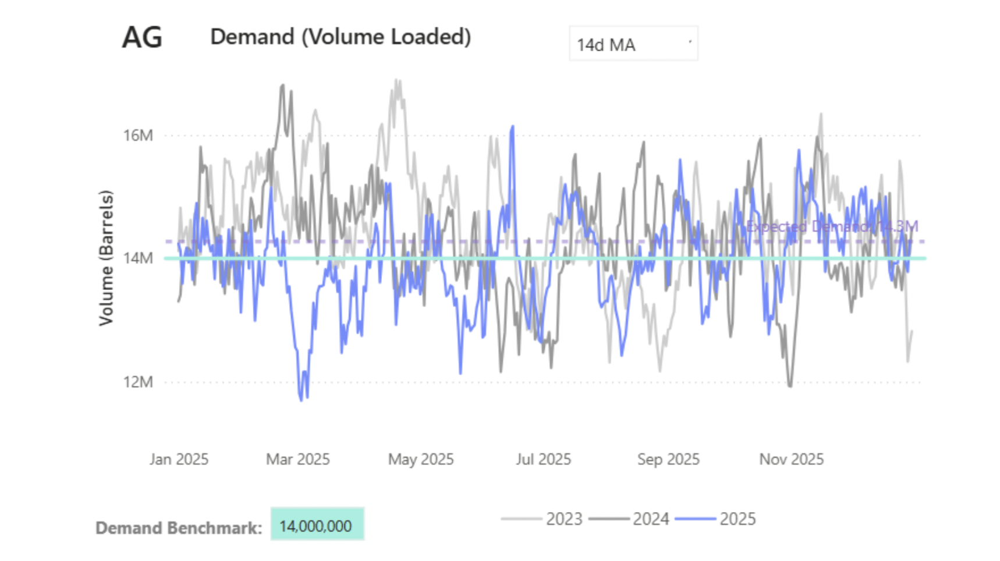

> **Figure 10: Market Chart 10**  
> **Interactive Data & Source:** [Signal Ocean Dynamic Timeseries](https://go.signalocean.com/e/983831/nker-dynamic-timeseries-tanker/2rqpwy/565317097/h/DCTjcbWoxrICqu1YO6NnGVN8HCrMSbfMgg0a-1BfKfk) | [Local Asset](file:///C:/Users/Dell/Github/Shipping/corpus/03-breakwave/insights/2026/assets/2026-01-02_freight-fundamentals-amp-market-momentum_img_unnamed281429_b5a217aa18ec.png)

**VLCC**[**Tonne**](https://go.signalocean.com/e/983831/nker-dynamic-timeseries-tanker/2rqpwy/565317097/h/DCTjcbWoxrICqu1YO6NnGVN8HCrMSbfMgg0a-1BfKfk)**Days | AG to Far East**

Momentum fading after recent highs

- VLCC tonne-days peaked earlier in the quarter and, while still at relatively high levels, have moderated in recent weeks. This easing in momentum has coincided with a softer rate environment toward year-end.

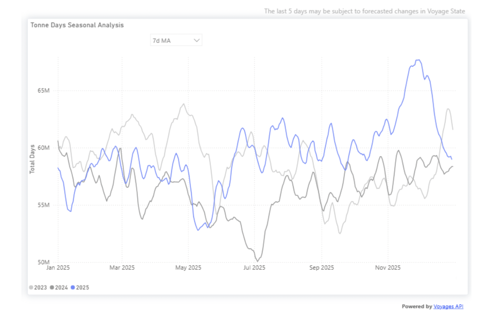

> **Figure 11: Market Chart 11**  
> **Interactive Data & Source:** [Signal Ocean Platform](https://www.thesignalgroup.com/signal-ocean-platform) | [Local Asset](file:///C:/Users/Dell/Github/Shipping/corpus/03-breakwave/insights/2026/assets/2026-01-02_freight-fundamentals-amp-market-momentum_img_unnamed281529_dfe36bf76479.png)

### Firmer Tonne-Day Trends | Dirty Aframax & Clean MR

- In Dirty Aframax and Clean MR, elevated tonne-days point to improving utilisation and a healthier market balance heading into year-end.

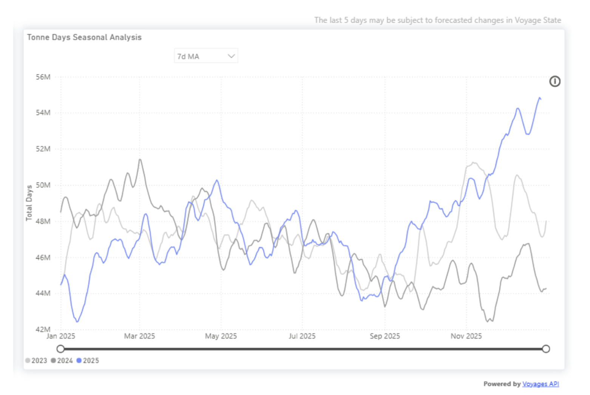

> **Figure 12: Dirty Aframax**  
> **Interactive Data & Source:** [Signal Ocean Platform](https://www.thesignalgroup.com/signal-ocean-platform) | [Local Asset](file:///C:/Users/Dell/Github/Shipping/corpus/03-breakwave/insights/2026/assets/2026-01-02_freight-fundamentals-amp-market-momentum_img_unnamed281629_758c71471a95.png)

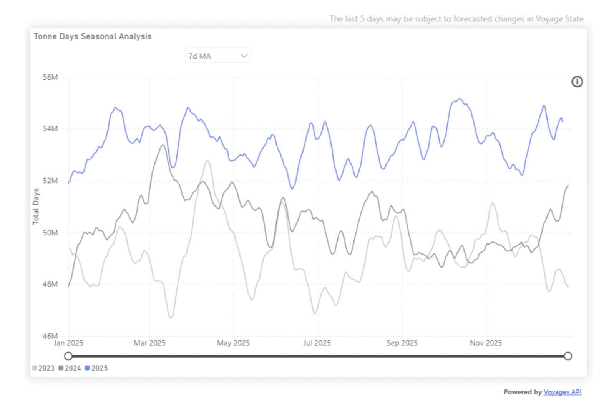

> **Figure 13: Clean MR**  
> **Interactive Data & Source:** [Signal Ocean Platform](https://www.thesignalgroup.com/signal-ocean-platform) | [Local Asset](file:///C:/Users/Dell/Github/Shipping/corpus/03-breakwave/insights/2026/assets/2026-01-02_freight-fundamentals-amp-market-momentum_img_unnamed281729_57fe147c9326.png)

### Takeaway

- As the year draws to a close, tanker markets are becoming more differentiated. VLCCs are facing near-term pressure amid rising supply and moderating tonne-day momentum, while clean and mid-size segments appear to show fewer signs of near-term softening.

Data Source:[Signal Ocean Platform](https://www.thesignalgroup.com/signal-ocean-platform)

---

**Tags:** Markets, Shipping, Tankers  
