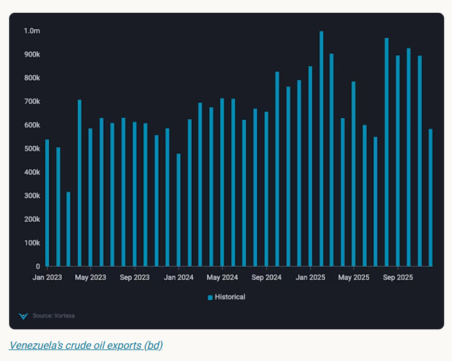

# Venezuela oil exports strained by December disruptions

**Date:** January 05, 2026  
**Publisher:** Breakwave Advisors | **Category:** Market Insights  
**Original URL:** [https://www.breakwaveadvisors.com/insights/2026/1/5/venezuela-oil-exports-strained-by-december-disruptions](https://www.breakwaveadvisors.com/insights/2026/1/5/venezuela-oil-exports-strained-by-december-disruptions)  

---

December saw a 36% drop in Venezuela exports as shadow flows stalled; Chevron volumes held, while politics added volatility.

*By*[*Claire Jungman*](https://www.linkedin.com/in/claire-jungman-b40a78110/)

Venezuela’s seaborne crude exports declined by 36% m-o-m in December 2025 to just under 600kbd, driven primarily by a collapse in long-haul Asia-bound “shadow” flows, which retreated as US naval interdiction risks spiked. In contrast, licensed US exports by Chevron remained comparatively resilient, totaling approximately 100kbd, accounting for ~18% of December’s total and anchoring what remained of Venezuela’s outbound trade.

On January 3, 2026, political developments introduced a new layer of volatility. While confirmed US strikes targeted military installations in Caracas (Fuerte Tiuna) and the commercial port of La Guaira, it is critical to note that La Guaira is a cargo hub, not an oil terminal. As of midday, there are no confirmed reports of physical damage to the Jose Terminal, Venezuela's primary oil export artery. The facility remains functional, though operational output is hampered by the lingering effects of the December cyberattack on PDVSA’s administrative systems.

> **Figure 1: Στιγμιότυπο Οθόνης 2026 01 05 104952**  
> **Interactive Data & Source:** [Analytics Vortexa](https://analytics.vortexa.com/InsightsHubPage?articleId=5qZHNY5WKIv2Kaz6jGLgmI&articleType=highlight&categoryFilters=%5B%22briefing%22%2C%22highlight%22%5D&page=InsightsHubPage&searchTerm=&tabId=1b0f9203-6807-4110-9092-711bbd0831c4) | [Local Asset](file:///C:/Users/Dell/Github/Shipping/corpus/03-breakwave/insights/2026/assets/2026-01-05_venezuela-oil-exports-strained-by-december-disruptions_img_cea3cf84ceb9ceb3cebcceb9cf8ccf84cf85_16f77dea1da1.png)

The December contraction reflects a[breakdown](https://analytics.vortexa.com/InsightsHubPage?articleId=5qZHNY5WKIv2Kaz6jGLgmI&articleType=highlight&categoryFilters=%5B%22briefing%22%2C%22highlight%22%5D&page=InsightsHubPage&searchTerm=&tabId=1b0f9203-6807-4110-9092-711bbd0831c4)in export execution rather than upstream supply availability. As the US “Operation Southern Spear” blockade intensified, tanker operators servicing the sanctioned trade to China faced[increased](https://analytics.vortexa.com/InsightsHubPage?articleId=4DtzjOk84sNaWZ9s8ExgI0&articleType=highlight&categoryFilters=%5B%22briefing%22%2C%22highlight%22%5D&page=InsightsHubPage&searchTerm=&tabId=1b0f9203-6807-4110-9092-711bbd0831c4)seizure risk, leading to a wave of mid-voyage[U-turns](https://analytics.vortexa.com/InsightsHubPage?articleId=7ARRSiIIWTSTaCo4vYUbN7&articleType=highlight&categoryFilters=%5B%22briefing%22%2C%22highlight%22%5D&page=InsightsHubPage&searchTerm=&tabId=1b0f9203-6807-4110-9092-711bbd0831c4)and delayed departures. This logistics bottleneck forced at least 15 million barrels of crude into floating storage. By year-end PDVSA was reportedly forced to resort to “extreme solutions,” including diverting residual fuels to waste handling systems, to prevent a total shutdown of the Paraguaná Refining Center.

## Market Outlook: Manageable Disruption

- ### Short Term

- The capture and removal of Venezeula’s president Nicolas Maduro on January 3, alongside Trump’s statement that the US will “run” Venezuela until a peaceful transition, injects fresh policy uncertainty and may drive a headline-led move at Monday’s market open. However, any initial risk premium is likely to fade unless accompanied by concrete policy actions—most importantly formal OFAC authorisations that clarify what oil-related transactions are permitted. December’s export disruption was already reflected in physical flows and market positioning, limiting the scope for a sustained upside move.
- Near-term focus will remain on shipping behaviour and export clearance, with floating storage providing the clearest signal if and when Venezuelan barrels re-enter the market.
- ### Medium Term

- The focus shifts to export execution. If a transition framework stabilises control of oil fields and export infrastructure—and if sanctions authorisations clarify permissible trade—some barrels in floating storage could be released and seaborne exports could normalise incrementally. The earliest gains would likely come from clearing delays and unwinding stored barrels, not from a step-change in upstream production.
- ### Long Term (multi-Year)

- A material production recovery would be a multi-year project requiring substantial capital, security, and infrastructure rehabilitation. Even with improved political backing and potential Western re-entry, sustained investment and operational rebuilding would be needed before Venezuela can deliver durable, higher supply at scale.

Data Source:[Vortexa](https://www.vortexa.com//oil-gas-data-traders-analysts-data-scientists?gclid=Cj0KCQjw8_qRBhCXARIsAE2AtRZKOvMnbilZ_6_91d7huSFFy71pWLrnPwGwOHVzXsmsG-1a1mZnQw8aAt89EALw_wcB&hsa_acc=1782073842&hsa_ad=548425387665&hsa_cam=14746637662&hsa_grp=125038601902&hsa_kw=&hsa_mt=&hsa_net=adwords&hsa_src=g&hsa_tgt=dsa-1431852288425&hsa_ver=3&utm_campaign=%5BCD%5D%20-%20DSA%20-%20EMEA&utm_medium=cpc&utm_medium=ppc&utm_source=google&utm_source=adwords&utm_term=)

---

**Tags:** Oil, Markets, Tankers  
