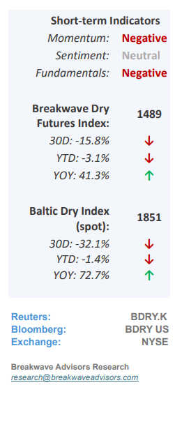
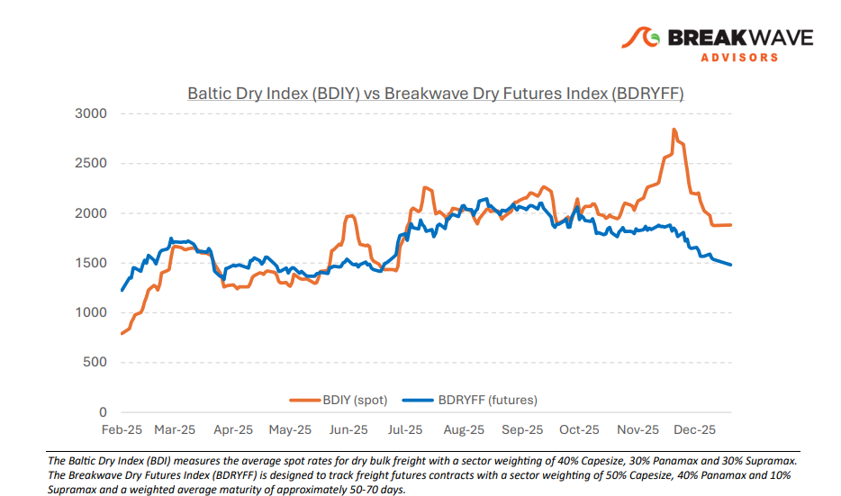
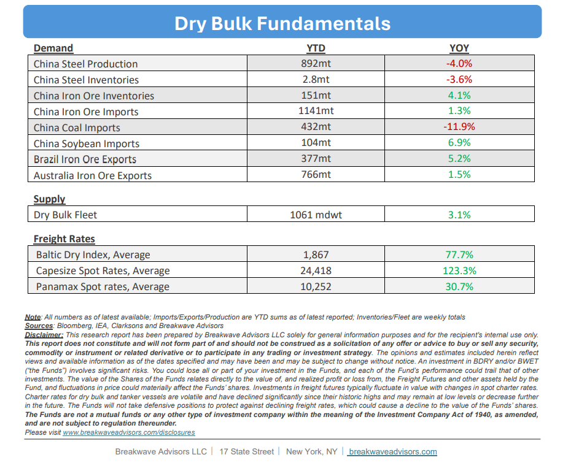

# Breakwave Bi-Weekly Dry Bulk Report - January 6, 2026

**Date:** January 06, 2026  
**Publisher:** Breakwave Advisors | **Category:** Market Insights  
**Original URL:** [https://www.breakwaveadvisors.com/insights/162026db-reportjuk547llo](https://www.breakwaveadvisors.com/insights/162026db-reportjuk547llo)  

---

•**New Year Brings Optimism**– Despite a relatively long holiday break, spot indices have shown little movement. While**Capesize rates are drifting lower**, this trend is anticipated and well-priced into the futures curve, though Panamax rates remain weak and Supramax rates are currently underperforming in a catch-up phase. Futures remain backwardated for the Capesize market and flattish for other sectors as near-term optimism balances seasonal headwinds. We anticipate further softening, with Capesize rates likely to**break the 20,000 mark**and move toward the mid-teen range soon. While the potential for a**strong spring recovery**following a weak first quarter remains a primary unknown, the dry bulk market is supported by**structural shifts**in iron ore trade and the emergence of bauxite as a major growth element. Consequently, we**maintain that the potential for a sharp recovery in the spring is significant**, and the risk-reward profile supports a positive outcome for our base scenario over the next few months despite near-term seasonal weakness. However, as in every investment, the**entry point is crucial,**and thus we would need more physical evidence regarding market balance, something that we anticipate developing over the coming week.

> **Figure 1: Cea3cf84ceb9ceb3cebcceb9cf8ccf84cf85**  
> [Local Asset](file:///C:/Users/Dell/Github/Shipping/corpus/03-breakwave/insights/2026/assets/2026-01-06_162026db-reportjuk547llo_img_cea3cf84ceb9ceb3cebcceb9cf8ccf84cf85_9652f5086e2b.png)

•**Iron Ore Drifts Higher as Global Metal Prices Boom**– Despite the recent surge in global metals markets, iron ore has**experienced limited momentum**due to high portside inventories, robust supply, and modest demand. Unlike more speculative mainstream metals, the**industrial focus of the iron ore market**has insulated it from the broader price frenzy. Our outlook remains cautious, as current supply and demand fundamentals suggest a**weakening market balance**. While prices have maintained stability for several months now, a correction is always possible, leading our focus toward external catalysts, such as weather disruptions or geopolitical shifts, that may create short-term trading opportunities. Absent such unexpected events, we see**little reason to be involved**in what seems to be another dull year for the steelmaking material.

•**Our Long-term View**– The last few years have been characterized by increased geopolitical uncertainty. Going forward, we expect such events to continue to affect global trade and have a meaningful impact on effective vessel supply. Combined with the potential for a multi-year cyclical rebound in China’s economic activity following the recent economic turmoil, dry bulk shipping should experience higher volatility on top of a secular tightness driven by stable bulk commodity demand and a slower fleet growth owing to a relatively low orderbook.

> **Figure 2: Στιγμιότυπο Οθόνης 2026 01 05 230500**  
> [Local Asset](file:///C:/Users/Dell/Github/Shipping/corpus/03-breakwave/insights/2026/assets/2026-01-06_162026db-reportjuk547llo_img_cea3cf84ceb9ceb3cebcceb9cf8ccf84cf85_97b28ba63339.png)

> **Figure 3: Στιγμιότυπο Οθόνης 2026 01 06 100918**  
> [Local Asset](file:///C:/Users/Dell/Github/Shipping/corpus/03-breakwave/insights/2026/assets/2026-01-06_162026db-reportjuk547llo_img_cea3cf84ceb9ceb3cebcceb9cf8ccf84cf85_7346f2ab5c56.png)

### Subscribe:
