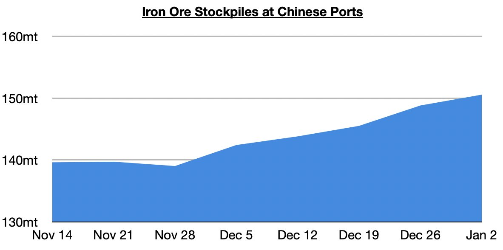
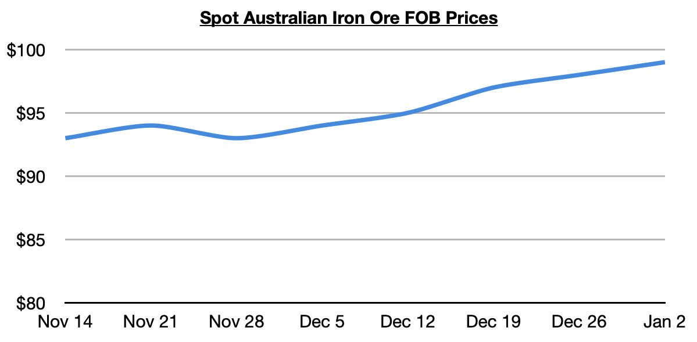

# Iron Ore Stockpiles Continue to Rise, But So Too Are Iron Ore Prices!

**Date:** January 06, 2026  
**Publisher:** Breakwave Advisors | **Category:** Market Insights  
**Original URL:** [https://www.breakwaveadvisors.com/insights/2026/1/6/iron-ore-stockpiles-continue-to-rise-but-so-too-are-iron-ore-prices](https://www.breakwaveadvisors.com/insights/2026/1/6/iron-ore-stockpiles-continue-to-rise-but-so-too-are-iron-ore-prices)  

---

*By*[*Jeffrey Landsberg*](https://www.linkedin.com/in/jeffrey-landsberg-70ab957/)

150.6 million tons of iron ore is now stockpiled at Chinese ports. This is up week-on-week by 1.8 million tons (1%) and is up year-on-year by 6 million tons (4%). Stockpiles have now increased during eleven of the last twelve weeks and remain up on a year-on-year basis.

> **Figure 1: Chart 2**  
> [Local Asset](file:///C:/Users/Dell/Github/Shipping/corpus/03-breakwave/insights/2026/assets/2026-01-06_iron-ore-stockpiles-continue-to-rise-but-so-too-are-iron-ore-prices_img_chart2_09f19a72cef2.jpg)

Also of note is that global iron ore prices have climbed even further despite the ongoing rise in China's port stockpiles. Spot benchmark Australian iron ore, for example, ended last week at approximately $99/ton FOB. This is up week-on-week by $1 (1%) and up year-on-year by $7 (8%).

> **Figure 2: Chart 1**  
> [Local Asset](file:///C:/Users/Dell/Github/Shipping/corpus/03-breakwave/insights/2026/assets/2026-01-06_iron-ore-stockpiles-continue-to-rise-but-so-too-are-iron-ore-prices_img_chart1_355197a213a9.jpg)

Overall, China's steel output has remained in a contraction since September, but China's iron ore imports have nevertheless remained strong as we have been predicting. China's iron ore imports have grown year-on-year during each of the last six months. As we have continued to stress in Commodore Research's Weekly China Reports and Weekly Executive Reports, it is global iron ore production that drives China's iron ore import volume. We remain bullish for China's iron ore import prospects.

---

**Tags:** Ironore, Shipping, Drybulk  
