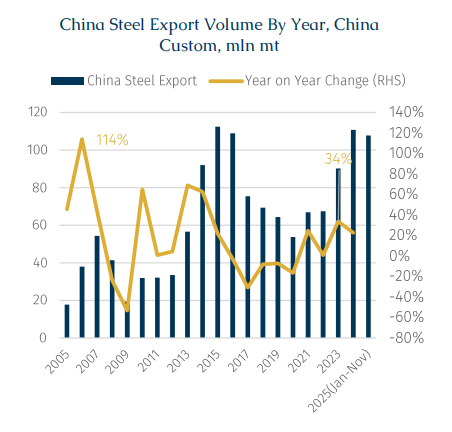
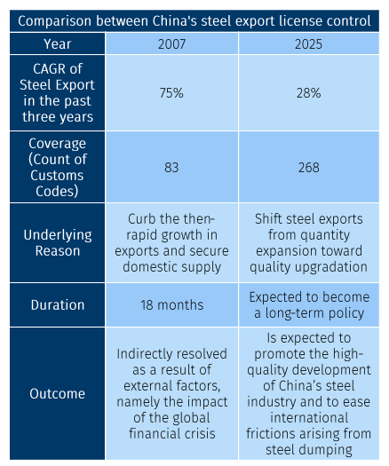
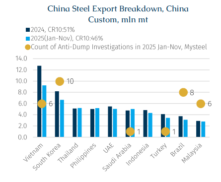

# China Adjusts Steel Export Controls

**Date:** January 08, 2026  
**Publisher:** Breakwave Advisors | **Category:** Market Insights  
**Original URL:** [https://www.breakwaveadvisors.com/insights/2026/1/8/china-adjusts-steel-export-controls](https://www.breakwaveadvisors.com/insights/2026/1/8/china-adjusts-steel-export-controls)  

---

> **Figure 1: Rgb Color Brs Shipbrokers Monogram L**  
> [Local Asset](file:///C:/Users/Dell/Github/Shipping/corpus/03-breakwave/insights/2026/assets/2026-01-08_china-adjusts-steel-export-controls_img_rgb-color-brs-shipbrokers-monogram-l_c365f35f1de5.png)

On 12 December 2025, China’s Ministry of Commerce and the General Administration of Customs jointly issued Announcement No. 79, adjusting the Catalogue of Goods Subject to Export License Administration (2025) by bringing certain steel products under export license control. According to the announcement’s appendix, a total of 268 customs codes for steel products are included, covering raw and semi-finished products, billets, hot-rolled coil, cold-rolled coil, coated, and other steel types.

The apparent intention of the policy appears to be focusing on controlling low-value-added, high-energy-consuming, and trade-sensitive products, while also covering some high-end products. This comes as global scrutiny on Chinese steel exports has intensified recently. Coming into effect on the first day of this year, it is expected to shift China’s steel exports from quantity toward quality.

Looking back at China’s steel export market, from 2017 to 2022, Chinese Customs data suggested that steel export volumes remained broadly stable around 70 mln mt per year, but exports surged to 110.7 mln mt in 2024, posting a compound annual growth (CAGR) of 28.2% across the past three years. This reflects that, amid peak domestic steel demand, exports gradually became the main mechanism for absorbing domestic overcapacity and stabilizing the market.

Meanwhile, the new policy could be interpreted as a phase of weaker reliance on exports to stabilise steel production and prices, shifting the policy focus toward pre-emptive management of export structure and quality. Proactively reducing exports of low-value-added steel, even at the cost of certain marginal profit, aligns with China’s industrial upgrading and structural adjustment goals while meeting the interests of major trading partners at the same time.

> **Figure 2: Στιγμιότυπο Οθόνης 2026 01 08 132136**  
> [Local Asset](file:///C:/Users/Dell/Github/Shipping/corpus/03-breakwave/insights/2026/assets/2026-01-08_china-adjusts-steel-export-controls_img_cea3cf84ceb9ceb3cebcceb9cf8ccf84cf85_fdf3197a6ac8.png)

Regarding timing, the policy rollout appears designed to align with steel mills’ production schedules, leaving room for planning next year’s production and sales, indicating a forward-looking and planned approach, in contrast with the abrupt, interventionist measures seen in 2007.

For context, on 20 May 2007, the Ministry of Commerce and Customs jointly issued Announcement No. 41, imposing export license control on 83 steel product custom codes, including hot-rolled coil, cold-rolled coil, and hot-rolled wire rod. That policy aimed to curb the then-rapid growth in exports and secure domestic supply. Nevertheless, from 2005 to 2007, China’s steel exports soared from 17.7 mln mt to 54.4 mln mt, a CAGR of 75%, far exceeding the growth seen in the more recent export expansion phase. It is worth noting that the 2007 policy was implemented mid-year, partially restraining second-half exports. In the second half of that year, China exported a total of 23.9 mln mt of steel, down 22% from 30.5 mln mt in the first half, demonstrating the impact of policy intervention on steel exports.

Furthermore, the 2007 policy was largely reactive, and its subsequent termination was also driven by external shocks. Meanwhile, post the 2008 global financial crisis, overseas steel demand fell sharply, significantly restricting external appetite for Chinese steel. In response, on 1 January 2009, the Ministry of Commerce and Customs issued Announcement No. 100, abolishing export license requirements for steel products, shifting the focus from export restriction to growth protection and export promotion. In contrast, the current policy, although similar in form, differs significantly in macroeconomic context, objectives, and industrial stage, and the market does not expect a near-term reversal.

> **Figure 3: Στιγμιότυπο Οθόνης 2026 01 08 132150**  
> [Local Asset](file:///C:/Users/Dell/Github/Shipping/corpus/03-breakwave/insights/2026/assets/2026-01-08_china-adjusts-steel-export-controls_img_cea3cf84ceb9ceb3cebcceb9cf8ccf84cf85_f674705363d3.png)

In the short term, the policy will inevitably disrupt export plans scheduled for early this year, potentially causing temporary market sentiment and price fluctuations. In the medium to long term, the license mechanism does not directly restrict export volumes but raises compliance costs, forcing steel mills and traders to reduce exports of low-value-added steel. Potential export reductions are more likely to be collateral damage, as the primal target is to promote industrial upgrading through policy guidance.

Consequently, low-value-added steel exports will face substantial contractions, though some mills may maintain export volumes by extending the processing chain, improving steel quality and increasing product value. Overall, the absolute decline in exports is expected, with market consensus suggesting that China’s steel exports this year shall remain around 90–100 mln mt. For reference, in the first eleven months of 2025, exports reached 107.7 mln mt, and with potential year-end “export rush” activity, full-year exports could approach 120 mln mt.

During the window between the policy announcement and year-end, clear signs of front loading have already emerged on the export side. According to AXSMarine’s tracking of dry bulk seaborne shipments, China’s seaborne steel exports reached 2.69 mln mt in the final full week of 2025 (22–28 December), representing a 61% increase compared with the annual weekly average of about 1.67 mln mt. This also marked the highest weekly export volume of the year, reflecting charterers’ efforts to lock in export volumes ahead of rising policy uncertainty.

Combining Mysteel’s statistics on anti-dumping investigations and China Customs export data, among the top ten steel export destinations from China, Vietnam, South Korea, Brazil and Malaysia face the most concentrated trade friction for low-value-added steel. Their imports are therefore most likely affected by the upcoming policy, thereby exerting downward pressure, particularly on the backhaul rates (Far East to Southeast Asia). According to customs data, these four countries combined imported about 26.3 mln mt from China in the first eleven months of 2025.

> **Figure 4: Στιγμιότυπο Οθόνης 2026 01 08 132159**  
> [Local Asset](file:///C:/Users/Dell/Github/Shipping/corpus/03-breakwave/insights/2026/assets/2026-01-08_china-adjusts-steel-export-controls_img_cea3cf84ceb9ceb3cebcceb9cf8ccf84cf85_b9ca95e430af.png)

Looking ahead to 2026, the potential impact of these policies on the dry bulk market warrants closer examination. It should be noted that not all steel cargoes are transported by dry bulk vessels. According to BRS, approximately 75% of steel exports are carried by dry bulk vessels, while the remainder is transported via alternative channels, including overland transportation and other non-dry-bulk vessels. Based on this assumption, a policy-driven reduction of around 20 mln mt in China’s steel exports in 2026 would translate into an estimated 15 mln mt loss in dry bulk volumes.

From a vessel-segment perspective, Supramax (50,000–68,000 dwt), which accounts for more than 60% of steel shipments by dry bulk, would bear the majority of this impact, with close to 10 mln mt of demand potentially removed. Under the assumption that export losses are more concentrated in key destination markets such as Vietnam, South Korea, Brazil and Malaysia, we estimate that the resulting tonne-mile demand loss for Supramax vessels would be equivalent to roughly 10% of China’s total Supramax-export tonne-mile demand in 2025.

According to AXSMarine, China’s Supramax-export tonne-mile demand reached 777 bln in 2025, representing a 17% y-o-y increase from 2024. Against this backdrop, with the implementation of the policy, as steel export reductions gradually materialize over the course of 2026, their marginal impact on this vessel segment is expected to become increasingly visible.

---

**Tags:** Drybulk, China, Shipping  
