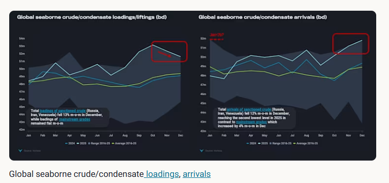
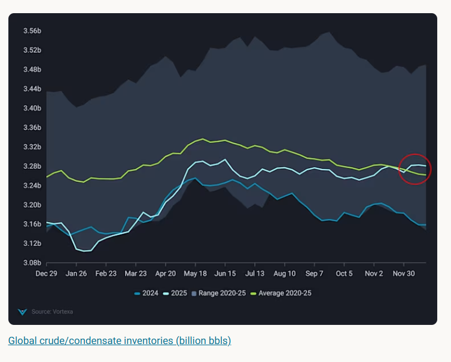
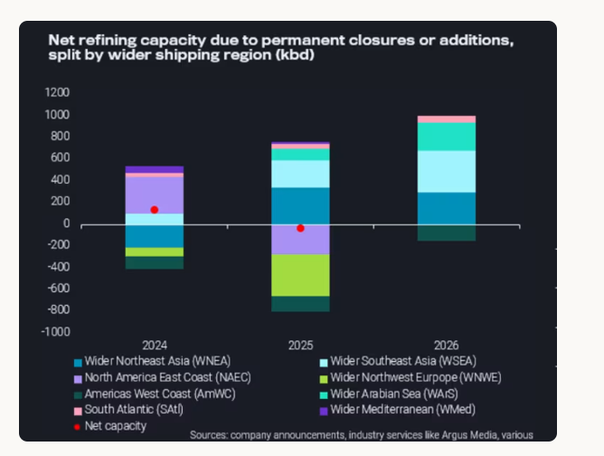

# Crude exports rebalance amid high geopolitical tensions

**Date:** January 08, 2026  
**Publisher:** Breakwave Advisors | **Category:** Market Insights  
**Original URL:** [https://www.breakwaveadvisors.com/insights/2026/1/8/crude-exports-rebalance-amid-high-geopolitical-tensions](https://www.breakwaveadvisors.com/insights/2026/1/8/crude-exports-rebalance-amid-high-geopolitical-tensions)  

---

We take a look at the fall in global crude loadings alongside rising arrivals, pushing up inventory levels and keeping crude in check

*By*[*Pamela Munger*](https://www.linkedin.com/in/pamela-munger-a7849a5/)

As 2025 ended, the global crude market was focused on the growing imbalance of crude loadings versus seasonal crude arrivals. As we move into 2026, amid a flurry of geopolitical tensions we can see a rebalancing take place due to a reduction in global loadings and intake that is rising to historical highs, pushing up inventory levels and keeping global crude benchmark prices on the front end of the curve relatively sanguine.

Global crude and condensate liftings/loadings rose to historical highs in October, however since then have taken a downward trend ending 3% lower in December compared to October. Declines in loadings were observed predominantly across the major export countries between this period from October to December (Saudi Arabia -6%, Russia -10%, US -11%).

Meanwhile[sanctioned crude](https://analytics.vortexa.com/Flows?dateRange=2024-01-01T00%3A00%3A00.000Z__2025-12-31T23%3A59%3A59.999Z&filtersEnabled=%5B%22p%22%2C%22o%22%2C%22d%22%2C%22d_r%22%2C%22v%22%2C%22intra_d%22%2C%22sts_o%22%2C%22c_o%22%2C%22w%22%5D&from=%5B%22b996521be9c996db3560ca234a56286ac38f798d34be229437555fab4f12a6a5%22%2C%22a1acb291bb339d07faa0d9c7b62ea292aa0ea1a01813b26c890aeeb4e2334b09%22%2C%22d308ddc557e774187ad6c7da81b39db990def9a39e6c88e79cb163b6bdd6e8e5%22%5D&intraMovementDropdown=all&metric=bpd&page=Flows&products=%5B%2254af755a090118dcf9b0724c9a4e9f14745c26165385ffa7f1445bc768f06f11%22%5D&productsExcluded=%5B%22bb70cf56200f5b72ba69a90bda2c6b47ba29da23945c6f1994cfd4c2ef2fe0ff%22%2C%22578b0722570521d64e6a1527e1fb88ddb1a064cc15afe1d6023d2a0b6d66be6b%22%5D&tabId=286e9173-e319-47fb-8767-6026f9affa0b&timeSeriesChartView=seasonal&v=3)loadings from (Russia (excl. CPC/Kebco, Iran, Venezuela) fell 13% m-o-m in December, mitigated only by loadings of[mainstream grades](https://analytics.vortexa.com/Flows?dateRange=2024-01-01T00%3A00%3A00.000Z__2025-12-31T23%3A59%3A59.999Z&filtersEnabled=%5B%22p%22%2C%22o%22%2C%22d%22%2C%22d_r%22%2C%22v%22%2C%22intra_d%22%2C%22sts_o%22%2C%22c_o%22%2C%22w%22%5D&fromExcluded=%5B%22b996521be9c996db3560ca234a56286ac38f798d34be229437555fab4f12a6a5%22%2C%22d308ddc557e774187ad6c7da81b39db990def9a39e6c88e79cb163b6bdd6e8e5%22%2C%22a1acb291bb339d07faa0d9c7b62ea292aa0ea1a01813b26c890aeeb4e2334b09%22%5D&intraMovementDropdown=all&metric=bpd&page=Flows&products=%5B%2254af755a090118dcf9b0724c9a4e9f14745c26165385ffa7f1445bc768f06f11%22%5D&tabId=50cf9f09-da04-4249-975f-392da0d77254&timeSeriesChartView=seasonal&v=3)that remained flat m-o-m. Sanctioned crudes fell likely due to factors relating to weather, infrastructure problems and the US naval blockade (Venezuela).

At the same time December crude loadings dipped from Saudi Arabia and the US which can likely be explained by refineries returning from a heavy and prolonged maintenance season (especially in the Middle East).

> **Figure 1: Στιγμιότυπο Οθόνης 2026 01 08 103235**  
> **Interactive Data & Source:** [Analytics Vortexa](https://analytics.vortexa.com/OnShoreCrudeInventories?dateRange=2022-01-01T00%3A00%3A00.000Z__2025-12-31T23%3A59%3A59.999Z&frequency=month&hiddenSeries=%5B%224bd22474bec28e0d2576ff0ad204966df7f082d85af4f062763c49c4b1cac65d%22%2C%223663536da3c85053556bc0d1a803481aa137a854da8bc835f614e84e810b1bb7%22%2C%226034694c5c614aecd76df3e55851fdbe17f05a2b3e3d55a4630ee5c030dc9e95%22%2C%227a8292b7fbc1786ffa991850919e22ea4bc7a84382075453768367386576b0b7%22%2C%229601c1f3570258ff1b61537034a11570bda4001b4b75df5d99697ce5d5ac00de%22%2C%225190e0bccad9bf9e0ab42bfbf078d5a6151c0862a5c65d073944d38bdcfbf4d8%22%2C%22f77b3f9efb465601faafacfa2f847a997af32aa9d2a2849720b86a9ef60e937b%22%2C%22898667e32a8ddfc0f123347154d4fc6e4a8396f789709e2988dc4defd557479d%22%5D&onshoreInventoriesLocations=%5B%22934c47f36c16a58d68ef5e007e62a23f5f036ee3f3d1f5f85a48c572b90ad8b2%22%5D&page=OnShoreCrudeInventories&selectedRegion=%5B%22934c47f36c16a58d68ef5e007e62a23f5f036ee3f3d1f5f85a48c572b90ad8b2%22%5D&tabId=b211d83a-82e7-42e8-9edd-bb3dbc5080d5&tankCrude=%5B%22confirmed%22%2C%22probable%22%5D&tsVisualType=seasonal) | [Local Asset](file:///C:/Users/Dell/Github/Shipping/corpus/03-breakwave/insights/2026/assets/2026-01-08_crude-exports-rebalance-amid-high-geopolitical-tensions_img_cea3cf84ceb9ceb3cebcceb9cf8ccf84cf85_b89b2e85cc08.png)

Drilling into the arrivals side, we can see an increasing trend for three consecutive months. China’s December arrivals/imports reached the second highest volume in the dataset since 2016.

Brazilian and Middle Eastern grades are the winners here, with Brazilian origin imports up 25% in December compared to October and Middle Eastern origin imports up 11% m-o-m in December. And while Chinese refinery runs did see some life toward the end of Q4 especially with a final batch of crude import quotas issued during the last week of November (higher than last year’s volumes), we note that a large portion of[crude intake went into storage](https://analytics.vortexa.com/OnShoreCrudeInventories?dateRange=2022-01-01T00%3A00%3A00.000Z__2025-12-31T23%3A59%3A59.999Z&frequency=month&hiddenSeries=%5B%224bd22474bec28e0d2576ff0ad204966df7f082d85af4f062763c49c4b1cac65d%22%2C%223663536da3c85053556bc0d1a803481aa137a854da8bc835f614e84e810b1bb7%22%2C%226034694c5c614aecd76df3e55851fdbe17f05a2b3e3d55a4630ee5c030dc9e95%22%2C%227a8292b7fbc1786ffa991850919e22ea4bc7a84382075453768367386576b0b7%22%2C%229601c1f3570258ff1b61537034a11570bda4001b4b75df5d99697ce5d5ac00de%22%2C%225190e0bccad9bf9e0ab42bfbf078d5a6151c0862a5c65d073944d38bdcfbf4d8%22%2C%22f77b3f9efb465601faafacfa2f847a997af32aa9d2a2849720b86a9ef60e937b%22%2C%22898667e32a8ddfc0f123347154d4fc6e4a8396f789709e2988dc4defd557479d%22%5D&onshoreInventoriesLocations=%5B%22934c47f36c16a58d68ef5e007e62a23f5f036ee3f3d1f5f85a48c572b90ad8b2%22%5D&page=OnShoreCrudeInventories&selectedRegion=%5B%22934c47f36c16a58d68ef5e007e62a23f5f036ee3f3d1f5f85a48c572b90ad8b2%22%5D&tabId=b211d83a-82e7-42e8-9edd-bb3dbc5080d5&tankCrude=%5B%22confirmed%22%2C%22probable%22%5D&tsVisualType=seasonal)pushing onshore crude inventory volumes toward the top of the five year range. The new quotas could likely lean toward higher storage drawdowns in future to meet quota demand.

Meanwhile, India’s crude intake jumped 12% in November compared to September despite a strong sanctioning program directed toward Indian buyers in October. Despite this a small dip was seen in arrivals for December, with[Middle Eastern barrels taking back market share from Russia](https://analytics.vortexa.com/Flows?dateRange=2024-01-01T00%3A00%3A00.000Z__2025-12-31T23%3A59%3A59.999Z&destinationGlobalXFilter=%5B%2270425373a1836d6d0390dc6fef838a468717fba7776d66065a5043488f9f041b%22%5D&filtersEnabled=%5B%22p%22%2C%22o%22%2C%22d%22%2C%22d_r%22%2C%22v%22%2C%22intra_d%22%2C%22sts_o%22%2C%22c_o%22%2C%22w%22%5D&geoBreakdownOriginGlobal=region&intraMovementDropdown=all&metric=bpd&movementEvent=unloading_start&page=Flows&products=%5B%2254af755a090118dcf9b0724c9a4e9f14745c26165385ffa7f1445bc768f06f11%22%5D&tabId=d11f80bf-326e-440a-86cd-b21e8db467dd&timeSeriesProperty=origin_region&v=3)last month as sanctions rerouted barrels to other buyers, mainly teapot refineries in Shangdong.

> **Figure 2: Στιγμιότυπο Οθόνης 2026 01 08 103323**  
> **Interactive Data & Source:** [Analytics Vortexa](https://analytics.vortexa.com/Flows?dateRange=2016-01-01T00%3A00%3A00.000Z__2025-12-31T23%3A59%3A59.999Z&filtersEnabled=%5B%22p%22%2C%22o%22%2C%22d%22%2C%22d_r%22%2C%22v%22%2C%22intra_d%22%2C%22sts_o%22%2C%22c_o%22%2C%22w%22%5D&from=%5B%22a1acb291bb339d07faa0d9c7b62ea292aa0ea1a01813b26c890aeeb4e2334b09%22%5D&intraMovementDropdown=all&maxEventFilter=1767225599999&metric=bpd&minEventFilter=1735689600000&page=Flows&products=%5B%2254af755a090118dcf9b0724c9a4e9f14745c26165385ffa7f1445bc768f06f11%22%5D&tabId=286e9173-e319-47fb-8767-6026f9affa0b&timeSeriesProperty=origin_region&v=3) | [Local Asset](file:///C:/Users/Dell/Github/Shipping/corpus/03-breakwave/insights/2026/assets/2026-01-08_crude-exports-rebalance-amid-high-geopolitical-tensions_img_cea3cf84ceb9ceb3cebcceb9cf8ccf84cf85_5aa71b5bf31b.png)

Looking forward, refinery expansions will continue to move refining capacity from the Atlantic Basin towards the Pacific Basin in the second half of 2026, which means more crude moving toward that direction namely Wider Southeast Asia, Northeast Asia and the Wider Arabian Sea. We have calculated net expansions in the Pacific Basin to nearly 1mbpd offering some relief to growing supplies.

> **Figure 3: Στιγμιότυπο Οθόνης 2026 01 08 103402**  
> **Interactive Data & Source:** [Analytics Vortexa](https://analytics.vortexa.com/Flows?dateRange=2016-01-01T00%3A00%3A00.000Z__2025-12-31T23%3A59%3A59.999Z&filtersEnabled=%5B%22p%22%2C%22o%22%2C%22d%22%2C%22d_r%22%2C%22v%22%2C%22intra_d%22%2C%22sts_o%22%2C%22c_o%22%2C%22w%22%5D&from=%5B%22a1acb291bb339d07faa0d9c7b62ea292aa0ea1a01813b26c890aeeb4e2334b09%22%5D&intraMovementDropdown=all&maxEventFilter=1767225599999&metric=bpd&minEventFilter=1735689600000&page=Flows&products=%5B%2254af755a090118dcf9b0724c9a4e9f14745c26165385ffa7f1445bc768f06f11%22%5D&tabId=286e9173-e319-47fb-8767-6026f9affa0b&timeSeriesProperty=origin_region&v=3) | [Local Asset](file:///C:/Users/Dell/Github/Shipping/corpus/03-breakwave/insights/2026/assets/2026-01-08_crude-exports-rebalance-amid-high-geopolitical-tensions_img_cea3cf84ceb9ceb3cebcceb9cf8ccf84cf85_6a3f7d7764e9.png)

Additionally, we can also expect to see crude export momentum pick up from the Atlantic Basin especially from new projects in Guyana, Brazil and Argentina placing an additional 500-550kbd of oil on the water available for export. And despite significant infrastructure hurdles ahead a wildcard for further exports could be Venezuela, with likely possibility of existing production/exports returning to mainstream markets.[Venezuela crude has exported an average of 850 kbd in 2025 with 60% of it headed to China.](https://analytics.vortexa.com/Flows?dateRange=2016-01-01T00%3A00%3A00.000Z__2025-12-31T23%3A59%3A59.999Z&filtersEnabled=%5B%22p%22%2C%22o%22%2C%22d%22%2C%22d_r%22%2C%22v%22%2C%22intra_d%22%2C%22sts_o%22%2C%22c_o%22%2C%22w%22%5D&from=%5B%22a1acb291bb339d07faa0d9c7b62ea292aa0ea1a01813b26c890aeeb4e2334b09%22%5D&intraMovementDropdown=all&maxEventFilter=1767225599999&metric=bpd&minEventFilter=1735689600000&page=Flows&products=%5B%2254af755a090118dcf9b0724c9a4e9f14745c26165385ffa7f1445bc768f06f11%22%5D&tabId=286e9173-e319-47fb-8767-6026f9affa0b&timeSeriesProperty=origin_region&v=3)

Data Source:[Vortexa](https://www.vortexa.com//oil-gas-data-traders-analysts-data-scientists?gclid=Cj0KCQjw8_qRBhCXARIsAE2AtRZKOvMnbilZ_6_91d7huSFFy71pWLrnPwGwOHVzXsmsG-1a1mZnQw8aAt89EALw_wcB&hsa_acc=1782073842&hsa_ad=548425387665&hsa_cam=14746637662&hsa_grp=125038601902&hsa_kw=&hsa_mt=&hsa_net=adwords&hsa_src=g&hsa_tgt=dsa-1431852288425&hsa_ver=3&utm_campaign=%5BCD%5D%20-%20DSA%20-%20EMEA&utm_medium=cpc&utm_medium=ppc&utm_source=google&utm_source=adwords&utm_term=)

---

**Tags:** Markets, Oil, Tankers  
