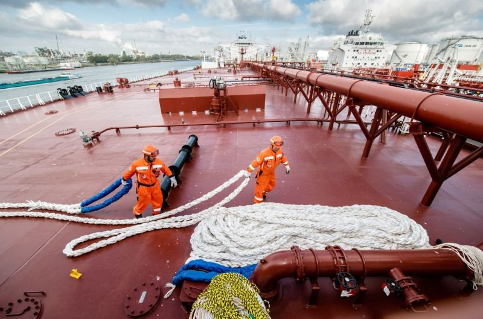

# Why the VLCC market had one of the strongest years in a decade — and what could lie ahead

**Date:** January 09, 2026  
**Publisher:** Breakwave Advisors | **Category:** Market Insights  
**Original URL:** [https://www.breakwaveadvisors.com/insights/2026/1/9/why-the-vlcc-market-had-one-of-the-strongest-years-in-a-decade-and-what-could-lie-ahead](https://www.breakwaveadvisors.com/insights/2026/1/9/why-the-vlcc-market-had-one-of-the-strongest-years-in-a-decade-and-what-could-lie-ahead)  

---

> **Figure 1: Bymette Frederiksen**  
> *ByMette Frederiksen*  
> **Interactive Data & Source:** [Linkedin](https://www.linkedin.com/in/mette-frederiksen-2a826216/) | [Local Asset](file:///C:/Users/Dell/Github/Shipping/corpus/03-breakwave/insights/2026/assets/2026-01-09_why-the-vlcc-market-had-one-of-the-strongest-years-in-a-decade-and-what-could-li_img_1767711335630_8e087d6fffaa.jpg)

The VLCC market has just wrapped up one of its most powerful freight environments in years. Earnings surged past $100,000 per day, with momentum staying strong throughout Q3 and Q4.

For much of the year, freight rates moved broadly in line with 2024 levels. However, as summer turned into autumn, the market broke away from historical patterns. The immediate driver was a surge in crude and condensate on the water, coupled with a sharp increase in tonnemiles. With more barrels traveling farther and remaining afloat longer, vessel demand shifted decisively, tightening the supply and demand balance – pushing freight rates to recent highs. The more compelling questions, however, are why has this occurred and can it last?

### A Shift in the Global Supply Chain

After a slower than expected 2024, when global oil supply barely grew and what little growth there came was almost entirely from non-OPEC producers – 2025 finally brought a very different supply story. Global output is set to rise by roughly 2.8 million barrels per day, with meaningful contributions from both OPEC and non-OPEC sources. OPEC alone restored the first tranche of voluntary supply cuts, quickly boosting VLCC cargo availability. At the same time, non-OPEC momentum remains strong, with Brazil, Guyana, the US, and Canada, expanding production and feeding long-haul trade routes.

Looking ahead to 2026, OPEC policy is far from certain, but another 1.2 million barrels per day of non-OPEC growth – most of it west of Suez – appears likely, creating an ideal backdrop for continued VLCC-friendly long-haul flows.

### Demand Growth Matters – But Geography Matters More

The EIA expects global oil demand to grow by just over one million barrels per day in both 2025 and 2026 – solid but far from explosive. For VLCCs, however, the real story isn’t the pace of demand growth, but where that growth is occurring relative to supply. Demand continues to expand in Asia, while most of the new supply is emerging from the Atlantic Basin. This imbalance forces crude to travel longer distances, structurally lifting tonne-miles which are the driving force of the VLCC sector.

### China Is Currently Driving the Market

China has played a significant role in this year’s freight strength. Seaborne crude flows into China climbed steadily through 2025, reaching around 12 million barrels per day in October compared with levels below 10 million for much of 2024. Much of this growth came from non-sanctioned, long-haul suppliers such as West Africa and South America, exactly the kind of flows that turbocharge tonnemiles. While some sanctioned barrels from Iran and Venezuela continue to move on VLCCs, these typically travel on shadow-fleet tonnage and don’t impact the mainstream market.

The key question now is how much of China’s recent strength reflects real consumption and how much is tied to stock building? Throughout 2025, China has been steadily adding to inventories under a Strategic Petroleum Reserve (SPR) mandate that runs through March 2026. With expectations of another mandate and new storage capacity under construction, continued stockpiling remains a feasible scenario. Whether for consumption or storage, if China keeps buying at this pace, its import appetite will remain a powerful driver of VLCC demand.

### The Impact of Sanctions

Geopolitics continues to shape the VLCC landscape, with sanctions emerging as one of the most influential structural factors. A large shadow fleet now operates outside mainstream markets: about 100 VLCCs are officially sanctioned, and roughly 100 more have carried sanctioned barrels in recent years and none of these are likely to return to regular trading. This removes around 23% of the global VLCC fleet from normal market participation, leaving the compliant fleet not only smaller but also less flexible due to sanctions-driven trade inefficiencies. Nearly all vessels aged 20 years or older now operate exclusively in this dark fleet.

Sanctions have also reshaped trade flows. Earlier this year, US tariffs prompted India to briefly reduce purchases of Russian crude and turn to Atlantic Basin suppliers instead, which immediately boosted VLCC demand and tonnemiles. These changes can be temporary, but they tend to sharpen freight strength at pivotal moments. More disruptions are expected as new compliance deadlines take effect toward the end of 2025.

### Newbuildings vs. Effective Tonnage Supply

At first glance, the scheduled delivery of 40 new VLCCs in 2026 might seem like a clear threat to freight rates. However,*effective*fleet growth tells a more nuanced story. Nearly 20% of the global VLCC fleet is now 20 years or older, and utilisation typically begins to decline from around age 15, slipping further each year. Many of these ageing vessels are moving permanently into the shadow fleet, never returning to compete with modern tonnage. Once these dynamics are accounted for, effective fleet growth remains comfortably below 3%, which is modest in comparison to historical averages.

### A Market Driven by Fundamentals and a Watchlist for 2026

The defining forces of 2025 have been strong long-haul flows, elevated volumes of crude in transit, China’s return as a reliable import driver, a shrinking compliant fleet, sanctions-driven inefficiencies, and a maturing fleet that continues to limit effective supply. Some variables can shift quickly and will require close monitoring, for example China’s stockpiling strategy, OPEC production policy, and the evolution of sanctioned oil flows. However, the underlying structural drivers remain firmly in place.

Overall, the VLCC freight market heads into 2026 on a strong position supported by elevated tonnemiles, tight effective supply, and demand patterns that continue to favour long-distance movements.

Data Source:[Tankers International](https://tankersinternational.com)

---

**Tags:** Tankers, Markets, Crude  
