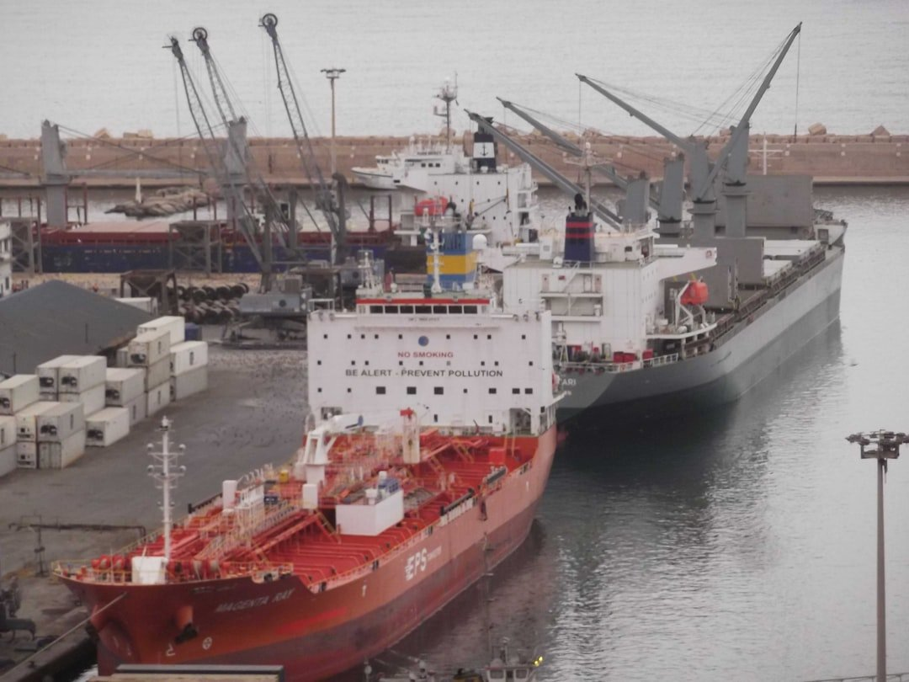

# 2026 opening market commentary

**Date:** January 12, 2026  
**Publisher:** Breakwave Advisors | **Category:** Market Insights  
**Original URL:** [https://www.breakwaveadvisors.com/insights/2026/1/12/2026-opening-market-commentary](https://www.breakwaveadvisors.com/insights/2026/1/12/2026-opening-market-commentary)  

---

> **Figure 1: Byeirini Diamantara&dimitris Roumeliotis**  
> *ByEirini Diamantara&Dimitris Roumeliotis*  
> **Interactive Data & Source:** [Linkedin](https://www.linkedin.com/in/eirini-diamantara-58b269105/) | [Local Asset](file:///C:/Users/Dell/Github/Shipping/corpus/03-breakwave/insights/2026/assets/2026-01-12_2026-opening-market-commentary_img_unsplash-image-kuxraybuwfg_9a32986b6d97.jpg)

2026 opens with a reminder that “seaborne trade” is not just demand and fleet numbers. It is politics, enforcement and the simple ability of a ship to load and sail. Venezuela is the clearest example. In December, Venezuelan crude output averaged roughly 963,000 b/d, down about 158,000 b/d month-on-month, while exports slid to around 17.6 million barrels versus 27.2 million in November as tankers struggled to access and depart Venezuelan waters amid tougher US enforcement.

Washington then raised the bar further. President Trump ordered a “total and complete blockade” of sanctioned oil tankers going into and out of Venezuela, and US authorities subsequently seized two tankers and pursued a third, a rare moment where geopolitics translates directly into fewer available ships and slower cargo execution.

For shipping, the first-order impact is not “missing barrels” globally, but rerouted barrels and extra friction. Venezuelan flows into Asia were already leaning on transshipment and re-labelling, a tighter net forces a larger share of cargoes through fewer, higher-risk channels, tying up tonnage and putting a premium on ships with clean trading histories. At the same time, Asian refiners are leaning harder into light sweet US crude in 2026 for both economics and diplomacy, as weak Brent-Dubai EFS dynamics and WTI Midland pricing at a discount to Murban on a delivered CFR North Asia basis keep Atlantic barrels competitive into Asia despite the longer sailing distance.

That shift matters for tonne-miles. A marginal barrel moving US Gulf–North Asia travels far further than a Caribbean barrel cleared through a nearby blending hub, and it tends to move on larger ships with longer ballast legs. So even if global crude balances look comfortable, the trade map can still tighten effective tanker supply in the Atlantic, supporting earnings and, crucially for SnP, supporting replacement demand for “clean” modern units. Just as important, it widens the price gap between mainstream, fully-compliant tonnage and grey-trade candidates in the SnP market.

The second-order effect is what happens when the political temperature spikes. On January 3, large-scale US strikes on Venezuela and the capture of President Maduro, while noting no incidents reported at oil facilities at that stage. Even without damage to fields, ports or refineries, the operating layer changes immediately: port calls slow, insurance and security premia creep up, and charterers become far less tolerant of paperwork gaps.

Meanwhile, dry bulk enters Q1 with unusually supportive momentum. Dry Bulk Quarterly flagged that Q4 2025 defied the typical year-end fade, with the BDI averaging about 2,170 in Q4 versus 1,464 a year earlier, the BCI averaging 3,518 versus 2,206 and the BPI averaging roughly 1,777 versus 1,173 in Q4 2024. West Africa’s bauxite/iron ore growth and expectations for firmer grain flows keep sentiment constructive in what is usually a softer season.

Put together, the week-one SnP message is straightforward. Venezuela is tightening the definition of “tradable” tonnage and rewarding cleanliness, flexibility and proven counterparties, while dry bulk fundamentals are giving buyers a reason to stay active rather than wait for a cheaper screen. Liquidity follows certainty: ships that can trade anywhere, for anyone, without questions are the ones that keep printing premiums.

Data source:[Xclusiv Shipbrokers Inc.](https://www.linkedin.com/company/xclusiv-shipbrokers-inc/)

---

**Tags:** Shipping, Markets  
