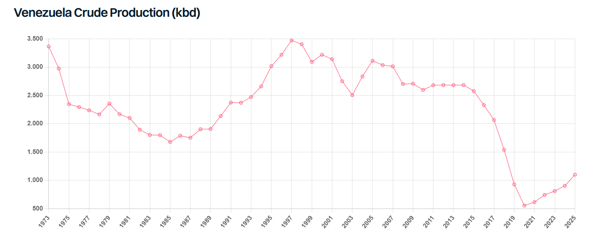

# Venezuela Reset

**Date:** January 12, 2026  
**Publisher:** Breakwave Advisors | **Category:** Market Insights  
**Original URL:** [https://www.breakwaveadvisors.com/insights/2026/1/12/venezuela-reset](https://www.breakwaveadvisors.com/insights/2026/1/12/venezuela-reset)  

---

> **Figure 1: Oil Drilling**  
> **Interactive Data & Source:** [Gibsons Co](https://www.gibsons.co.uk/market-reports) | [Local Asset](file:///C:/Users/Dell/Github/Shipping/corpus/03-breakwave/insights/2026/assets/2026-01-12_venezuela-reset_img_oil-drilling_b002be8ead60.jpg)

If anyone expected 2026 to be less eventful than 2025, the first weekend of the year has swiftly proved them wrong. On January 3rd, the US announced that Venezuelan President Nicolás Maduro and his wife had been captured and taken into US custody.

As the week progressed, a new interim president was sworn in, three more sanctioned vessels were seized by the US, including one tanker flying the Russian flag. Venezuela’s interim government has agreed to “hand over” 30-50 million bbls of crude to the US, with the initial barrels being “backed up stored oil”. Whilst a maritime blockade remains in place, US officials swiftly stated that all further Venezuelan production will be sold by the US at market price, whilst the US will supply naphtha diluent to Venezuela to enhance crude production. Pledges have been made that the US will aim to stabilise and grow Venezuelan output as soon as possible, which suggests a sanctions rollback. The US government appears to be actively engaging with oil companies, traders, financial institutions and the private sector to put things in motion: news emerged yesterday that a major trader has received a preliminary special license from the US government to begin negotiations to import and export oil from Venezuela for 18 months.

For now, however, Venezuela remains in a fragile and unstable condition. Despite the change at the top, the government structure remains largely intact, with the same Venezuelan socialist principles. Externally, the newly sworn president has sent mixed signals. On one hand, Rodríguez has insisted that Nicolás Maduro remains the legitimate president; on the other, she is collaborating with the Trump administration. There is great internal instability, with multiple armed actors, including paramilitary groups and criminal gangs, with varying degrees of autonomy.

On production, the situation on the ground is also dire. Decades of mismanagement and infrastructure decay reduced the country’s production to just 1.1 mbd last year, from a peak of 3.5 mbd in 1997. As such, the short-term production outlook remains challenging, although small increases are possible if bottlenecks are eased and quick fixes implemented. Over the longer term, if political stability and a safer operating environment can be achieved, production growth could be substantial, although analyst estimates vary widely. US oil companies may be encouraged to invest if a rapid return and large capital deployment is linked to compensation for assets expropriated in the early 2000s.

In the nearer term, crude flows are likely to change direction rather than rebound strongly. More Venezuelan barrels are expected to be redirected into the US and crude flows to Europe could resume, particularly Italy and Spain, as well as to India. Legitimate flows to China are also a possibility but there is a lack of clarity at this stage considering the wider politics involved. At the same time, the US is expected to restart clean product shipments into Venezuela, which largely stopped in the second half of 2025. All of this will support demand for mainstream tonnage at the expense of dark/sanctioned ships. Aframaxes will be the key beneficiaries, as they are the main workhorse on the existing Venezuela/US trade. Exports to Europe would mainly use Aframaxes and Suezmaxes, while any legitimate flows to Asia would move on VLCCs.

The picture is different for dark/sanctioned tankers. Chinese independents are highly exposed to a loss of sanctioned Venezuelan crude and would likely switch to discounted Iranian or Russian barrels, where possible. Still, there is a question mark whether Iran/Russia can fully offset the loss of the Venezuela’s supply and some incremental demand for mainstream crude here could not be ruled out, both from the Middle East and Canada’s TMX. The risk of further seizures of sanctioned vessels by the US has also increased, particularly in the western hemisphere.

Greater clarity should emerge over the coming days and weeks. At a macro level, however, one thing already appears clear: coercive statecraft is back, with major implications not just for the Americas but for the world. For tanker markets, this adds another layer of geopolitical risk and points to increased freight volatility, with oil flows increasingly driven by political decisions and not by pure economics.

> **Figure 2: Στιγμιότυπο Οθόνης 2026 01 12 101323**  
> **Interactive Data & Source:** [Gibsons Co](https://www.gibsons.co.uk/market-reports) | [Local Asset](file:///C:/Users/Dell/Github/Shipping/corpus/03-breakwave/insights/2026/assets/2026-01-12_venezuela-reset_img_cea3cf84ceb9ceb3cebcceb9cf8ccf84cf85_64aed2d1612e.png)

Data source:[Gibson Shipbrokers](https://www.gibsons.co.uk/market-reports)

---

**Tags:** Tankers, Crude, Geopolitics  
